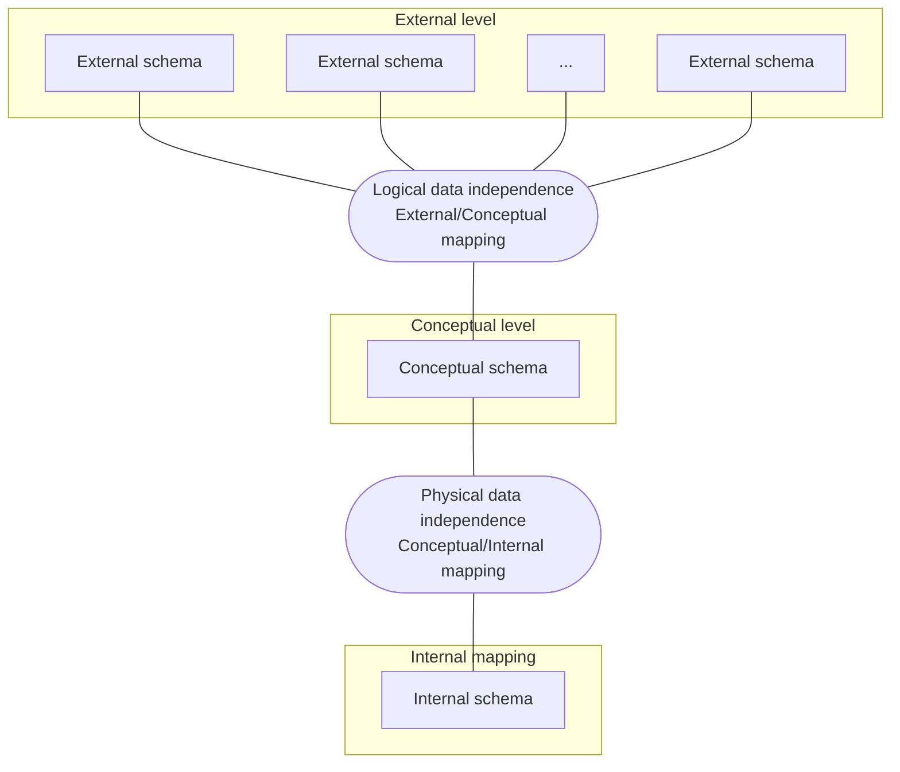
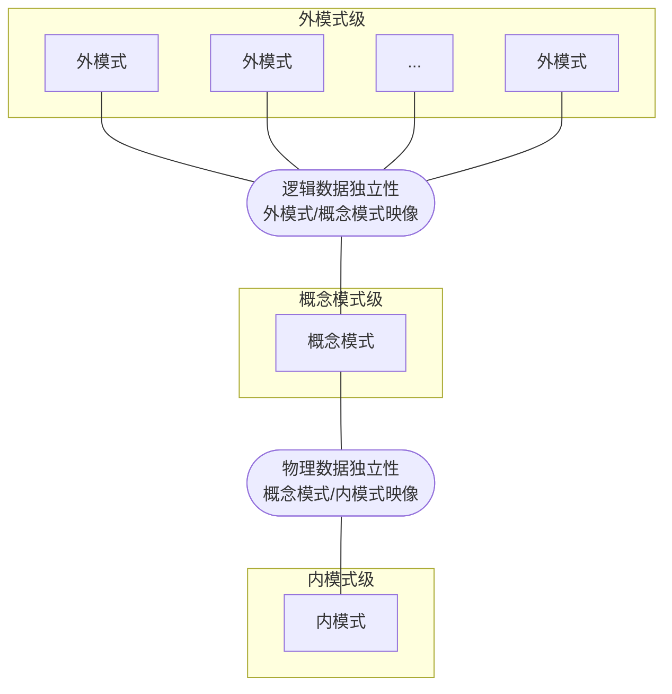

# 1.1 关系模型

## 数据模型

### 基本概念

**模型**：客观世界事物的模拟与抽象。

**数据模型**：客观世界事物的**数据**模拟与抽象。通过数据以及数据之间的联系以及约束表达事物特征。

::: info 例如
建筑沙盘模型、车模、飞机模型等外观模型；也包括各种结构模型和数学模型，例如专业领域还有受力分析模型、概率模型。
:::

### 数据模型建模的基本原则

- **能够比较真实反应客观事物特征**。面向不同应用，特征表达也不同。
- **容易理解**。模型的一个重要作用在于交流。
- **容易计算机实现**。模型最终目的是进入计算机世界。

### 数据模型三要素

- **数据结构**
- **数据操作**
- **完整性约束**

### 模型多样性

视角与用途不同，同一客观对象可能有多种表达模型。

### 数据库中数据模型的三级模式结构与两级映射

如图所示：

对应中文图示：

## 关系模型

### 基本概念

关系模型的出现主要来源于人们对于如何表达现实世界中的数据以及数据与数据之间的联系的思考。从**层次模型**到**网状模型**，再到**关系模型**：

- **层次模型**：以层次结构（树结构）表达数据以及数据之间的联系。虽然这种结构相对简单，并且检索效率较高，但是并不能完全表达客观数据之间的实际联系。一旦子孙节点与祖先节点发生某种联系，层次化结构将会被打破。
- **网状模型**：以网状结构（图结构）表达数据以及数据之间的联系。这种结构对于表达客观世界数据之间的联系相对充分，但结构相对复杂，检索效率不高。
- **关系模型**：以关系结构表达数据以及数据之间的联系。关系是数据与数据之间的一种逻辑联系，关系基于集合论，有相对严格与完备的数学基础。

### 关系模型特征

#### 数据结构

**数据结构**：

- 关系模型建立在数学概念**关系**（relation）的基础上，在物理上通常表示为一张二维表。
- 关系数据结构主要建立在数学中的集合论和谓词逻辑基础之上。

**关系**：

- 关系是一张由行和列组成的 **表**。
- 数学定义：关系是 $n$ 个集合的笛卡尔乘积中若干 $n$ 元组构成的任意有限子集。

::: tip 注
笛卡尔乘积：

设 $D_1$, $D_2$, $\dots$, $D_n$ 为 $n$ 个集合。它们的笛卡尔乘积定义为

$$D_1 \times D_2 \times \dots \times D_n = \{(d_1,d_2,\dots,d_n)|d_1 \in D_1, d_2 \in D_2, \dots, d_n \in D_n\}$$
:::

**关系的性质**：

- 关系必须是一个有限集合。
- 属性的次序无关紧要。
- 同一属性的取值必须来自同一域，因而具有同质性。
- 元组的次序无关紧要。
- 关系中每个分量必须是不可再分的原子值。
- 关系中的每个元组必须互不相同。

**关系中的码或键（Key）**

- 超码（Super key）：关系中能够唯一标识一个元组的一个属性或属性组。
- 候选码（Candidate key）：不含多余属性的超码，即其任一真子集都不能作为超码。
- 主码（Primary key）：从候选码中选定的、用于唯一标识元组的码。一个关系通常只选一个主码。
- 备用码（Alternate key）：没有被选作主码的其余候选码。
- 外码（Foreign key）：一个关系中的某个属性或属性组，它对应于另一个关系（或同一关系）的候选码。

**关系模式（Relation Schema）的表示**

关系模式通常写为：关系名后跟属性名表，并将属性名放在圆括号内。

通常用下划线标出主码。

::: info 例如
Student (<u>sNo</u>, sName, sSex, sAge, sDept)

Course (<u>cNo</u>, cName, cPNo, cCredit)

SC (<u>sNo</u>, <u>cNo</u>, score)
:::

#### 完整性约束

1. **实体完整性（Entity integrity）**

   在基本关系中，主码的任何属性都不能为空值。

1. **参照完整性（Referential integrity）**

   如果一个关系中存在外码，那么该外码的值必须要么取其所参照关系中某个元组的候选码值，要么全部为空值。

1. **用户定义完整性（Enterprise constraints）**

   用户或数据库管理员根据具体应用语义所规定的附加约束条件。

**关于空值 Null 的含义**：

- 空值表示某个属性的值当前未知，或者该属性值对该元组不适用。
- 由于关系模型建立在谓词演算基础之上，而谓词演算采用的是二值逻辑（布尔逻辑），因此空值会带来实现上的问题。
- 是否应在关系模型中引入空值，一直是一个有争议的问题。
