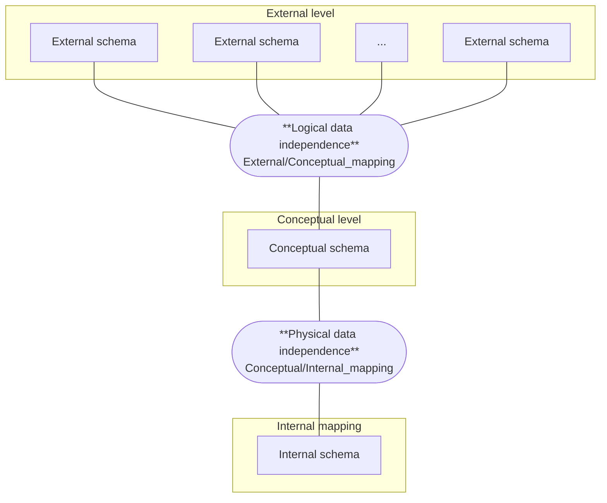

# 第 1 章 关系模型

## 数据模型

### 基本概念

**模型**：客观世界事物的模拟与抽象。

**数据模型**：客观世界事物的**数据**模拟与抽象。通过数据以及数据之间的联系以及约束表达事物特征。

::: info 例如：
建筑沙盘模型、车模、飞机模型等外观模型；也包括各种结构模型和数学模型，例如专业领域还有受力分析模型、概率模型。
:::

### 数据模型建模的基本原则

- **能够比较真实反应客观事物特征**。面向不同应用，特征表达也不同。
- **容易理解**。模型的一个重要作用在于交流。
- **容易计算机实现**。模型最终目的是进入计算机世界。

### 数据模型三要素

- **数据结构**
- **数据操作**
- **完整性约束**

### 模型多样性

视角与用途不同，同一客观对象可能有多种表达模型。

### 数据库中数据模型的三级模式结构与两级映射

如图所示：

