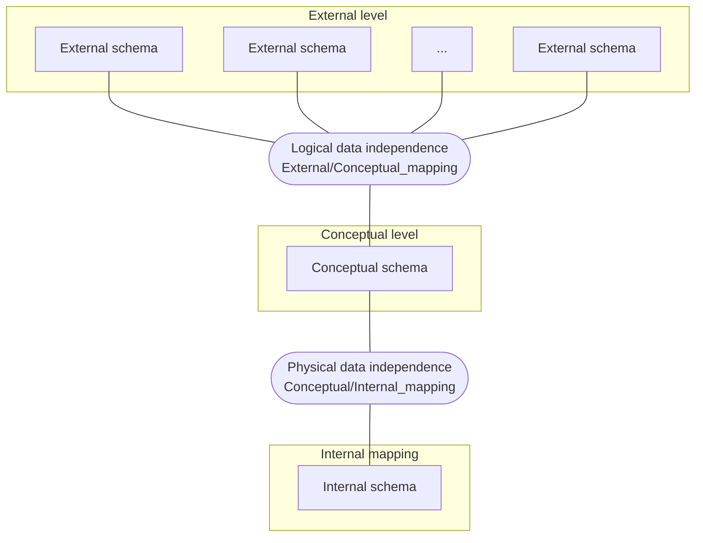
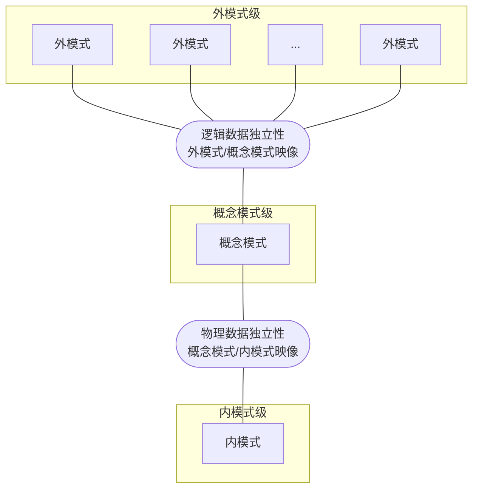

# 第 1 章 关系模型

## 数据模型

### 基本概念

**模型**：客观世界事物的模拟与抽象。

**数据模型**：客观世界事物的**数据**模拟与抽象。通过数据以及数据之间的联系以及约束表达事物特征。

::: info 例如
建筑沙盘模型、车模、飞机模型等外观模型；也包括各种结构模型和数学模型，例如专业领域还有受力分析模型、概率模型。
:::

### 数据模型建模的基本原则

- **能够比较真实反应客观事物特征**。面向不同应用，特征表达也不同。
- **容易理解**。模型的一个重要作用在于交流。
- **容易计算机实现**。模型最终目的是进入计算机世界。

### 数据模型三要素

- **数据结构**
- **数据操作**
- **完整性约束**

### 模型多样性

视角与用途不同，同一客观对象可能有多种表达模型。

### 数据库中数据模型的三级模式结构与两级映射

如图所示：

对应中文图示：

## 关系模型

### 基本概念

关系模型的出现主要来源于人们对于如何表达现实世界中的数据以及数据与数据之间的联系的思考。从**层次模型**到**网状模型**，再到**关系模型**：

- **层次模型**：以层次结构（树结构）表达数据以及数据之间的联系。虽然这种结构相对简单，并且检索效率较高，但是并不能完全表达客观数据之间的实际联系。一旦子孙节点与祖先节点发生某种联系，层次化结构将会被打破。
- **网状模型**：以网状结构（图结构）表达数据以及数据之间的联系。这种结构对于表达客观世界数据之间的联系相对充分，但结构相对复杂，检索效率不高。
- **关系模型**：以关系结构表达数据以及数据之间的联系。关系是数据与数据之间的一种逻辑联系，关系基于集合论，有相对严格与完备的数学基础。

### 关系模型特征

#### 数据结构

**数据结构**：

- 关系模型建立在数学概念**关系**（relation）的基础上，在物理上通常表示为一张二维表。
- 关系数据结构主要建立在数学中的集合论和谓词逻辑基础之上。

**关系**：

- 关系是一张由行和列组成的 **表**。
- 数学定义：关系是 $n$ 个集合的笛卡尔乘积中若干 $n$ 元组构成的任意有限子集。

::: tip 注
笛卡尔乘积：

设 $D_1$, $D_2$, $\dots$, $D_n$ 为 $n$ 个集合。它们的笛卡尔乘积定义为

$$D_1 \times D_2 \times \dots \times D_n = \{(d_1,d_2,\dots,d_n)|d_1 \in D_1, d_2 \in D_2, \dots, d_n \in D_n\}$$
:::

**关系的性质**：

- 关系必须是一个有限集合。
- 属性的次序无关紧要。
- 同一属性的取值必须来自同一域，因而具有同质性。
- 元组的次序无关紧要。
- 关系中每个分量必须是不可再分的原子值。
- 关系中的每个元组必须互不相同。

**关系中的码或键（Key）**

- 超码（Super key）：关系中能够唯一标识一个元组的一个属性或属性组。
- 候选码（Candidate key）：不含多余属性的超码，即其任一真子集都不能作为超码。
- 主码（Primary key）：从候选码中选定的、用于唯一标识元组的码。一个关系通常只选一个主码。
- 备用码（Alternate key）：没有被选作主码的其余候选码。
- 外码（Foreign key）：一个关系中的某个属性或属性组，它对应于另一个关系（或同一关系）的候选码。

**关系模式（Relation Schema）的表示**

关系模式通常写为：关系名后跟属性名表，并将属性名放在圆括号内。

通常用下划线标出主码。

::: info 例如
Student (<u>sNo</u>, sName, sSex, sAge, sDept)

Course (<u>cNo</u>, cName, cPNo, cCredit)

SC (<u>sNo</u>, <u>cNo</u>, score)
:::

#### 完整性约束

1. **实体完整性（Entity integrity）**

   在基本关系中，主码的任何属性都不能为空值。

1. **参照完整性（Referential integrity）**

   如果一个关系中存在外码，那么该外码的值必须要么取其所参照关系中某个元组的候选码值，要么全部为空值。

1. **用户定义完整性（Enterprise constraints）**

   用户或数据库管理员根据具体应用语义所规定的附加约束条件。

**关于空值 Null 的含义**：

- 空值表示某个属性的值当前未知，或者该属性值对该元组不适用。
- 由于关系模型建立在谓词演算基础之上，而谓词演算采用的是二值逻辑（布尔逻辑），因此空值会带来实现上的问题。
- 是否应在关系模型中引入空值，一直是一个有争议的问题。

## 关系代数

### 关系模型的特征

关系操作（Relational manipulation）：

- 关系模型中的数据操作，本质上就是对关系或集合的操作。
- 关系代数和关系演算都是形式化的、面向用户不够友好的语言，但它们构成了关系数据库中更高层数据操纵语言（DML）的理论基础。
- 关系代数和关系演算在表达能力上是等价的。
- 关系代数是一种理论化语言，它通过对一个或多个关系进行运算，在不改变原关系的前提下定义出新的关系。
- 关系代数满足封闭性，即运算对象和运算结果都是关系。
- 运算的操作数和结果均为关系。

### 关系代数

#### 并（Union）

- 两个关系 $R$ 和 $S$ 的并运算所得到的关系，包含属于 $R$、属于 $S$ 或同时属于 $R$ 和 $S$ 的所有元组，其中重复元组只保留一次。
- $R$ 和 $S$ 必须是并相容的。
- 两个关系的元数（degree）必须相同。
  $$R∪S=\{t|t∈R∨t∈S\}$$

::: details 例

| $R$ | A   | B   | C   |
| :-- | :-- | :-- | :-- |
|     | 3   | 6   | 7   |
|     | 2   | 5   | 7   |
|     | 7   | 2   | 3   |
|     | 4   | 4   | 3   |

| $S$ | A   | B   | C   |
| :-- | :-- | :-- | :-- |
|     | 3   | 4   | 5   |
|     | 7   | 2   | 3   |

| $R∪S$ | A     | B     | C     |
| :---- | :---- | :---- | :---- |
|       | 3     | 6     | 7     |
|       | 2     | 5     | 7     |
|       | 7     | 2     | 3     |
|       | 4     | 4     | 3     |
|       | **3** | **4** | **5** |

:::

#### 差（Difference）

- 差运算得到的关系由所有属于关系 $R$ 但不属于关系 $S$ 的元组组成。
- $R$ 和 $S$ 必须是并相容的。
  $$R－S=\{t|t∈R∧t∉S\}$$

::: details 例

| $R$ | A   | B   | C   |
| :-- | :-- | :-- | :-- |
|     | 3   | 6   | 7   |
|     | 2   | 5   | 7   |
|     | 7   | 2   | 3   |
|     | 4   | 4   | 3   |

| $S$ | A   | B   | C   |
| :-- | :-- | :-- | :-- |
|     | 3   | 4   | 5   |
|     | 7   | 2   | 3   |

| $R-S$ | A   | B   | C   |
| :---- | :-- | :-- | :-- |
|       | 3   | 6   | 7   |
|       | 2   | 5   | 7   |
|       | 4   | 4   | 3   |

| $S-R$ | A   | B   | C   |
| :---- | :-- | :-- | :-- |
|       | 3   | 4   | 5   |

:::

#### 交（Intersection）

- 交运算得到的关系由同时属于 $R$ 和 $S$ 的所有元组组成。
- $R$ 和 $S$ 必须是并相容的。
  $$R∩S=\{t|t∈R∧t∈S\}$$
  $$R∩S=R-(R-S)$$

::: details 例_

| $R$ | A   | B   | C   |
| :-- | :-- | :-- | :-- |
|     | 3   | 6   | 7   |
|     | 2   | 5   | 7   |
|     | 7   | 2   | 3   |
|     | 4   | 4   | 3   |

| $S$ | A   | B   | C   |
| :-- | :-- | :-- | :-- |
|     | 3   | 4   | 5   |
|     | 7   | 2   | 3   |

| $R∩S$ | A   | B   | C   |
| :---- | :-- | :-- | :-- |
|       | 7   | 2   | 3   |

:::

#### 笛卡尔积（Cartesian product）

- 笛卡尔积运算得到的关系，是将关系 $R$ 的每一个元组与关系 $S$ 的每一个元组依次连接后形成的关系。
  $$R\times S =\{t|t=\langle t_r, t_s \rangle ∧ t_r∈R ∧ t_s∈S\}$$
- 设关系 $R$ 和 $S$ 的元数分别为 $m$ 和 $n$，基数分别为 $k_1$ 和 $k_2$。
- 新关系的元数为 $m+n$。
- 新关系的基数为 $k1\times k2$。

::: details 例

| $R$ | A   | B   |
| :-- | :-- | :-- |
|     | a   | 1   |
|     | b   | 2   |

| $S$ | C   | D   | E   |
| :-- | :-- | :-- | :-- |
|     | a   | 10  | x   |
|     | b   | 10  | x   |
|     | b   | 20  | y   |
|     | c   | 10  | y   |

| $R\times S$ | A   | B   | C   | D   | E   |
| :---------- | :-- | :-- | :-- | :-- | --- |
|             | a   | 1   | a   | 10  | x   |
|             | a   | 1   | b   | 10  | x   |
|             | a   | 1   | b   | 20  | y   |
|             | a   | 1   | c   | 10  | y   |
|             | b   | 2   | a   | 10  | x   |
|             | b   | 2   | b   | 10  | x   |
|             | b   | 2   | b   | 20  | y   |
|             | b   | 2   | c   | 10  | y   |

:::

#### 选择（Selection or Restriction）

- 选择运算作用于单个关系 $R$，其结果是由 $R$ 中满足给定条件（谓词）的那些元组组成的新关系。
  $$\sigma_F(R)=\{t|t∈R∧F(t)=\text{true}\}$$
- 选择运算是从行的角度对关系进行操作。

::: details 例

| $R$ | A   | B   | C   |
| :-- | :-- | :-- | :-- |
|     | 3   | 6   | 7   |
|     | 2   | 5   | 7   |
|     | 7   | 2   | 3   |
|     | 4   | 4   | 3   |

| $\sigma_{A<5}(R)$ | A   | B   | C   |
| :---------------- | :-- | :-- | :-- |
|                   | 3   | 6   | 7   |
|                   | 2   | 5   | 7   |
|                   | 4   | 4   | 3   |

| $\sigma_{A<5 ∨ C=7}(R)$ | A   | B   | C   |
| :---------------------- | :-- | :-- | :-- |
|                         | 3   | 6   | 7   |
|                         | 2   | 5   | 7   |

:::

#### 投影（Projection）

- 投影运算作用于单个关系 $R$，其结果是由 $R$ 中指定属性列构成的纵向子集，并且会消去重复元组。
  $$\prod_A(R) = \{ t[A] | t∈R \}$$
- 投影运算是从列的角度对关系进行操作。

::: details 例

| $R$ | A   | B   | C   |
| :-- | :-- | :-- | :-- |
|     | a   | b   | c   |
|     | d   | e   | f   |
|     | c   | b   | c   |

| $\prod_{B,C}(R)$ | B   | C   |
| :--------------- | :-- | :-- |
|                  | b   | c   |
|                  | e   | f   |

| $\prod_A(R)$ | A   |
| :----------- | :-- |
|              | a   |
|              | d   |
|              | c   |

:::

#### 连接（Join）

- $\theta$ 连接运算是从关系 $R$ 与 $S$ 的笛卡尔积中选取满足谓词 $F$ 的元组所构成的关系。谓词 $F$ 的形式为 $R.a_i\theta S.b_i$，其中 $θ$ 可以是比较运算符 $<$、$≤$、$>$、$≥$、$=$、$≠$ 中的任意一种。
  $$\underset{A \theta B}{R \Join S}=\{\stackrel\frown{t_rt_s} | t_r∈R ∧ t_s∈S ∧ t_r[A]\theta t_s[B]\}$$
- $\theta$ 连接可以用基本的选择运算和笛卡尔积运算来表示。
  $$\underset{A \theta B}{R \Join S}=\sigma_{R[A] \theta S[B]}(R \times S)$$

::: details 例

| $R$ | A   | B   | C   |
| :-- | :-- | :-- | :-- |
|     | 1   | 2   | 3   |
|     | 4   | 5   | 6   |
|     | 7   | 8   | 9   |

| $S$ | D   | E   |
| :-- | :-- | :-- |
|     | 3   | 1   |
|     | 6   | 2   |

| $\underset{B<D}{R \Join S}$ | A   | B   | C   | D   | E   |
| :-------------------------- | :-- | :-- | :-- | :-- | :-- |
|                             | 1   | 2   | 3   | 3   | 1   |
|                             | 1   | 2   | 3   | 6   | 2   |
|                             | 4   | 5   | 6   | 6   | 2   |

:::

#### 相等连接（Equijoin）

当 $\theta$ 连接中的 $θ$ 取等号 $=$ 时，这种特殊的 $\theta$ 连接称为相等连接。

$$\underset{A = B}{R \Join S}=\{\stackrel\frown{t_rt_s} | t_r∈R ∧ t_s∈S ∧ t_r[A]\theta t_s[B]\}$$

#### 自然连接（Natural join）

- 自然连接是关系 $R$ 和 $S$ 在所有同名公共属性 $x$ 上进行的相等连接，并在结果中去掉重复出现的一份公共属性。
  $$R \Join S=\{\stackrel\frown{t_rt_s} | t_r∈R ∧ t_s∈S ∧ t_r[x]\theta t_s[x]\}$$
- **当 $R$ 和 $S$ 没有公共属性时，自然连接就等价于笛卡尔积。**

::: details 例 1

| $R$ | A   | B   | C   |
| :-- | :-- | :-- | :-- |
|     | 1   | 2   | 3   |
|     | 4   | 5   | 6   |
|     | 7   | 8   | 9   |

| $S$ | C   | D   |
| :-- | :-- | :-- |
|     | 3   | 1   |
|     | 6   | 2   |

| $R \Join S$ | A   | B   | C   | D   |
| :---------- | :-- | :-- | :-- | :-- |
|             | 1   | 2   | 3   | 1   |
|             | 4   | 5   | 6   | 2   |

:::

::: details 例 2

| $R$ | A   | B     | C   | D     |
| :-- | :-- | :---- | :-- | :---- |
|     | 1   | **1** | 1   | **a** |
|     | 2   | 2     | 3   | a     |
|     | 3   | 4     | 2   | b     |
|     | 1   | **1** | 3   | **a** |
|     | 4   | **2** | 2   | **b** |

| $S$ | B     | D     | E   |
| :-- | :---- | :---- | :-- |
|     | **1** | **a** | 1   |
|     | 3     | a     | 2   |
|     | **1** | **a** | 3   |
|     | **2** | **b** | 4   |
|     | 3     | b     | 5   |

| $R \Join S$ | A   | B   | C   | D   | E   |
| :---------- | :-- | :-- | :-- | :-- | :-- |
|             | 1   | 1   | 1   | a   | 1   |
|             | 1   | 1   | 1   | a   | 3   |
|             | 1   | 1   | 3   | a   | 1   |
|             | 1   | 1   | 3   | a   | 3   |
|             | 4   | 2   | 2   | b   | 5   |

:::

#### 外连接（Outer join）

- 在连接两个关系时，一个关系中的某些元组可能在另一个关系中找不到与之匹配的元组。有时即使没有匹配值，也希望这些元组仍然出现在结果中。
- （左）外连接是指：关系 $R$ 中那些在关系 $S$ 的公共属性上没有匹配值的元组，也要保留在结果关系中。
- **第二个关系中缺失的属性值用 `Null` 填充。**
- 左外连接记作 $R$ ⟕ $S$，右外连接记作 $R$ ⟖ $S$，全外连接记作 $R$ ⟗ $S$。

::: details 例

| $T$ | tNo | tName | salary |
| :-- | :-- | :---- | :----- |
|     | p01 | 赵明  | 8000   |
|     | p02 | 钱丰  | 7000   |
|     | p03 | 孙丽  | 6000   |
|     | p04 | 李广  | 6000   |

| $C$ | cNo | cName      | tNo |
| :-- | :-- | :--------- | :-- |
|     | c01 | 离散数学   | p01 |
|     | c02 | 数据结构   | p02 |
|     | c03 | 数据库系统 | p04 |

| $T$ ⟕ $C$ | tNo | tName | salary | cNo  | cName      |
| :-------- | :-- | :---- | :----- | :--- | :--------- |
|           | p01 | 赵明  | 8000   | c01  | 离散数学   |
|           | p02 | 钱丰  | 7000   | c02  | 数据结构   |
|           | p04 | 李广  | 6000   | c03  | 数据库系统 |
|           | p03 | 孙丽  | 6000   | Null | Null       |

:::

#### 像集（Images set）

- 设关系为 $R(X,Z)$，其中 $X$ 和 $Z$ 是 $R$ 的两个属性组。对每一个满足 $t[X]=x$ 的取值 $x$，可以定义 $x$ 在关系 $R$ 中关于属性组 $Z$ 的像集 $Z_x$：
  $$Z_x=\{t[Z]|t∈R,t[X]=x\}$$
- 像集表示 $R$ 中属性组 $X$ 上值为 $x$ 的诸元组在 $Z$ 上分量的集合。

::: details 例

| $R$ | 姓名（$X$） | 课程（$Z$） |
| :-- | :---------- | :---------- |
|     | 张军        | 物理        |
|     | 王红        | 数学        |
|     | 张军        | 数学        |

- $x = \text{张军}$

  张军同学所选修的全部课程：

  | $Z_x = \text{张军}$ | 课程 |
  | :------------------ | :--- |
  |                     | 物理 |
  |                     | 数学 |

- $x = \text{王红}$

  王红同学所选修的全部课程：

  | $Z_x = \text{王红}$ | 课程 |
  | :------------------ | :--- |
  |                     | 数学 |

:::

#### 除法（Division）

- 给定关系 $R(X,Y)$ 和 $S(Y,Z)$，其中 $X$, $Y$, $Z$ 为属性组。$R$ 中的 $Y$ 与 $S$ 中的 $Y$ 可以有不同的属性名，但必须出自相同的域集。$R$ 与 $S$ 的除运算得到一个新的关系 $P(X)$，$P$ 是 $R$ 中满足下列条件的元组在 $X$ 属性列上的投影：元组在 $X$ 上分量值 $x$ 的象集 $Y_x$ 包含 $S$ 在 $Y$ 上投影的集合。记作:
  $$R÷S=\{t_r[X]|t_r\in R∧\prod_Y(S)\subseteq Y_x\}$$
- 除法运算还可以用差运算和笛卡尔积运算改写为：
  $$R÷S=\prod_X(R)−\prod_X(\prod_X(R)\times \prod_Y(S)−R)$$

::: details 例

| $R$ | A   | B   | C   | D   |
| :-- | :-- | :-- | :-- | :-- |
|     | a   | b   | c   | d   |
|     | a   | b   | e   | f   |
|     | a   | b   | d   | e   |
|     | b   | c   | e   | f   |
|     | e   | d   | c   | d   |
|     | e   | d   | e   | f   |

| $S$ | C   | D   |
| :-- | :-- | :-- |
|     | c   | d   |
|     | e   | f   |

$$
\begin{aligned}
CD_{(a,b)} &= \{(c,d),(e,f),(d,e)\} \\
CD_{(b,c)} &= \{(e,f)\} \\
CD_{(e,d)} &= \{(c,d),(e,f)\} \\
\{(c,d),(e,f)\} &\subseteq CD_{(a,b)} \\
\{(c,d),(e,f)\} &\subseteq CD_{(e,d)} \\
\Rightarrow R \div S &= \{(a,b),(e,d)\}
\end{aligned}
$$

| $\prod_{AB}(R)$ | A   | B   |
| :------------ | :-- | :-- |
|               | a   | b   |
|               | b   | c   |
|               | e   | d   |

| $\prod_{AB}(R) \times \prod_{CD}(S)$ | A   | B   | C   | D   |
| :------------------------------- | :-- | :-- | :-- | :-- |
|                                  | a   | b   | c   | d   |
|                                  | a   | b   | e   | f   |
|                                  | b   | c   | c   | d   |
|                                  | b   | c   | e   | f   |
|                                  | e   | d   | c   | d   |
|                                  | e   | d   | e   | f   |

| $\prod_{AB}(R) \times \prod_{CD}(S) - R$ | A   | B   | C   | D   |
| :----------------------------------- | :-- | :-- | :-- | :-- |
|                                      | b   | c   | c   | d   |

| $\prod_{AB}\left( \prod_{AB}(R) \times \prod_{CD}(S) - R \right)$ | A   | B   |
| :--------------------------------------------------------- | :-- | :-- |
|                                                            | b   | c   |

| $R \div S$ | A   | B   |
| :--------- | :-- | :-- |
|            | a   | b   |
|            | e   | d   |

:::

#### 除法的内涵

  <table>
    <thead>
      <tr>
        <th>姓名</th>
        <th>课程</th>
      </tr>
    </thead>
    <tbody>
      <tr>
        <td>张军</td>
        <td>物理</td>
      </tr>
      <tr>
        <td>王红</td>
        <td>数学</td>
      </tr>
      <tr>
        <td>张军</td>
        <td>数学</td>
      </tr>
      <tr>
        <td>王红</td>
        <td>物理</td>
      </tr>
    </tbody>
  </table>
  ÷
  <table>
    <thead>
      <tr>
        <th>课程</th>
      </tr>
    </thead>
    <tbody>
      <tr>
        <td>物理</td>
      </tr>
      <tr>
        <td>数学</td>
      </tr>
    </tbody>
  </table>
  =
  <table>
    <thead>
      <tr>
        <th>姓名</th>
      </tr>
    </thead>
    <tbody>
      <tr>
        <td>张军</td>
      </tr>
      <tr>
        <td>王红</td>
      </tr>
    </tbody>
  </table>

  <table>
    <thead>
      <tr>
        <th>姓名</th>
        <th>课程</th>
        <th>成绩</th>
      </tr>
    </thead>
    <tbody>
      <tr>
        <td>张军</td>
        <td>物理</td>
        <td>93</td>
      </tr>
      <tr>
        <td>王红</td>
        <td>数学</td>
        <td>86</td>
      </tr>
      <tr>
        <td>张军</td>
        <td>数学</td>
        <td>93</td>
      </tr>
      <tr>
        <td>王红</td>
        <td>物理</td>
        <td>92</td>
      </tr>
    </tbody>
  </table>
  ÷
  <table>
    <thead>
      <tr>
        <th>课程</th>
      </tr>
    </thead>
    <tbody>
      <tr>
        <td>物理</td>
      </tr>
      <tr>
        <td>数学</td>
      </tr>
    </tbody>
  </table>
  =
  <table>
    <thead>
      <tr>
        <th>姓名</th>
        <th>成绩</th>
      </tr>
    </thead>
    <tbody>
      <tr>
        <td>张军</td>
        <td>93</td>
      </tr>
    </tbody>
  </table>

