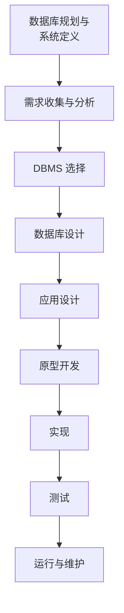
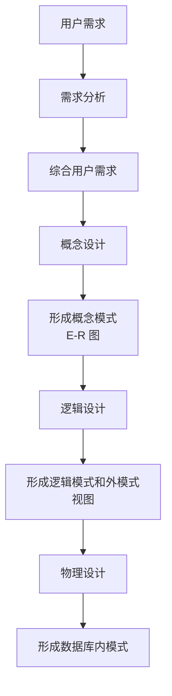

# 3.1 数据库设计概述

## 数据库系统生存周期

数据库是信息系统的**核心组成部分**，其生命周期与支撑它的信息系统生命周期紧密相连。完整的数据库系统生存周期包含以下阶段：

### 各阶段核心任务

| 阶段           | 核心任务                                         | 主要产出                             |
| -------------- | ------------------------------------------------ | ------------------------------------ |
| 数据库规划     | 制定数据库项目目标和任务，评估现有系统和 IT 机会 | 数据库应用程序的任务陈述和任务目标   |
| 系统定义       | 确定数据库应用的范围、边界和主要用户视图         | 数据库应用范围边界定义、用户视图定义 |
| 需求收集与分析 | 收集并分析用户对数据和处理的需求                 | 用户和系统需求说明书                 |
| 数据库设计     | 构建满足需求的数据库结构                         | 概念/逻辑/物理数据库设计             |
| 应用设计       | 设计用户界面和应用程序                           | 应用程序设计文档                     |
| DBMS 选择      | 评估并选择合适的数据库管理系统                   | DBMS 评估和推荐报告                  |
| 原型开发       | 构建系统原型验证需求                             | 改进的需求说明书                     |
| 实现           | 编写代码、创建数据库、加载数据                   | 可运行的数据库系统                   |
| 测试           | 验证系统功能和性能                               | 测试策略、测试结果分析               |
| 运行与维护     | 系统上线运行，持续监控和优化                     | 用户手册、性能分析报告               |

::: tip 重要提示
需求分析和概念设计阶段**独立于任何 DBMS**，逻辑设计和物理设计则与选用的 **DBMS** 密切相关。
:::

## 数据库设计的定义与目标

### 定义

数据库设计是指对于一个给定的应用环境，构造优化的**数据库逻辑模式**和**物理结构**，并据此建立数据库及其应用系统，使之能够有效地存储和管理数据，满足各种用户的应用需求。

### 用户需求分类

1. **信息管理要求**：数据库中需要存储和管理哪些数据对象
2. **数据操作要求**：对数据对象需要进行哪些操作（查询、增删改、统计等）

### 设计目标

为用户和各种应用系统提供一个信息基础设施和高效率的运行环境：

- **数据库数据的存取效率高**
- **数据库存储空间的利用率高**
- **数据库系统运行管理的效率高**

## 数据库设计的六个阶段

数据库设计是一个**迭代过程**，通常分为**六个主要阶段**：

### 1. 需求分析阶段

- **任务**：详细调查现实世界要处理的对象，充分了解原系统工作概况，明确用户的各种需求
- **调查重点**："数据"和"处理"
- **用户需求的三个方面**：
  - **信息要求**：需要从数据库中获得的信息内容与性质
  - **处理要求**：需要完成的处理功能和对处理性能的要求
  - **安全性与完整性要求**

::: info 需求分析方法
常用的需求收集方法：

1. **跟班作业**：亲身参加业务工作了解情况
2. **开调查会**：与用户座谈交流
3. **请专人介绍**
4. **询问**：针对特定问题进行深入了解
5. **设计调查表**请用户填写
6. **查阅记录**：查阅与原系统有关的数据记录

:::

### 2. 概念结构设计阶段

**任务**：通过对用户需求进行综合、归纳与抽象，形成一个**独立于具体数据库管理系统**的概念模型

**主要工具**：实体 - 联系（ER）模型

**产出**：概念模型（E-R 图）、数据字典

### 3. 逻辑结构设计阶段

**任务**：将概念结构转换为某个数据库管理系统所支持的数据模型，并对其进行优化

**主要工作**：

- **E-R 图转换为关系模型**
- **关系模式规范化**
- **建立必要的视图**

### 4. 物理结构设计阶段

**任务**：为逻辑数据结构选取一个最适合应用环境的物理结构，包括存储结构和存取方法

**主要工作**：

- **存储安排**
- **存取方法选择**
- **存取路径建立**
- **索引设计**

### 5. 数据库实施阶段

**任务**：根据逻辑设计和物理设计的结果构建数据库，编写与调试应用程序，组织数据入库并进行试运行

**主要工作**：

- **创建数据库模式**
- **装入数据**
- **数据库试运行**

### 6. 数据库运行和维护阶段

**任务**：系统投入正式运行后，不断对其进行评估、调整与修改

**主要工作**：

- **性能监测**
- **转储与恢复**
- **数据库重组和重构**

## 数据库各级模式与设计阶段的对应关系

::: info 各级模式详解

- **外模式**：面向用户的局部数据视图，不同用户可以有不同的外模式
- **概念模式**：数据库中全体数据的逻辑结构和特征的描述
- **内模式**：数据物理结构和存储方式的描述

:::

::: warning 常见误区
需求分析是数据库设计的**起点**，其结果是否准确直接影响到后面各个阶段的设计。如果需求分析不充分，后续阶段可能需要**大量返工**，甚至导致整个项目失败。
:::
