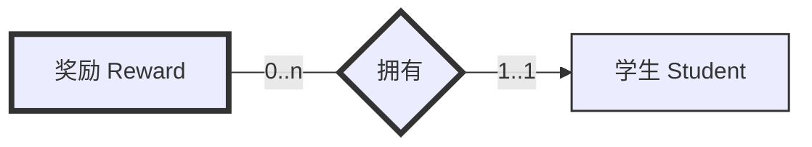
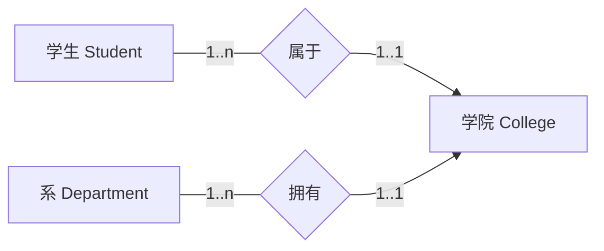
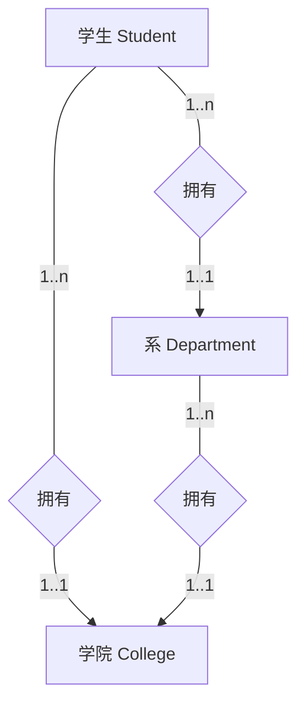
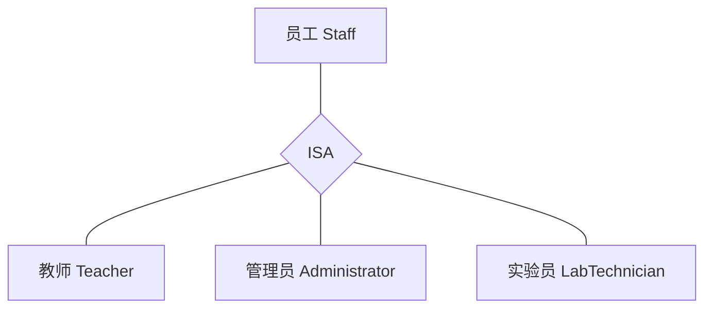

# 3.2 数据库概念设计

## 概念设计概述

### 概念设计的重要性

数据库设计最困难的方面在于设计人员、程序员和最终用户往往以不同的方式看待数据及其使用。为了确保对企业数据及其使用方式有**准确的理解**，需要一个用于**沟通**的模型。

### 概念模型的要求

- **非技术性**，易于理解
- **无二义性**
- 能够**准确表达业务语义**

### 主要工具：实体 - 联系（ER）模型

ER 模型提供了一种**半形式化的表示法**，用于创建高层概念模式。常用的图示表示法包括：

- 统一建模语言（UML）
- 乌鸦脚表示法（Crow's Feet Notation）
- 陈氏表示法（Chen Notation）

## ER 模型的基本元素

### 1. 实体（Entity）

- **定义**：现实世界中可**唯一标识**且具有**独立存在**的对象
- **实体类型**：具有相同属性的实体的集合
- **表示方法**：用矩形表示，矩形内标注实体名称（通常为单数名词）

::: info 示例

- 强实体：学生（Student）、课程（Course）、教师（Teacher）
- 弱实体：奖励（Reward）、成绩（Score）

:::

### 2. 属性（Attribute）

- **定义**：实体或联系类型的性质
- **属性域**：一个或多个属性允许取值的集合
- **属性分类**：

| 属性类型 | 定义                                   | 示例                       |
| -------- | -------------------------------------- | -------------------------- |
| 简单属性 | 由单一组件组成，具有独立存在性         | 学号（sNo）、姓名（sName） |
| 复合属性 | 由多个组件组成，每个组件都有独立存在性 | 地址（省、市、街道）       |
| 单值属性 | 每个实体实例只能取一个值               | 性别（sex）、年龄（age）   |
| 多值属性 | 每个实体实例可以取多个值               | 电话号码（telNo[1..3]）    |
| 派生属性 | 其值可以从其他相关属性的值推导出来     | 年龄（从出生日期推导）     |

### 3. 联系（Relationship）

- **定义**：两个或多个实体之间有意义的关联
- **联系类型**：相似联系的集合
- **表示方法**：用菱形表示，菱形内标注联系名称，用线段连接相关实体

### 联系的度（Degree）

- **二元联系**：参与联系的实体类型数量为 **2**（最常见）
- **一元联系（递归联系）**：同一实体类型多次参与联系，扮演不同角色
- **多元联系**：参与联系的实体类型数量 **≥ 3**

::: info 递归联系示例

- 员工（Staff）与员工之间的“监督（supervises）”联系：一个员工可以监督多个员工，一个员工只能被一个员工监督
- 学生（Student）与学生之间的“帮助（helps）”联系：一个学生可以帮助多个学生，也可以被多个学生帮助

  员工递归联系可表示为：

  ```mermaid
  flowchart LR
    A[员工 Staff<br/>被监督者] ---|1..1| R{监督<br/>supervises}
    R -->|0..n| B[员工 Staff<br/>监督者]
  ```

  学生递归联系可表示为：

  ```mermaid
  flowchart LR
    R{帮助<br/>helps} -->|0..n| A[学生 Student<br/>帮助者]
    R -->|0..n| B[学生 Student<br/>被帮助者]
  ```

:::

## 联系的约束

ER 模型使用两种**多重性约束**来表达业务规则：**基数比**和**参与约束**。

### 1. 基数比（Cardinality Ratio）

表示联系双方实体参与联系的个体数量关系：

- **一对一（1:1）**：A 中的一个实体最多与 B 中的一个实体相关联，反之亦然
- **一对多（1:n）**：A 中的一个实体可以与 B 中的多个实体相关联，但 B 中的一个实体最多与 A 中的一个实体相关联
- **多对多（m:n）**：A 中的一个实体可以与 B 中的多个实体相关联，反之亦然

### 2. 参与约束（Participation）

表示联系双方实体参与联系的个体参与情况：

- **强制参与（Mandatory participation）**：实体集中的每个实体都必须参与联系
- **可选参与（Optional participation）**：实体集中的实体可以不参与联系

::: info 联系约束示例


- 基数比：**一对多（1:n）**
- 参与约束：
  - 教师：**可选参与（0..n）**，不是所有教师都监督学生
  - 学生：**强制参与（1..1）**，所有学生都必须有一个指导教师

:::

## 强实体与弱实体

### 强实体（Strong Entity）

不依赖于其他实体而存在的实体类型，**有自己的主键**。

### 弱实体（Weak Entity）

存在依赖于其他实体类型的实体类型，其主键**部分或全部来自所依赖的实体**。

:::: info 示例



- 学生是**强实体**，主键为 **sNo**
- 奖励是**弱实体**，存在依赖于学生，主键为 **(sNo, rName)**

::: info 注
弱实体的图示为双边框。
:::

::::

## ER 建模中的常见问题

### 1. 扇形陷阱（Fan Trap）

- **产生原因**：当一个实体类型作为两个“一对多”联系的“一”端时，可能无法表示两个“多”端实体之间的关联
- **典型结构**：`A 1..n → B 1..1 ← C 1..n`
- **问题表现**：无法确定A和C之间的关联关系

::: details 扇形陷阱示例
错误的ER模型：



问题：无法确定某个学生属于哪个系

解决方法：调整联系次序


:::

### 2. 深坑陷阱（Chasm Trap）

- **产生原因**：当联系中存在可选参与时，可能导致某些实体之间的关联丢失
- **典型结构**：`A 1..1 → B 0..1 ← C 1..n`
- **问题表现**：无法表示不通过B直接关联的A和C

::: details 深坑陷阱示例
错误的ER模型：


问题：无法表示不属于任何系的学生属于哪个学院

解决方法：添加直接联系



:::

## 增强的 ER 模型（EER）

增强的 ER 模型在原始 ER 模型的基础上加入了**语义概念**，主要包括**特化/泛化**。

### 特化（Specialization）

从一个实体类型中定义其子集的过程，这些子集具有不同的属性或参与不同的联系。

### 泛化（Generalization）

特化的逆过程，将多个具有共同特征的实体类型抽象为一个更一般的超类。

:::: info 示例



::: tip 注
标准 Chen 记法中，`ISA` 节点应画为**倒三角**。由于 `mermaid` 的 `flowchart` 暂不支持稳定的倒三角节点，此处以上图中的菱形近似表示。

:::

- **Staff** 是**超类**，**Teacher**、**Administrator**、**LabTechnician** 是**子类**
- **子类继承超类的所有属性和联系**
- **子类可以有自己特有的属性和联系**

::::
