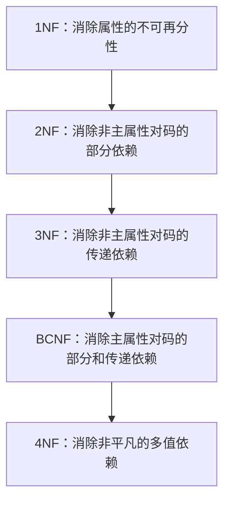

# 3.3 关系模式规范化理论

## 规范化问题的引出

### 关系模式的潜在问题

不规范的关系模式可能导致以下问题：

1. **数据冗余**：相同信息重复存储
2. **插入异常**：无法插入某些信息
3. **删除异常**：删除某些信息时会丢失其他相关信息
4. **更新异常**：更新数据时需要修改多个地方，容易导致不一致

::: info 问题示例

考虑以下关系模式：

教师课程(<u>tNo</u>, tName, addr, cNo, cName, credit)

- 数据冗余：同一教师的姓名和地址会随着其教授的课程数重复存储
- 插入异常：无法插入还没有教授课程的教师信息
- 删除异常：删除某门课程时会同时删除教授该课程的教师信息
- 更新异常：修改教师地址时需要修改所有相关记录

:::

### 关系模式的形式化定义

关系模式可以形式化地表示为五元组：

$$R(U, D, \text{dom}, F)$$

- $R$：关系名
- $U$：属性集合
- $D$：属性域的集合
- $\text{dom}$：属性到域的映射
- $F$：属性之间的数据依赖集合

在实际应用中，通常简化为：
$$R(U, F)$$

## 函数依赖（Functional Dependencies）

### 定义

设 $A$ 和 $B$ 是关系 $R$ 的属性，如果对于 $A$ 的每一个值，$B$ 都有唯一的值与之对应，则称 $B$ **函数依赖**于 $A$，记作 $A \to B$。其中 $A$ 称为**决定因素**。

### 函数依赖的分类

1. **平凡函数依赖**：如果 $A \to B$ 且 $B \subseteq A$
2. **非平凡函数依赖**：如果 $A \to B$ 且 $B \nsubseteq A$

::: tip 注意

平凡函数依赖总是成立的，不反映新的语义。在讨论函数依赖时，通常指非平凡函数依赖。
:::

### 函数依赖与联系的关系

- 如果 $X$ 和 $Y$ 之间是**一对一（1:1）联系**，则 $X \leftrightarrow Y$
- 如果 $X$ 和 $Y$ 之间是**一对多（1:n）联系**，则 $Y \to X$
- 如果 $X$ 和 $Y$ 之间是**多对多（m:n）联系**，则 $X$ 和 $Y$ 之间不存在函数依赖

## Armstrong 公理系统

Armstrong 公理系统是一套用于从已知函数依赖推导出其他函数依赖的**推理规则**。

### 基本公理

1. **自反律（Reflexivity）**：如果 $B \subseteq A$，则 $A \to B$
2. **增广律（Augmentation）**：如果 $A \to B$，则 $AC \to BC$
3. **传递律（Transitivity）**：如果 $A \to B$ 且 $B \to C$，则 $A \to C$

### 导出规则

1. **自决律（Self-determination）**：$A \to A$
2. **分解律（Decomposition）**：如果 $A \to BC$，则 $A \to B$ 且 $A \to C$
3. **合并律（Union）**：如果 $A \to B$ 且 $A \to C$，则 $A \to BC$
4. **复合律（Composition）**：如果 $A \to B$ 且 $C \to D$，则 $AC \to BD$

## 属性闭包

### 定义

设 $F$ 是关系模式 $R(U, F)$ 的函数依赖集，$X \subseteq U$，则所有由 $F$ 逻辑蕴涵的函数依赖 $X \to Y$ 的右部属性 $Y$ 的集合称为 $X$ 关于 $F$ 的**闭包**，记作 $X_F^+$。

### 计算方法

1. 初始化 $X^{(0)} = X$
2. 对于 $F$ 中的每一个函数依赖 $A \to B$，如果 $A \subseteq X^{(i)}$，则 $X^{(i+1)} = X^{(i)} \cup B$
3. 重复步骤 2，直到 $X^{(i)}$ 不再变化

### 应用

- 判断 $X \to Y$ 是否成立：检查 $Y \subseteq X_F^+$
- 求**候选码**：找到最小的 $X$ 使得 $X_F^+ = U$

::: info 属性闭包计算示例

已知关系模式 $R\langle U, F\rangle$，其中：

$$U = \{A, B, C, D, E\}$$
$$F = \{AB \to C, B \to D, C \to E, AC \to B\}$$

求 $(AB)_F^+$：

1. $X^{(0)} = AB$
2. $X^{(1)} = AB \cup C \cup D = ABCD$（由 $AB \to C$ 和 $B \to D$）
3. $X^{(2)} = ABCD \cup E \cup B = ABCDE$（由 $C \to E$ 和 $AC \to B$）
4. $X^{(2)} = U$，计算结束

因此，$(AB)_F^+ = ABCDE$
:::

## 最小函数依赖集

### 定义

一个函数依赖集 $F$ 的**最小依赖集** $F_{min}$ 满足：

1. 所有函数依赖的右部都是单属性
2. 没有冗余的函数依赖（即不存在 $X \to A$，使得 $F - \{X \to A\}$ 与 $F$ 等价）
3. 每个函数依赖的左部没有冗余属性（即不存在 $X \to A$，$X$ 有真子集 $Y$ 使得 $F - \{X \to A\} \cup \{Y \to A\}$ 与 $F$ 等价）

## 范式（Normal Forms）

范式是符合某一种级别的**关系模式的集合**。关系数据库中的关系必须满足一定的要求，满足不同程度要求的为不同范式。

范式之间的包含关系：

$$1NF \supset 2NF \supset 3NF \supset BCNF \supset 4NF \supset 5NF$$

### 第一范式（1NF）

- **定义**：关系中的每个属性都是不可再分的基本数据项
- **要求**：不允许表中有表，不允许有复合属性和多值属性

::: info 1NF示例

不满足1NF的关系：

| sNo | sName | addr | phoneNo                  |
| --- | ----- | ---- | ------------------------ |
| s01 | 赵剑  | No.1 | 02988451234, 02886654321 |
| s02 | 钱斌  | No.2 | 02988451235              |

改造为满足 1NF 的关系（方法一：拆分为多行）：

| sNo | sName | addr | phoneNo     |
| --- | ----- | ---- | ----------- |
| s01 | 赵剑  | No.1 | 02988451234 |
| s01 | 赵剑  | No.1 | 02886654321 |
| s02 | 钱斌  | No.2 | 02988451235 |

改造为满足 1NF 的关系（方法二：拆分为多列）：

| sNo | sName | addr | phoneNo1    | phoneNo2    |
| --- | ----- | ---- | ----------- | ----------- |
| s01 | 赵剑  | No.1 | 02988451234 | 02886654321 |
| s02 | 钱斌  | No.2 | 02988451235 | NULL        |

:::

### 第二范式（2NF）

#### 完全函数依赖与部分函数依赖

- **完全函数依赖**：如果 $X \to Y$，且对于 $X$ 的任何真子集 $X'$，都有 $X' \nrightarrow Y$，则称 $Y$ 完全函数依赖于 $X$，记作 $X \stackrel{F}{\to} Y$
- **部分函数依赖**：如果 $X \to Y$，但 $Y$ 不完全函数依赖于 $X$，则称 $Y$ 部分函数依赖于 $X$，记作 $X \stackrel{P}{\to} Y$

#### 2NF 定义

关系模式 $R$ 属于第二范式，当且仅当 $R$ 属于第一范式，且每一个**非主属性**都**完全函数依赖于候选码**。

::: warning 注意

如果一个关系模式的**主码是单个属性**，那么它一定满足 2NF，因为不存在主码的真子集。
:::

::: info 2NF规范化示例

关系模式 $R(U, F)$：

$$U = \{\text{sNo}, \text{cNo}, \text{score}, \text{credit}\}$$
$$F = \{(\text{sNo}, \text{cNo}) \to \text{score}; \text{cNo} \to \text{credit}\}$$

- 候选码：$(\text{sNo}, \text{cNo})$
- 主属性：sNo, cNo
- 非主属性：score, credit
- 函数依赖分析：
  - $(\text{sNo}, \text{cNo}) \stackrel{F}{\to} \text{score}$（完全依赖）
  - $(\text{sNo}, \text{cNo}) \stackrel{P}{\to} \text{credit}$（部分依赖，因为 $\text{cNo} \to \text{credit}$）

该关系模式**不满足 2NF**，需要分解：

$$R_1(\text{sNo}, \text{cNo}, \text{score}), F_1 = \{(\text{sNo}, \text{cNo}) \to \text{score}\}$$
$$R_2(\text{cNo}, \text{credit}), F_2 = \{\text{cNo} \to \text{credit}\}$$

分解后的 $R_1$ 和 $R_2$ 都满足 2NF。
:::

### 第三范式（3NF）

#### 传递函数依赖

如果 $A \to B$，$B \to C$，且 $B \nrightarrow A$，$C \nsubseteq B$，则称 $C$ **传递函数依赖**于 $A$。

#### 3NF 定义

关系模式 $R$ 属于第三范式，当且仅当 $R$ 属于第二范式，且**没有非主属性传递函数依赖于候选码**。

::: info 3NF规范化示例

关系模式 $R(U, F)$：

$$U = \{\text{sNo}, \text{sName}, \text{dept}, \text{deptAddr}, \text{deptMn}\}$$
$$F = \{\text{sNo} \to \text{sName}, \text{dept}; \text{dept} \to \text{deptAddr}, \text{deptMn}\}$$

- 候选码：sNo
- 主属性：sNo
- 非主属性：sName, dept, deptAddr, deptMn
- 函数依赖分析：
  - $\text{sNo} \to \text{sName}$（直接依赖）
  - $\text{sNo} \to \text{dept}$（直接依赖）
  - $\text{sNo} \stackrel{\text{传递}}{\to} \text{deptAddr}$（传递依赖，因为 $\text{sNo} \to \text{dept}$ 且 $\text{dept} \to \text{deptAddr}$）
  - $\text{sNo} \stackrel{\text{传递}}{\to} \text{deptMn}$（传递依赖）

该关系模式满足 2NF 但**不满足 3NF**，需要分解：

$$R_1(\text{sNo}, \text{sName}, \text{dept}), F_1 = \{\text{sNo} \to \text{sName}, \text{dept}\}$$
$$R_2(\text{dept}, \text{deptAddr}, \text{deptMn}), F_2 = \{\text{dept} \to \text{deptAddr}, \text{deptMn}\}$$

分解后的 $R_1$ 和 $R_2$ 都满足 3NF。
:::

### Boyce-Codd 范式（BCNF）

#### 定义

关系模式 $R$ 属于 BCNF，当且仅当对于 $R$ 的每一个**非平凡函数依赖** $X \to Y$，$X$ 都包含候选码。

换句话说，**BCNF 要求所有的决定因素都是候选码**。

#### 3NF 与 BCNF 的关系

- 满足 BCNF 的关系模式一定满足 3NF
- 满足 3NF 的关系模式不一定满足 BCNF
- 当关系模式存在两个及以上的候选码，且候选码有重叠属性时，可能出现满足 3NF 但不满足 BCNF 的情况

::: info BCNF示例

关系模式 $\text{STJ}(S, T, J)$，其中：

- S 表示学生，T 表示教师，J 表示课程
- 语义：每一教师只教一门课；每门课有若干教师；某一学生选定某门课，就对应一个固定的教师

函数依赖：

$$(S, J) \to T; (S, T) \to J; T \to J$$

- 候选码：$(S, J)$ 和 $(S, T)$
- 主属性：S, T, J
- 非主属性：无

该关系模式满足 3NF（因为没有非主属性），但**不满足 BCNF**（因为 $T \to J$，而 $T$ 不是候选码）。

分解为 BCNF：

$$\text{ST}(S, T), F_1 = \{(S, T) \to T\}$$
$$\text{TJ}(T, J), F_2 = \{T \to J\}$$
:::

### 第四范式（4NF）

#### 多值依赖（Multi-valued Dependency, MVD）

设 $R(U)$ 是属性集 $U$ 上的一个关系模式，$X, Y, Z$ 是 $U$ 的子集，且 $Z = U - X - Y$。如果对于 $R(U)$ 的任意一个关系 $r$，给定一对 $(x, z)$ 值，有一组 $Y$ 的值与之对应，且这组 $Y$ 的值仅由 $x$ 值决定而与 $z$ 值无关，则称 $Y$ **多值依赖**于 $X$，记作 $X \twoheadrightarrow Y$。

#### 4NF 定义

关系模式 $R$ 属于第四范式，当且仅当 $R$ 属于 BCNF，且**没有非平凡的多值依赖**。

::: info 4NF示例

关系模式 Course-Teacher-Reference：

| course  | teacher | references |
| ------- | ------- | ---------- |
| math    | 孙丽    | 高等数学   |
| math    | 孙丽    | 数学分析   |
| math    | 李苗    | 高等数学   |
| math    | 李苗    | 数学分析   |
| physics | 赵明    | 大学物理   |
| physics | 赵明    | 物理习题集 |

多值依赖：
$$\text{course} \twoheadrightarrow \text{teacher}$$
$$\text{course} \twoheadrightarrow \text{references}$$

该关系模式满足 BCNF 但**不满足 4NF**，需要分解：

$$\text{Course-Teacher}(\text{course}, \text{teacher})$$
$$\text{Course-Reference}(\text{course}, \text{references})$$
:::

## 规范化过程总结

::: tip 工程实践建议
在实际工程中，通常将关系模式规范化到 **3NF** 即可。更高的范式虽然可以进一步减少数据冗余，但可能会增加**连接操作的开销**，影响查询性能。
:::
