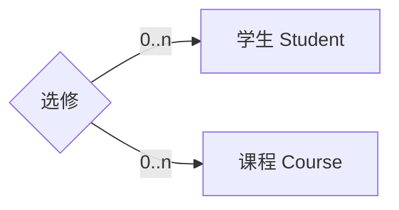
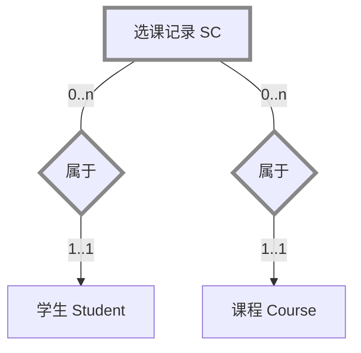
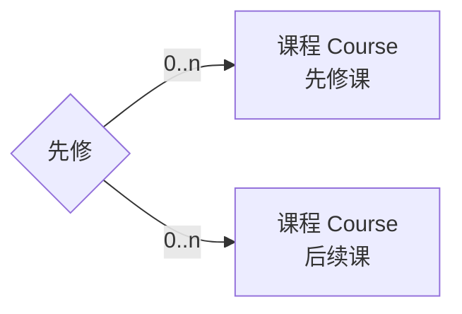
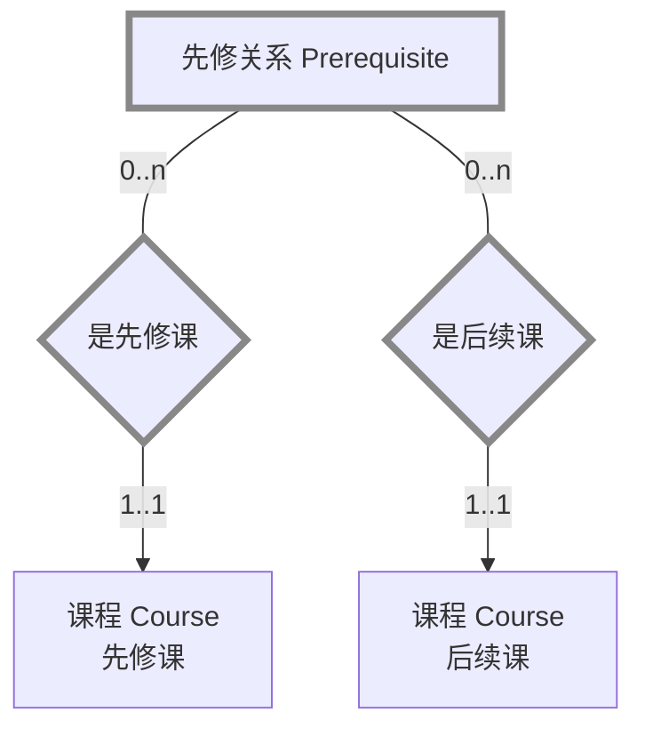
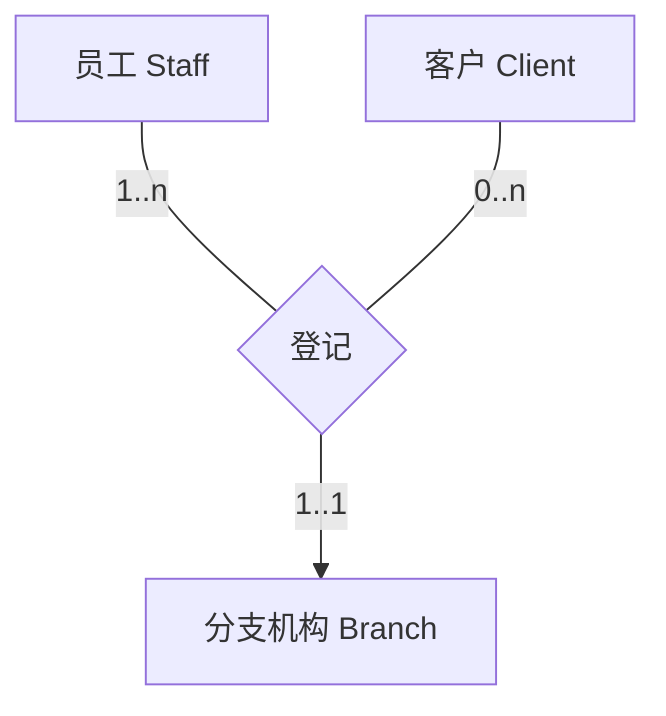
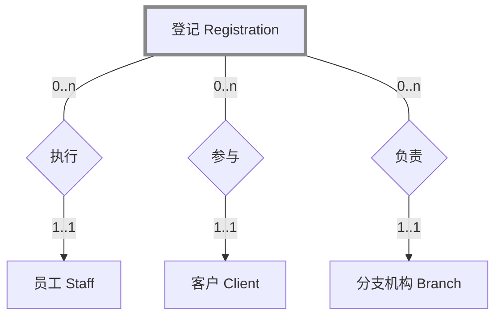
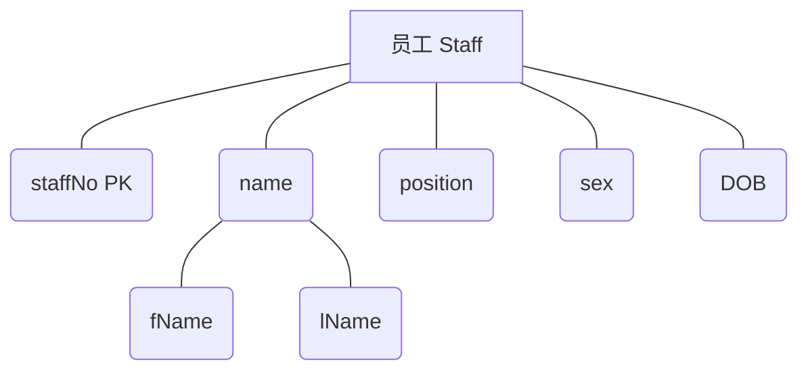
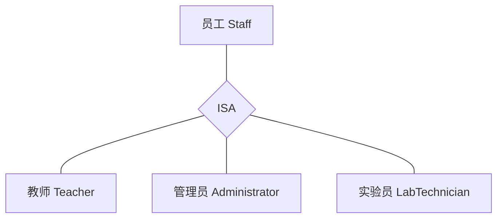

# 3.4 ER 模型向关系模型的映射

## 映射目标与任务

### 目标

创建一组**关系模式**和**约束**来表示 ER 模型中的元素，并满足用户的需求。

### 映射前的准备工作

在进行正式映射之前，需要先移除 ER 模型中难以直接映射的特征：

1. 移除**多对多（\*:\*）二元联系类型**
2. 移除**多对多（\*:\*）递归联系类型**
3. 移除复杂联系类型（三元及以上联系）
4. 移除**多值属性**

## 预处理步骤详解

### 1. 处理多对多（\*:\*）二元联系

- **方法**：将多对多联系分解为一个**中间实体（弱实体）**，然后用两个**一对多（1:\*）联系**代替原来的多对多联系
- **中间实体的属性**：包含联系本身的所有属性，以及参与联系的所有实体的主键（作为外键）

::: info 示例

学生与课程之间的“选修”联系是多对多联系：



分解为：



选课记录的属性：`sNo`（外键）、`cNo`（外键）、`score`、`dateOf`
:::

### 2. 处理多对多（\*:\*）递归联系

- **方法**：与处理二元多对多联系类似，创建一个中间实体，然后用两个一对多联系连接到原实体
- **注意**：需要为两个联系指定不同的角色名

::: info 示例

课程之间的“先修”联系是多对多递归联系：



分解为：



先修关系的属性：`preCourseNo`（外键）、`postCourseNo`（外键）
:::

### 3. 处理复杂联系类型

- **方法**：将复杂联系（三元及以上）分解为一个中间实体，然后用多个一对多联系连接到参与的实体

::: info 示例

员工、客户和分支机构之间的“登记”联系是三元联系：



分解为：



登记的属性：`staffNo`（外键）、`clientNo`（外键）、`branchNo`（外键）、`date`
:::

### 4. 处理多值属性

- **方法**：将多值属性分解为一个独立的实体，然后用一对多联系连接到原实体
- **新实体的属性**：多值属性本身，以及原实体的主键（作为外键）

::: info 示例

分支机构的电话号码是多值属性：

```mermaid
flowchart TD
  B[分支机构 Branch]
  A1(branchNo PK)
  A2(address)
  A3(telNo [1..3])

  B --- A1
  B --- A2
  B --- A3
```

分解为：


电话的属性：`branchNo`（外键）、`telNo`（主键）
:::

## 基本元素的映射规则

### 1. 强实体类型的映射

- **规则**：为每个强实体创建一个关系，包含该实体的所有简单属性
- **复合属性处理**：只包含组成复合属性的简单属性
- **主键**：实体的主键作为关系的主键

::: info 示例

员工实体：



映射为关系：

```sql
Staff(
  staffNo,
  fName,
  lName,
  position,
  sex,
  DOB
)
PRIMARY KEY (staffNo)
```

:::

### 2. 弱实体类型的映射

- **规则**：为每个弱实体创建一个关系，包含该弱实体的所有简单属性
- **主键**：弱实体的主键部分或全部来自其所有者实体的主键
- **外键**：包含所有者实体的主键作为外键

::: info 示例

奖励是依赖于学生的弱实体：


学生：`sNo`（主键）、`sName`、`sex`、`DOB`  
奖励：`rName`、`level`

映射为关系：

```sql
Student(
  sNo,
  sName,
  sex,
  DOB
)
PRIMARY KEY (sNo)

Reward(
  sNo,
  rName,
  level
)
PRIMARY KEY (sNo, rName)
FOREIGN KEY (sNo) REFERENCES Student(sNo)
```

:::

### 3. 一对多（1:\*）二元联系的映射

- **规则**：将"一"方实体的主键作为外键添加到"多"方实体的关系中
- **联系属性处理**：如果联系有属性，也将其添加到"多"方实体的关系中

::: info 示例

部门与学生之间的“拥有”联系是一对多联系：


部门：`dNo`（主键）、`dName`、`officeRoom`、`homepage`  
学生：`sNo`（主键）、`sName`、`sex`、`DOB`、`address`、`email`

映射为关系：

```sql
Department(
  dNo,
  dName,
  officeRoom,
  homepage
)
PRIMARY KEY (dNo)

Student(
  sNo,
  sName,
  sex,
  DOB,
  address,
  email,
  dNo
)
PRIMARY KEY (sNo)
FOREIGN KEY (dNo) REFERENCES Department(dNo)
```

:::

### 4. 一对一（1:1）二元联系的映射

一对一联系的映射需要根据**参与约束**来决定：

#### (a) 双方强制参与

- **规则**：将两个实体合并为一个关系，选择其中一个实体的主键作为新关系的主键，另一个实体的主键作为候选键
- **联系属性处理**：联系的属性也包含在合并后的关系中

::: info 示例

教师与汽车之间的“使用”联系是一对一联系，且双方都是强制参与：


教师：`tNo`（主键）、`tName`、`officeRoom`、`address`、`homepage`  
汽车：`cNo`（主键）、`color`

映射为关系：

```sql
Teacher(
  tNo,
  tName,
  officeRoom,
  address,
  homepage,
  carNo,
  color
)
PRIMARY KEY (tNo)
UNIQUE (carNo)
```

:::

#### (b) 一方强制参与，一方可选参与

- **规则**：将"可选"方实体的主键作为外键添加到"强制"方实体的关系中
- **联系属性处理**：联系的属性也添加到"强制"方实体的关系中

::: info 示例

教师与汽车之间的“使用”联系是一对一联系，教师是强制参与，汽车是可选参与：


映射为关系：

```sql
Teacher(
  tNo,
  tName,
  officeRoom,
  address,
  homepage,
  carNo
)
PRIMARY KEY (tNo)
FOREIGN KEY (carNo) REFERENCES Car(cNo)

Car(
  cNo,
  color
)
PRIMARY KEY (cNo)
```

:::

#### (c) 双方可选参与

- **规则**：可以任意选择一方作为"父"实体，将其主键作为外键添加到另一方的关系中
- **建议**：根据业务语义选择更合理的方式

### 5. 超类/子类联系的映射

超类 / 子类联系的映射需要根据**参与约束**和**不相交约束**来决定：

| 参与约束 | 不相交约束 | 映射方法                                       |
| -------- | ---------- | ---------------------------------------------- |
| 强制(M)  | 与(And)    | 单个关系（包含一个或多个鉴别器来区分元组类型） |
| 可选(O)  | 或(Or)     | 两个关系：一个超类关系，一个包含所有子类的关系 |
| 强制(M)  | 与(And)    | 多个关系：每个超类/子类组合一个关系            |
| 可选(O)  | 或(Or)     | 多个关系：一个超类关系，每个子类一个关系       |

::: info 示例

员工超类及其子类：



假设是“可选参与”和“或”约束，映射为：

```sql
Staff(
  staffNo,
  name,
  position,
  sex,
  DOB
)
PRIMARY KEY (staffNo)

Teacher(
  staffNo,
  department,
  researchArea
)
PRIMARY KEY (staffNo)
FOREIGN KEY (staffNo) REFERENCES Staff(staffNo)

Administrator(
  staffNo,
  department,
  office
)
PRIMARY KEY (staffNo)
FOREIGN KEY (staffNo) REFERENCES Staff(staffNo)

LabTechnician(
  staffNo,
  labNo,
  skill
)
PRIMARY KEY (staffNo)
FOREIGN KEY (staffNo) REFERENCES Staff(staffNo)
```

:::

## 映射规则总结表

| ER 模型元素                                                        | 映射方法                                                                                                                     |
| ------------------------------------------------------------------ | ---------------------------------------------------------------------------------------------------------------------------- |
| 强实体                                                             | 创建包含所有简单属性的关系，主键为实体的主键                                                                                 |
| 弱实体                                                             | 创建包含所有简单属性的关系，主键包含所有者实体的主键                                                                         |
| 1:\* 二元联系                                                      | 将“一”方的主键作为外键添加到“多”方的关系中                                                                                   |
| 1:1 二元联系                                                       | - 双方强制参与：合并为一个关系<br>- 一方强制参与：将“可选”方的主键作为外键添加到“强制”方<br>- 双方可选参与：任选一方作为外键 |
| <span style="white-space: nowrap;">\*:\* 二元联系、复杂联系</span> | 创建一个中间关系，包含联系的属性和所有参与实体的主键                                                                         |
| 多值属性                                                           | 创建一个新关系，包含多值属性和原实体的主键                                                                                   |
| 超类/子类联系                                                      | 根据参与约束和不相交约束选择合适的映射方法                                                                                   |
