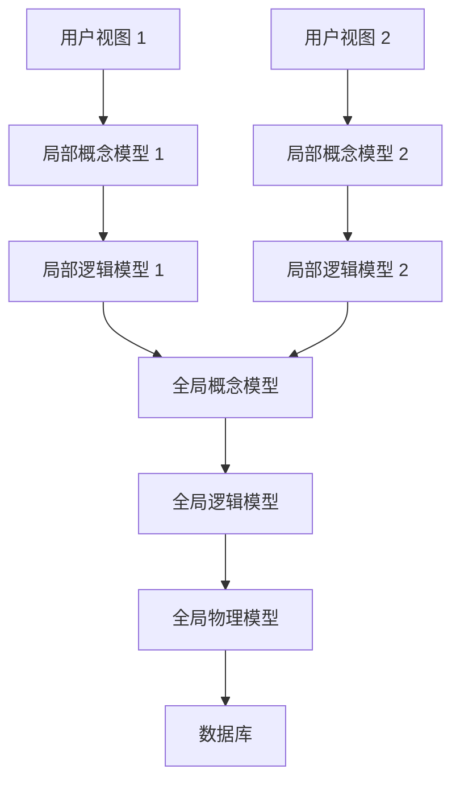
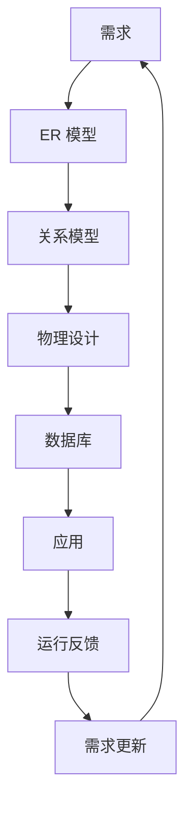

# 3.5 数据库设计方法学与实践

## 数据库设计方法学概述

### 方法学的定义

方法学是支撑达到目标的要素，包括**过程、技术、工具以及文档**，有时也涵盖理论指导。

### 数据库设计的三个核心阶段

数据库设计分为**三个主要阶段**，每个阶段都有明确的目标和任务：

| 阶段           | 目标                                          | 关注点           |
| -------------- | --------------------------------------------- | ---------------- |
| 概念数据库设计 | 构建企业信息模型，独立于所有物理考虑          | 对需求负责       |
| 逻辑数据库设计 | 基于特定数据模型构建信息模型，独立于具体 DBMS | 对目标模型负责   |
| 物理数据库设计 | 描述数据库在二级存储上的实现细节              | 对具体 DBMS 负责 |

## 复杂系统的设计分解

对于复杂的数据库系统，通常采用“**局部设计 - 全局集成**”的方法：

## 数据库设计各阶段详细步骤

### 1. 概念数据库设计步骤

**目标**：为每个用户视图构建**局部概念数据模型**

1. **识别实体类型**：确定系统中需要表示的主要实体
2. **识别联系类型**：确定实体之间的关联关系
3. **识别并关联属性**：为实体和联系分配合适的属性
4. **确定属性域**：定义每个属性的取值范围和数据类型
5. **确定候选键和主键**：为每个实体选择合适的主键
6. **考虑使用增强建模概念**（可选）：如特化/泛化
7. **检查模型冗余**：消除不必要的重复数据和联系
8. **验证局部概念模型**：确保模型能够支持用户的事务需求
9. **与用户评审局部概念模型**：获得用户的确认和认可

### 2. 逻辑数据库设计步骤

**目标**：将**概念模型转换为关系模型**，并进行规范化

1. **移除难以直接映射的特征**：如多对多联系、多值属性等
2. **推导关系模式**：根据映射规则将 ER 模型转换为关系模式
3. **使用规范化验证关系**：确保关系模式满足 `3NF` 或 `BCNF`
4. **验证关系模式**：确保关系模式能够支持用户的事务需求
5. **定义完整性约束**：包括实体完整性、参照完整性和用户定义完整性
6. **与用户评审逻辑数据模型**：获得用户的确认和认可
7. **合并局部数据模型为全局模型**：集成各个用户视图的逻辑模型
8. **验证全局模型**：检查模型的完整性和一致性
9. **与用户评审全局数据模型**：获得最终确认

### 3. 物理数据库设计步骤

**目标**：为目标 DBMS 设计高效的物理存储结构

1. **转换全局逻辑模型为目标 DBMS 支持的格式**
2. **分析事务**：识别高频查询和更新操作
3. **选择文件组织方式**：如堆文件、顺序文件、索引文件等
4. **选择索引**：为经常作为查询条件、连接条件和排序条件的列建立索引
5. **估计磁盘空间需求**：计算数据库所需的存储空间
6. **设计安全性**：包括权限控制、访问控制、角色设计和用户视图
7. **定义完整性约束**：在 DBMS 中实现完整性约束

## AI 辅助数据库设计

### AI 在数据库设计中的应用

AI 可以在数据库设计的各个阶段提供帮助：

1. **需求提取**：从自然语言描述中提取实体、属性和联系
2. **ER 图生成**：自动生成初步的 ER 模型
3. **关系模式转换**：将 ER 图转换为关系模式
4. **范式检查**：检查关系模式是否满足规范化要求
5. **SQL 生成**：自动生成建表语句、查询语句等
6. **性能优化建议**：提供索引设计和查询优化建议

### AI 辅助设计的实践流程

#### 任务 1：需求提取与 ER 图生成

1. 向 AI 提问：“请分析 [系统需求描述]，识别主要实体及其属性，并给出 ER 图”
2. 评估 AI 输出：检查是否遗漏关键实体、属性和联系
3. 修正与重新绘制：手动修正 AI 生成的 ER 图

#### 任务 2：关系模式转换与范式检查

1. 将修正后的 ER 图转换为初始关系模式
2. 向 AI 提问：“请检查以下关系模式是否满足 `3NF`，若不满足，指出存在的函数依赖和传递依赖，并给出分解方案”
3. 评估 AI 的分析结果：检查是否正确识别了依赖关系
4. 调整关系模式：根据评估结果优化关系模式

#### 任务 3：数据库验证与确认

1. 设计测试数据并生成 SQL 建表和插入语句
2. 向 AI 提问：“请生成 SQL 查询语句来 [业务问题描述]”
3. 执行并验证 SQL：检查语法和逻辑错误
4. 修正错误并验证设计是否满足需求

### AI 辅助设计的注意事项

- AI 生成的结果只能作为参考，不能直接使用
- 必须对 AI 输出进行仔细的评估和验证
- 理解设计原理比依赖 AI 更重要
- 记录设计过程和决策理由

## 数据库设计与应用的闭环

数据库设计不是一次性的工作，而是一个**持续迭代的过程**：

## 数据库设计 CASE 工具

计算机辅助软件工程（`CASE`）工具可以帮助数据库设计人员更高效地完成设计工作：

- 支持 ER 图的绘制和编辑
- 自动将 ER 图转换为关系模式
- 生成 SQL 建表语句
- 支持团队协作和版本控制
- 生成设计文档

常见的数据库设计 `CASE` 工具包括：

- PowerDesigner
- ER/Studio
- MySQL Workbench
- Navicat Data Modeler
- DbSchema

::: tip 设计原则

数据库设计是一门艺术，也是一门科学。好的数据库设计应该：

1. **满足用户的信息需求和处理需求**
2. **最小化数据冗余**
3. **保证数据的一致性和完整性**
4. **具有良好的性能**
5. **易于维护和扩展**

:::
