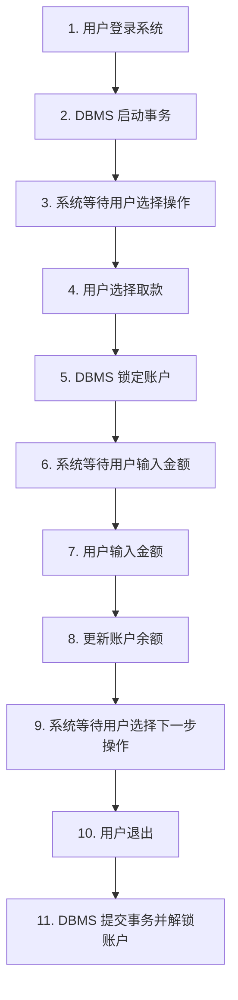
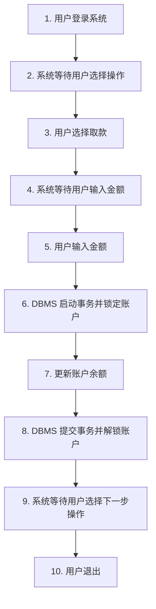

# 4.3 事务设计

## 事务边界设计

事务边界是指事务开始和结束的位置。合理的事务边界设计对系统性能和数据一致性至关重要。

::: details 反例：过长的事务边界

**问题**：事务持有锁的时间过长，导致其他用户长时间等待，系统并发度低。
:::

::: details 正例：合理的事务边界

**优点**：事务持有锁的时间短，系统并发度高。
:::

## 事务隔离等级

`ANSI SQL2` 标准定义了四个事务隔离等级，从低到高依次为：

1. **读未提交（Read Uncommitted）**：可能发生脏读
2. **读已提交（Read Committed）**：不会发生脏读，可能发生不可重复读和幻读（大多数数据库的默认级别）
3. **可重复读（Repeatable Read）**：不会发生脏读和不可重复读，可能发生幻读（`MySQL` 的默认级别）
4. **串行化（Serializable）**：不会发生所有并发问题，性能最低

::: tip 隔离等级与并发问题的关系

| 隔离等级 | 脏读     | 不可重复读 | 幻读     |
| -------- | -------- | ---------- | -------- |
| 读未提交 | 可能发生 | 可能发生   | 可能发生 |
| 读已提交 | 不会发生 | 可能发生   | 可能发生 |
| 可重复读 | 不会发生 | 不会发生   | 可能发生 |
| 串行化   | 不会发生 | 不会发生   | 不会发生 |

:::
