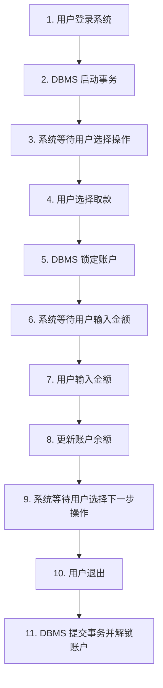
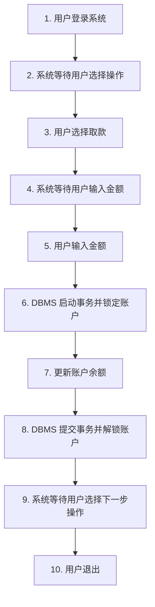

# 4.3 事务设计

## 事务边界设计

事务边界是指事务开始和结束的位置。合理的事务边界设计对系统性能和数据一致性至关重要。

::: details 反例：过长的事务边界

**问题**：事务持有锁的时间过长，导致其他用户长时间等待，系统并发度低。
:::

::: details 正例：合理的事务边界

**优点**：事务持有锁的时间短，系统并发度高。
:::

## 事务隔离等级

`ANSI SQL2` 标准定义了四个事务隔离等级，从低到高依次为：

1. **读未提交（Read Uncommitted）**：可能发生脏读
2. **读已提交（Read Committed）**：不会发生脏读，可能发生不可重复读和幻读（大多数数据库的默认级别）
3. **可重复读（Repeatable Read）**：不会发生脏读和不可重复读，可能发生幻读（`MySQL` 的默认级别）
4. **串行化（Serializable）**：不会发生脏读、不可重复读和幻读，性能最低

::: tip 隔离等级与并发问题的关系

| 隔离等级 | 脏读     | 不可重复读 | 幻读     |
| -------- | -------- | ---------- | -------- |
| 读未提交 | 可能发生 | 可能发生   | 可能发生 |
| 读已提交 | 不会发生 | 可能发生   | 可能发生 |
| 可重复读 | 不会发生 | 不会发生   | 可能发生 |
| 串行化   | 不会发生 | 不会发生   | 不会发生 |

:::

::: info 关于脏读、不可重复读和幻读

**脏读、不可重复读**：详见 [并发控制](4.2%20并发控制.html#并发控制的必要性)。

**幻读（Phantom Read）**：同一个事务中，**两次按相同条件查询一批记录**，第二次发现结果集“多了一行”或“少了一行”，因为中间有其他事务插入、删除了满足条件的行。

例：`T1` 查询“年龄大于 `20` 岁的学生人数”，第一次得到 `10` 人；`T2` 插入了一条年龄为 `21` 的学生记录并提交；`T1` 再次查询时得到 `11` 人。新增的这一行就像“幻影”一样出现。

:::

### 四种隔离等级解释

1. **读未提交（Read Uncommitted）**

   含义：隔离级别最低，一个事务可以读取另一个事务**尚未提交**的修改结果。

   特点：并发能力最高，但最不安全，**脏读、不可重复读、幻读都可能发生**。

   适合理解：几乎不做隔离，事务之间可以互相看到尚未稳定的数据。

2. **读已提交（Read Committed）**

   含义：一个事务只能读取到其他事务**已经提交**的数据。

   特点：能防止**脏读**，但**不可重复读**和**幻读**仍可能发生。

   例：第一次查到工资是 `5000`，另一个事务提交后把工资改成 `5500`，同一事务第二次再查就可能看到 `5500`。

3. **可重复读（Repeatable Read）**

   含义：同一个事务中，多次读取**同一行记录**应保持一致。

   特点：能防止**脏读**和**不可重复读**，但标准意义下**幻读**仍可能发生。

   例：同一事务里反复读取某条订单记录，字段值保持不变；但如果按条件查询一批订单，中间别的事务插入了新订单，结果集理论上仍可能变化。

4. **串行化（Serializable）**

   含义：最高隔离级别，要求并发执行的结果与某种**串行执行**结果一致。

   特点：能防止**脏读、不可重复读和幻读**，一致性最好，但并发性能最低。

   适合理解：相当于事务一个一个排队执行，最安全，但等待也最多。

::: info 记忆技巧

- **读未提交**：什么都可能看到
- **读已提交**：只保证“不读脏数据”
- **可重复读**：保证“同一行反复读一致”
- **串行化**：把并发当串行处理

:::
