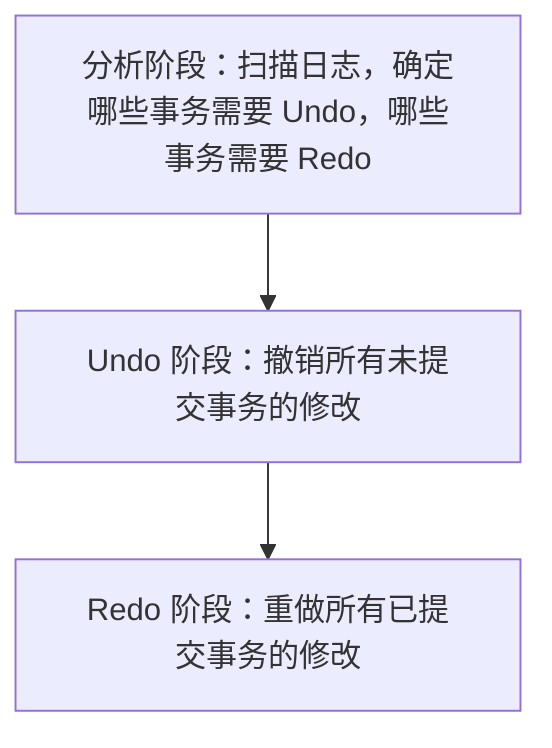

# 4.4 数据库恢复

## 恢复的基本概念

数据库恢复是指在系统发生故障后，将数据库从**不一致状态**恢复到**最近的一致状态**的过程。

## 恢复的基本操作

1. **Undo（撤销）**：撤销**未提交事务**对数据库的修改，保证**原子性**
2. **Redo（重做）**：重做**已提交事务**对数据库的修改，保证**持久性**

## 日志（Log）

日志是记录数据库所有更新操作的文件，是**数据库恢复的基础**。

### 日志的内容

- 事务的开始、提交和回滚记录
- 数据项的更新记录（包括**旧值**和**新值**）

### 日志的两条基本规则（WAL原则）

1. **Undo 规则（Write-Ahead Logging）**：对数据的修改在写入稳定数据库之前，对应的日志记录必须先写入稳定存储
2. **Redo 规则**：事务提交之前，该事务的所有日志记录必须先写入稳定存储

## 数据库恢复过程

## 检查点（Checkpoint）

检查点是 `DBMS` 定期执行的一个操作，用于**减少恢复时需要扫描的日志量**。

- 在检查点时刻，`DBMS` 将内存中所有已修改的数据块写入稳定数据库
- 恢复时，只需扫描检查点之后的日志记录

## 二级存储故障的恢复

1. **静态备份**：系统停机时进行的完整备份
2. **动态备份**：系统运行时进行的备份
3. **归档日志**：将历史日志文件归档保存
4. **恢复步骤**：使用最近的完整备份恢复数据库，然后应用归档日志重做所有已提交的事务
