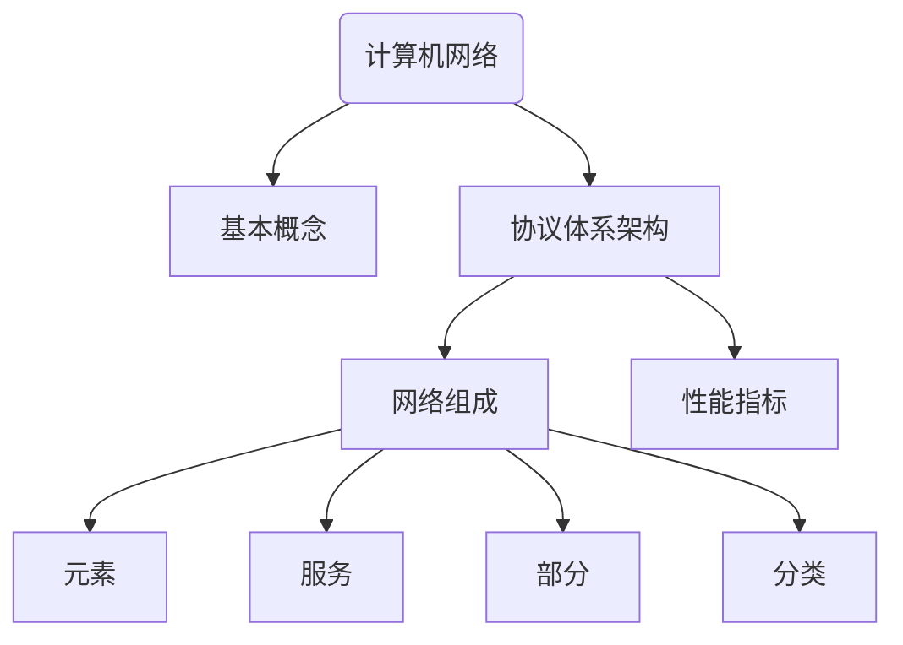

# 第 1 章 计算机网络概述

本章思维导图：

## 互联网：组成元素

1. 海量互联的计算设备
   - 主机 = 端系统
   - 运行网络应用程序

2. **通信链路**
   - 光纤、同轴电缆、无线电、卫星
   - 传输速率：**带宽**

3. 分组交换：转发数据分组
   - 路由器和交换机

4. 互联网：“万网之网”

   大量互联的 ISP

5. 协议控制消息的发送与接收

   例如，HTTP、TCP、IP、Skype、802.11等

6. 互联网标准：
   - IETF：互联网工程任务工作组
   - RFC：请求评论
   - ITU-T：国际电信联盟
     - 3GPP
     - IMT-2030

## 互联网：提供服务

- **互联网为多种应用提供基础设施服务**

  例如，网页服务、网络电话、电子邮件、网络游戏、电子商务、社交网络……

- **互联网为多种应用提供应用编程接口**
  - 通过应用程序连接互联网的网络钩子
  - 面向应用提供类似于生活中邮政业务的选择性服务

## 什么是协议？

**协议**定义了网络实体之间发送和接收信息的**格式**、**顺序**，以及发送和接收消息后或发生某些事件时所**采取的行动**。

::: tip 协议三要素

- **语义**
- **语法**
- **时序**

:::

## 深入探索网络结构

- 网络边缘
  - 主机：客户端和服务器
  - 服务器通常位于数据中心
- 接入网络、物理媒介
  - 有线通信链路
  - 无线通信链路
- 网络核心
  - 互联的路由器
  - 互联网络的网络

问题：端系统如何连接边缘路由器？

- 家庭接入网
- 机构接入网，如学校、企业
- 移动接入网

### 家庭接入

- 用户数字线路（DSL、ADSL）
- 电缆网络
  - HFC：混合光纤同轴电缆（非对称）
  - 用户采用1电缆和光纤网络连接至 ISP 路由器
    - 家庭采用共享接入网络连接至电缆头端
    - 注意此处与 DSL 采用专用线路连接至中心局不同

### 机构接入

- 以太网

### 无线接入

- 无线局域网（WLAN）
  - 典型范围 100 英尺
  - 典型标准 802.11b\g (WiFi)
- 无线广域网
  - 典型范围 10~20 公里
  - 电信运营商提供服务

    如 3G、4G、LTE、LTE-A、5G、B5G、6G
