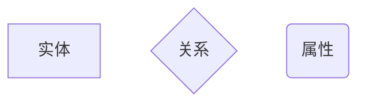

# 需求分析与描述

## 什么是需求？

IEEE 软件工程标准词汇表（1997 年）中定义需求为：

1. 用户为解决某个问题或达到某种目标而需具备的条件或能力（Capability）。
2. 系统或系统部件要满足合同、标准、规范或其它正式规定文档而必须满足的条件或必须具备的能力。
3. 一种反映上面任意一点所描述的条件或能力的文档说明。

## 什么是功能需求？什么是非功能需求？

- **功能需求**描述系统应该提供的功能或服务，通常**涉及用户或外部系统与该系统之间的交互**，一般不考虑系统的实现细节。
- **非功能需求**是从各个角度对系统的约束和限制，反映了**应用对软件系统质量和特性的额外要求**，例如响应时间、数据精度、可靠性等。非功能需求包括**过程需求**、**产品需求**和**外部需求**等类型。

## 什么是系统需求？系统需求包括哪些分析模型？

**系统需求**是**更加详细地描述系统应该做什么**，通常包括许多分析模型，如对象模型、数据模型、状态模型等。主要是面向开发人员进行描述，是**开发人员进行软件设计的基础**。需要采用适当的方法形成一致的、完备的和无二义性的系统需求描述。

## 面向对象的系统需求模型的描述有哪几种方法？

通常，系统需求模型的描述有 3 种方法：**结构化语言**、**可视化模型**、**形式化方法**。

## 需求工程的活动可以划分为哪几个独立的阶段？

可以把需求工程的活动划分为以下 5 个独立的阶段：

- **需求获取**：通过与用户的交流，开发、捕获和修订用户的需求；
- **需求分析**：为最终用户建立一个系统的概念模型，作为对需求的抽象描述；
- **需求规格说明**：生成需求模型构件的精确的形式化的描述，
- **需求验证**：分析需求规格的正确性和可行性；
- **需求管理**：支持系统的需求演进；

## 面向对象的需求分析需建立系统的哪几种模型？

需求分析建立三种模型：**实体-联系图**、**数据流图**、**状态转换图**。

## 使用什么图来建立数据模型？

通常，使用**实体-联系图**来建立数据模型。

## 什么是 ER 模型？

可以把实体-联系图简称为 ER 图，相应地可把**用 ER 图描绘的数据模型**称为 ER 模型。

## ER 图中包含哪几种基本元素？分别都用什么来描述？

ER 图中包含了**实体（即数据对象）**、**关系**和**属性**3 种基本成分。

通常用**矩形框代表实体**，用**连接相关实体的菱形框表示关系**，用**椭圆形或圆角矩形表示实体（或关系）的属性**，并用直线把实体（或关系）与其属性连接起来。

## 什么是联系？数据对象的联系分为哪几种类型？

客观世界中的事物彼此间往往是有联系的。

**数据对象彼此之间相互连接的方式**称为联系，可分为以下 3 种类型：

- **一对一联系（1:1）**：一个部门有一个经理，而每个经理只在一个部门任职，则部门与经理的联系是一对一的。
- **一对多联系（1:N）**：每位教师可以教多门课程，但是每门课程只能由一位教师来教。
- **多对多联系（M:N）**：一个学生可以学多门课程，而每门课程可以有多个学生来学。

## 什么是数据字典？

数据字典定义了系统中**使用的所有数据项及其结构**，确保客户和开发人员**使用一致的定义和术语**。

## 什么是原型化方法？它可以分为哪几种？

原型化方法是需求获取过程中一种常用的方法，它通过使系统或者系统一部分可视化，以获得客户的反馈，从而**有效地解决在系统开发的早期阶段需求不确定**的问题。

软件原型可以分为：**抛弃型原型**、**演化型原型**。

## 能根据具体的场景描述画出系统的用例图

这咋讲啊，我也没招 \:)

建议[去网上搜一下](https://cn.bing.com/search?q=%E7%94%A8%E4%BE%8B%E5%9B%BE)自行学习吧。
