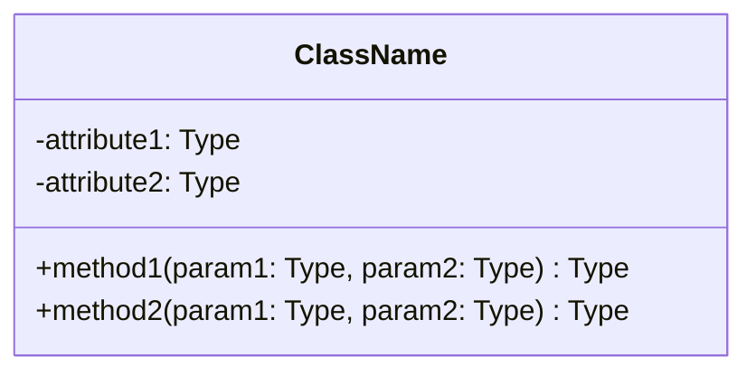
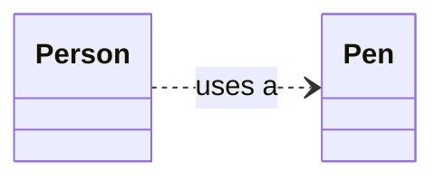
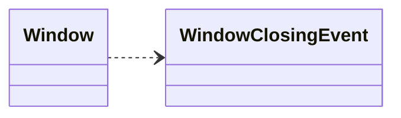
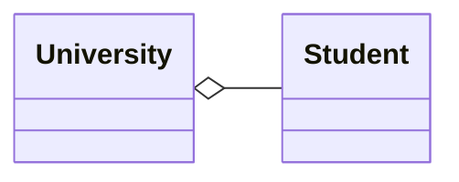
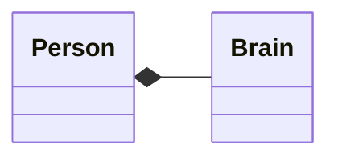

# 2.1 UML 类图

## 2.1.1 UML 类图介绍

想象一下，当我们要建造一座房子时，我们首先需要一张详细的建筑蓝图。这张蓝图清晰地展示了房子的结构、房间的布局以及门窗的位置。在软件开发的世界里，UML 类图就扮演着类似“蓝图”的角色。

**类图（Class Diagram）** 是 **UML（统一建模语言，Unified Modeling Language）** 中最常用的一种图，它是一种**静态结构图**，专门用来描述一个系统的“静态”结构。

那么，什么是“静态结构”呢？简单来说，就是系统由哪些“积木块”（也就是**类**）组成，每个“积木块”内部有什么（比如**属性**和**方法**），以及“积木块”之间是如何相互连接的（也就是**关系**）。

通过一张类图，我们可以在编码之前就对整个系统的结构有一个清晰的认识，这对于我们设计出结构优良、易于维护的软件系统至关重要。它可以帮助我们：

- **可视化系统结构**：将抽象的代码逻辑转化为直观的图形。
- **沟通设计思想**：方便团队成员之间交流和讨论系统设计。
- **指导代码编写**：作为编码阶段的重要参考依据。

## 2.1.2 UML 类的表示

在类图中，一个类通常用一个矩形框来表示。这个矩形框被分为三个部分，从上到下依次是：

1.  **类名（Class Name）**：位于矩形框的顶部，用于唯一标识一个类。类名通常使用名词，并且首字母大写。
2.  **类属性（Attributes）**：位于矩形框的中间部分，描述了类的静态特征，也就是类所包含的数据。每个属性通常独占一行，其格式为：`可见性 名称: 类型`。
3.  **类方法（Methods）**：位于矩形框的底部，描述了类的动态行为，也就是类能够执行的操作。每个方法也通常独占一行，其格式为：`可见性 名称(参数列表): 返回类型`。

下面是一个典型的例子：



在这个例子中，`ClassName` 是类名，`attribute1` 和 `attribute2` 是它的两个属性，而 `method1` 和 `method2` 则是它的两个方法。

> **深入理解“可见性”**
>
> 在属性和方法前面，我们看到了 `+` 和 `-` 这样的符号，它们表示**可见性（Visibility）**，也常被称为**访问权限（Access Modifiers）**。这决定了类的外部是否能够直接访问这些属性或调用这些方法。
>
> 想象一下，一个类就像一个房子，房子里有你的私人物品（私有属性/方法），也有可以展示给客人的东西（公有属性/方法）。
>
> - `+` **public（公共的）**：表示任何其他类都可以访问。就像你家客厅里的电视，所有客人都可以看到和使用。
> - `-` **private（私有的）**：表示只有该类自身可以访问。就像你的日记本，只有你自己能看。
> - `#` **protected（受保护的）**：表示该类自身、它的子类以及同一个包中的其他类可以访问。就像家里的相册，除了家人，亲近的朋友也可以翻阅。
> - `~` **package（包私有的）**：也称为 `friendly`，表示只有在同一个包（package）中的类可以访问。这在某些语言（如 Java）中是默认的访问权限。
>
> | 符号 | 描述 | 对应 Java 关键字 |
> | :--: | :---: | :---: |
> | `+` | public | `public` |
> | `#` | protected | `protected` |
> | `-` | private | `private` |
> | `~` | package | (默认) |

## 2.1.3 类之间的关系

在现实世界中，事物之间总是存在着千丝万缕的联系。同样，在面向对象的世界里，类也不是孤立存在的，它们之间也存在着各种各样的关系。理解和运用这些关系，是构建一个结构清晰、易于扩展的软件系统的关键。

UML 类图正是用来清晰地表达这些关系的工具。常见的类之间关系包括：**依赖关系**、**关联关系**、**聚合关系**和**继承关系**。下面我们将逐一进行介绍。

### 依赖关系（Dependency）

依赖关系是类之间最弱的一种关系，它是一种典型的**瞬时性关系**。我们可以把它想象成“人和笔”的关系：

> 一个人（`Person` 类）在签名的时候需要用到笔（`Pen` 类），但是他并不会一直把这支笔带在身上。他只是在需要签名的时候，临时找来一支笔，用完之后就放下了。笔的损坏或丢失，在签名这个动作完成之后，并不会持续影响到人。

在这个例子中，`Person` 类依赖于 `Pen` 类，因为 `Person` 类的一个方法（比如 `sign()`）用到了 `Pen` 类的对象。但是，`Person` 类本身并不持有 `Pen` 类对象的引用。

在代码层面，依赖关系通常体现在以下几种情况：

- 一个类的方法接收另一个类的对象作为**参数**。
- 一个类的方法返回另一个类的对象。
- 一个类的方法在实现时**创建**了另一个类的对象。

在 UML 中，依赖关系用一条**带箭头的虚线**表示，箭头指向被依赖的类（也就是“被使用”的那个类）。



下面展示了 `Window` 类对 `WindowClosingEvent` 类的依赖。当用户点击窗口的关闭按钮时，`Window` 对象会临时创建一个 `WindowClosingEvent` 事件对象来处理这个关闭动作，但这是一种临时性的使用，`Window` 类并不会一直持有着这个事件对象。



### 关联关系（Association）

如果说依赖关系是一种“临时使用”，那么关联关系则是一种“长期拥有”的关系。它表示一个类的对象会**持有另一个类对象的引用**，这是一种比依赖关系更强的、持续性的合作关系。

我们可以把它想象成“司机和车”的关系：

> 一位司机（`Driver` 类）需要拥有一辆属于他自己的车（`Car` 类）才能完成工作。这辆车是作为司机的一个属性（或成员变量）存在的。只要司机还在工作，他就会一直拥有并使用这辆车。车对于司机来说，是必不可少的一部分。

在代码层面，关联关系通常表现为一个类将另一个类的对象作为自己的**成员变量**。

在 UML 中，关联关系用一条**实线**表示。实线可以带有箭头，表示关联的方向。

绘制关联关系时，我们通常需要关注以下几个要素：

- **关联的方向**：箭头指明了关系是单向的还是双向的。
- **关联的多重性**：线段两端的数字或符号，表示一个类的多少个对象可以与另一个类的多少个对象相关联。
- **关联的角色名**：在线段旁边标注的名称，描述了被关联的类在关联关系中所扮演的角色（相当于成员变量名）。

#### 关联关系的多重性

关联关系两端所附带的数字或者数字范围称为**多重性（Multiplicity）**，它精确地描述了一个类的对象能够与另一个类的对象形成多少个**实例关系**。

**类与类之间常用的多重性表示及其含义有以下几种**：

- **具体数字**：比如 `1`，表示一个对象只能关联一个另一个类的对象。
- **`*` 或 `0..*`**：表示可以关联 0 个或任意多个对象。
- **`0..1`**：表示可以关联 0 个或 1 个对象（可选的关联）。
- **`1..*`**：表示至少要关联 1 个，最多无上限。

#### 单向关联关系

单向关联关系指的是，类 A **拥有**对类 B 对象的引用，但类 B **没有**对类 A 对象的引用。就像司机拥有汽车，但汽车本身并不知道它的司机是谁。

在 UML 中，单向关联用**带普通箭头的实线**表示，箭头从“拥有者”指向“被拥有者”。

- **示例 1：客户与银行账户**

  一个客户（`Client`）可以拥有多个银行账户（`BankAccount`），但一个银行账户只属于一个客户。`Client` 类中会有一个集合来存放 `BankAccount` 对象，而 `BankAccount` 类则不需要知道 `Client` 的信息。

  ```mermaid
  classDiagram
  direction LR
  class Client {
    -name: String
    +addBankAccount(account: BankAccount)
    +getBankAccount(index: int) BankAccount
    +getNumberOfBankAccounts() int
  }
  class BankAccount {
    -balance: double
    +deposit(amount: double)
    +withdraw(amount: double)
  }
  Client "1" --> "*" BankAccount : -accounts
  ```
  *这里的 `"1"` 和 `"*"` 就表示多重性，一个客户可以关联多个银行账户。`-accounts` 则是角色名，表示 `Client` 类中持有 `BankAccount` 引用的成员变量名。*

#### 双向关联关系

双向关联关系则意味着，每个类都包含**对另一个类对象的引用**。双方都知道对方的存在。

在 UML 中，双向关联用**不带箭头的实线**或者**两端都带箭头的实线**表示。

- **示例：学生与课程**

  一个学生（`Student`）可以选择多门课程（`Course`），同时一门课程也可以被多个学生选择。在这种关系中，`Student` 类需要知道自己选了哪些课程，而 `Course` 类也需要知道有哪些学生选了这门课。

  ```mermaid
  classDiagram
  direction LR
  Student "*" -- "*" Course : -students / -courses
  ```
  *这里的 `"*"` 和 `"*"` 表示这是一个多对多的关系。`-students` 和 `-courses` 分别是 `Course` 类和 `Student` 类中用于持有对方引用的成员变量名。*

### 聚合关系（Aggregation）与组合关系（Composition）

聚合和组合都是关联关系的特例，它们都用来建模**整体和部分**的关系，也就是我们常说的“**有一个（has-a）**”关系。但是，根据整体和部分之间生命周期的依赖关系强弱，又可以细分为聚合和组合。

#### 聚合关系（Aggregation）

聚合关系是一种**弱**的“拥有”关系。在聚合关系中，整体（`Whole`）和部分（`Part`）的**生命周期是独立的**。即使整体消失了，部分依然可以独立存在。

我们可以把它想象成“大学和学生”的关系：

> 一所大学（`University`）拥有很多学生（`Student`）。但是，如果这所大学因为某种原因关闭了，学生们并不会因此“消失”，他们依然是独立存在的个体，可以转到其他学校继续学习。

在 UML 中，聚合关系用一条**带空心菱形的实线**表示，菱形指向整体。



#### 组合关系（Composition）

组合关系则是一种**强**的“拥有”关系，有时也被称为“组合聚合”。在组合关系中，部分（`Part`）的生命周期**完全依赖于**整体（`Whole`）的生命周期。如果整体消失了，部分也随之消失。

我们可以把它想象成“人和大脑”的关系：

> 一个人（`Person`）拥有一个大脑（`Brain`）。大脑是人不可分割的一部分。如果人死亡了，大脑也就不复存在了。大脑不能脱离人而独立存在。

在 UML 中，组合关系用一条**带实心菱形的实线**表示，菱形同样指向整体。



**总结一下聚合与组合的关键区别：**

| 特征 | 聚合关系 (Aggregation) | 组合关系 (Composition) |
| :--- | :--- | :--- |
| **关系强度** | 弱 | 强 |
| **生命周期** | 部分可以独立于整体存在 | 部分的生命周期依赖于整体 |
| **UML符号** | 空心菱形 | 实心菱形 |
| **比喻** | 大学与学生、公司与员工 | 人与大脑、鸟与翅膀 |

### 继承关系（Inheritance / Generalization）

继承关系是面向对象编程中非常重要的一个概念，它用来表示类与类之间的“**是一个（is-a）**”关系。它允许我们创建一个新类（称为**子类**或**派生类**），从一个已有的类（称为**父类**、**基类**或**超类**）那里继承属性和方法。

我们可以把它想象成生物界的“猫和动物”的关系：

> 猫（`Cat` 类）**是**一种动物（`Animal` 类）。作为动物，猫继承了动物的所有基本特征和行为，比如有生命、会呼吸、能移动。同时，猫还有自己独特的行为，比如“会喵喵叫”。

通过继承，子类可以**重用**父类的代码，并且可以在此基础上进行**扩展**（添加新的属性和方法）或**重写**（改变继承来的方法的实现）。这极大地提高了代码的复用性和可维护性。

在 UML 中，继承关系用一条**带空心三角箭头的实线**表示，箭头从子类指向父类，表示子类继承自父类。

- **示例：学生分类**

  小学生（`ElementaryStudent`）、中学生（`MiddleSchoolStudent`）和大学生（`UniversityStudent`）都是学生（`Student`）的一种。它们都具有学生的共性（如学号、姓名），但又各自有不同的特点。

  ```mermaid
  classDiagram
  class Student {
    -studentId: String
    -name: String
    +study()
  }
  Student <|-- ElementaryStudent
  Student <|-- MiddleSchoolStudent
  Student <|-- UniversityStudent
  class ElementaryStudent {
    +playGames()
  }
  class MiddleSchoolStudent {
    +doHomework()
  }
  class UniversityStudent {
    +writePaper()
  }
  ```

通过继承，我们清晰地表达了不同类型学生之间的“is-a”关系，构建了一个层次清晰的类体系。
