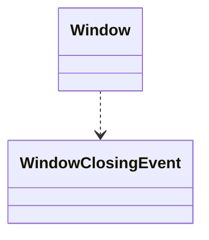
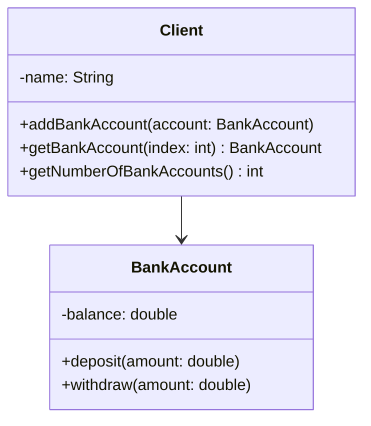
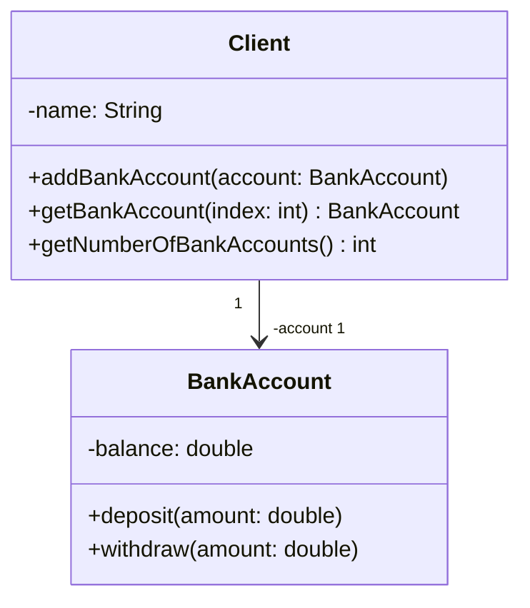
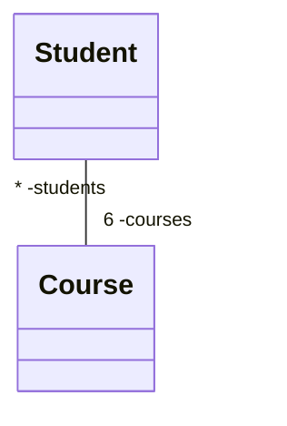
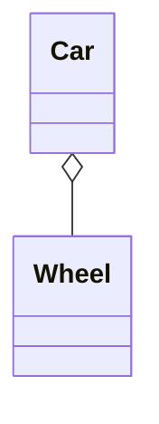

# 2.1 UML 类图

## 2.1.1 UML 类图介绍

**类图（Class Diagram）** 是 **UML（统一建模语言）**中的一种**静态结构图**，他用于描述系统的静态结构。

## 2.1.2 UML 类的表示

| NameClass                                                                                |
| :--------------------------------------------------------------------------------------- |
| -attribute1: Type -attribute2: Type                                                   |
| +method1(param1: Type, param2: Type): Type +method2(param1: Type, param2: Type): Type |

从上至下依次为：**类名**、**类属性**、**类方法**。

> 其中，`+`、`-` 表示**访问权限**，除此之外，还有 `#`、`~`。
> | 符号 | 描述 |
> | :--: | :-----------------------: |
> | `+` | 代表 public |
> | `#` | 代表 protected |
> | `-` | 代表 private |
> | `~` | 代表 package，即 friendly |

## 2.1.3 类之间的关联关系

### 依赖关系

典型的**瞬时关系**，依赖类和目标类进行简单的交互，但是依赖类并不维护目标类的对象，仅仅是**临时使用**。

### 关联关系

一个类**拥有另一个类对象的引用**，表示类之间的一种持续一段时间的合作关系。

绘制时应注意：

- 关联的**方向**
- 关联的**数量**
- 关联的**引用**

#### 关联关系的数量

关联关系两端所附带的数字或者数字范围称为**多重性**，用于描述一个类的对象能够与另一个类的对象形成多少个**实例关系**。

#### 单向关联关系

类 A **拥有**对类 B 对象的引用，但类 B **没有**对类 A 对象的引用。

#### 双向关联关系

每个类都包含**对另一个类对象的引用**。

##### 一对多关联关系

##### 多对多关联关系

### 聚合关系

建模**整体和部分**的关系。

代表“**有一个（has-a）**”的关系。

#### 基本聚合

在基本聚合关系中，部分类对象与整体类对象的**生命周期是独立的**。

#### 组合聚合

在组合聚合关系中，部分类对象的生命周期**依赖于整体类对象的生命周期**。

### 继承关系

将有相似继承含义的两个实体建模为有**继承关系的两个类**。

代表“**是一个（is-a）**”的关系。

