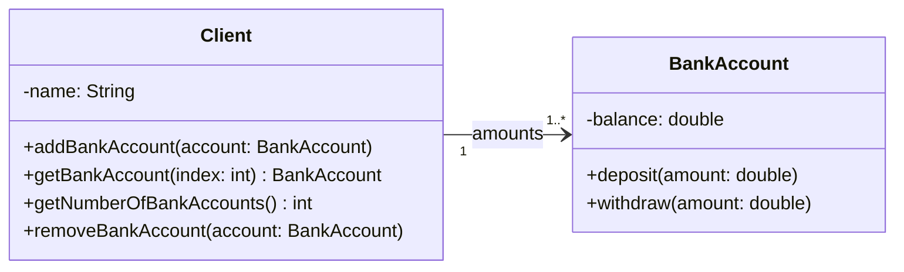
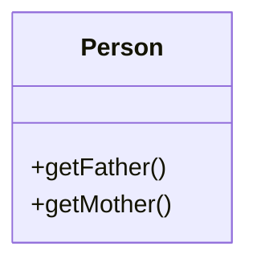

# 2.2 典型的类图结构

## 2.2.1 集合（Collection）模型

代表类与类之间**一对多的关联关系**。

## 2.2.2 自包含（Self-Containing）类

代表一个类**与自身存在关联**。在这样的类中有一个具有这个类本身类型的私有属性。

::: warning 注意
_Mermaid 类图画不出自包含类。可以想象上图中的 `Person` 类从底部伸出两个**指向自己头部**的**单向关联箭头**，一个**引用 `-mother`**，另一个**引用 `-father`**。_
:::

## 2.2.3 关系环（Relationship Loops）模型

如果**类 B 与类 C 存在同样的代码**，可以**设计一个类 A，用于存放通用代码**，使得**类 B 和类 C 继承类 A**，通过继承，类 B 和类 C 可以**复用类 A 的代码**。

如果**类 A 与类 B 所有子类关联**，则**类 A 仅需与基类关联**即可，同时**将类 A 中的属性变量/方法参数的类型设为基类**，属性变量/方法形式参数可以**接受该基类及其子类的对象**。
