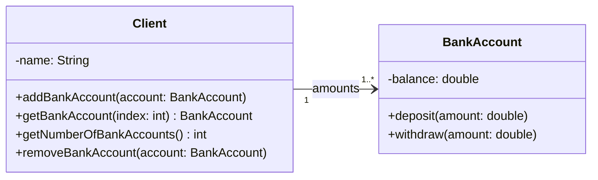
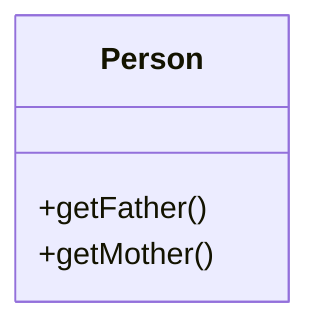

# 2.2 典型的类图结构

在面向对象设计中，类图是描述系统静态结构的重要工具。通过类图，我们可以清晰地看到类与类之间的关系。在复杂的系统中，一些典型的类图结构会反复出现。理解这些典型的结构，有助于我们更好地进行面向对象的设计和编程。

## 2.2.1 集合（Collection）模型

在现实世界中，“一对多”的关系非常普遍。例如，一个客户可以拥有多个银行账户，一个订单可以包含多个商品。在 UML 类图中，我们使用**集合（Collection）模型**来表示这种**一对多的关联关系**。

在这种模型中，通常会有一个“整体”类和一个“部分”类。“整体”类持有一个“部分”类对象的集合。下面的类图就是一个典型的集合模型，展示了 `Client`（客户）和 `BankAccount`（银行账户）之间的关系。

## 2.2.2 自包含（Self-Containing）类

有些时候，一个类的实例需要与同类的其他实例相关联。例如，在一个人事管理系统中，一个员工（Employee）对象可能需要关联到他的经理（Manager），而经理本身也是一名员工。这种**一个类与自身存在关联**的情况，我们称之为**自包含（Self-Containing）类**。

在设计自包含类时，我们通常会在类中定义一个或多个具有该类本身类型的属性。下面的 `Person` 类就是一个例子，它通过 `getFather()` 和 `getMother()` 方法来获取一个人的父母，而父母本身也是 `Person` 类的实例。

::: warning 注意
_Mermaid 类图画不出自包含类。可以想象上图中的 `Person` 类从底部伸出两个**指向自己头部**的**单向关联箭头**，一个**引用 `-mother`**，另一个**引用 `-father`**。_
:::

## 2.2.3 关系环（Relationship Loops）模型

在软件开发中，我们经常会遇到多个类具有相似功能或属性的情况。为了提高代码的复用性和可维护性，我们可以将这些共同的特性提取到一个单独的基类（或称为父类、超类）中。然后，让那些具有相似功能的类都来继承这个基类。这样，子类就可以直接使用基类中已经实现好的代码，从而避免了代码的重复编写。

这种通过继承来复用代码的设计模式，在类图上就体现为**关系环（Relationship Loops）模型**。下面是关于这个模型的一些关键点：

- **提取通用代码**：如果**类 B 与类 C 存在同样的代码**，可以**设计一个类 A，用于存放通用代码**，使得**类 B 和类 C 继承类 A**，通过继承，类 B 和类 C 可以**复用类 A 的代码**。
- **与基类关联**：如果一个类（例如类 A）需要与多个相关的子类（例如类 B 的所有子类）进行交互，我们不需要让类 A 与每一个子类都建立关联。更简洁的做法是，让**类 A 仅需与它们的基类关联**即可。同时，在**类 A 中将相关的属性变量或方法参数的类型设置为基类**。由于多态性，这些属性变量或方法参数就**可以接受该基类及其所有子类的对象**，大大增强了代码的灵活性和可扩展性。
