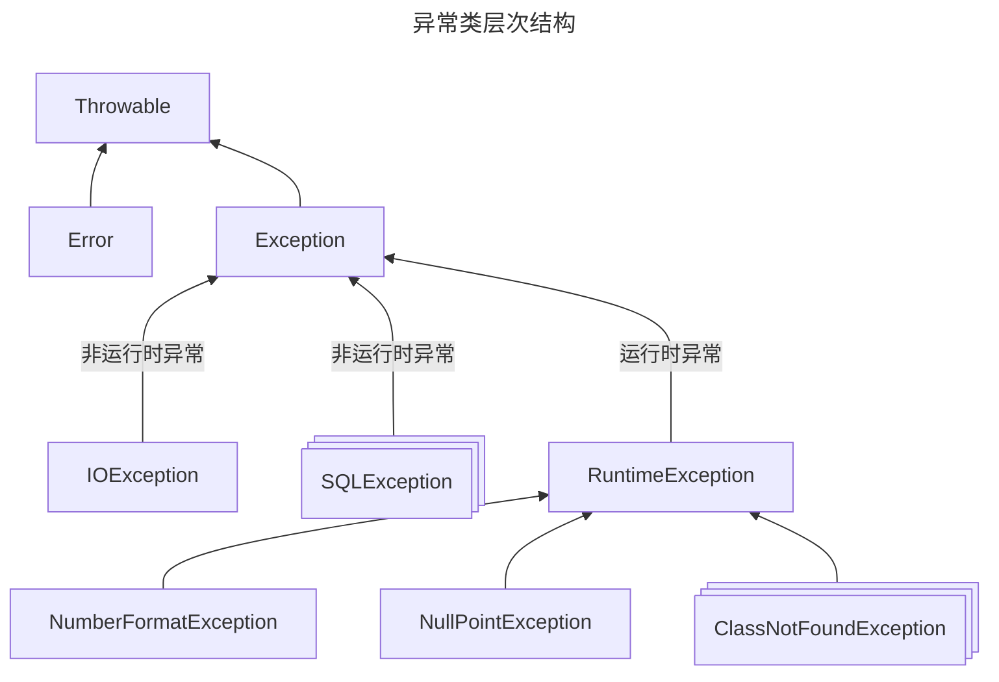

# 3.5 Java 异常处理机制

::: tip
本页除目录和下图以外的内容由 Gemini 2.5 Pro 生成，由 [TouHikari](https://github.com/TouHikari/) 审阅并修改。
:::



## 3.5.1 Java 异常处理机制的引入

在编写程序时，我们常常会遇到各种各样的错误。这些错误可能来自于用户的非法输入、硬件设备问题、网络连接中断，甚至是程序自身的逻辑漏洞。当这些错误发生时，如果程序没有有效的处理机制，就可能会意外终止，给用户带来非常糟糕的体验。

为了解决这个问题，Java 引入了异常处理机制。它提供了一种结构化的方式来处理程序运行时发生的错误，使得程序在遇到问题时能够优雅地应对，而不是直接崩溃。

**什么是异常？**

在 Java 中，异常（Exception）是在程序执行期间发生的、扰乱了程序正常执行流程的事件。当一个方法中发生错误时，该方法会创建一个对象并将其交给运行时系统。这个对象被称为“异常对象”，它包含了关于错误的信息，包括错误的类型和程序在发生错误时的状态。在方法中创建异常对象并将其交给运行时系统的过程称为“抛出异常”（throwing an exception）。

**为什么需要异常处理？**

想象一下，你正在编写一个程序，需要从文件中读取数据。如果文件不存在，或者文件内容格式不正确，你的程序应该怎么办？

- **不使用异常处理：** 如果没有异常处理机制，你可能需要在每个可能出错的地方都加上 `if-else` 判断。例如，在读取文件之前，你需要检查文件是否存在；在读取数据之后，你需要检查数据格式是否正确。这会导致代码变得非常臃肿、难以阅读和维护。更糟糕的是，如果某个你没有预料到的错误发生了，程序可能就会直接崩溃。

- **使用异常处理：** Java 的异常处理机制允许你将处理错误的代码与正常的业务逻辑代码分离开来。你可以将正常的业务逻辑代码放在 `try` 代码块中，而将处理错误的代码放在 `catch` 代码块中。这样，当 `try` 代码块中发生异常时，程序会立即跳转到相应的 `catch` 代码块中执行，而不会中断整个程序的运行。

通过将错误处理逻辑和核心业务逻辑分离，异常处理机制带来了以下好处：

- **提高程序的可读性：** 核心业务逻辑更加清晰，不受错误处理代码的干扰。
- **提高程序的健壮性：** 程序能够优雅地处理各种预料之外的错误，避免程序意外终止。
- **简化错误处理流程：** 可以将不同类型的异常分类处理，使错误处理逻辑更加清晰。

在接下来的章节中，我们将详细学习 Java 异常处理机制中涉及到的关键字，如 `throw`、`try-catch`、`throws`，以及如何自定义异常类来满足我们特定的需求。

## 3.5.2 `throw` 关键字

在 Java 中，除了系统自动抛出异常外，我们还可以使用 `throw` 关键字在代码中显式地抛出一个异常。这通常用于在程序检测到不正常的条件时，主动通知调用者发生了错误。

**`throw` 关键字的语法**

`throw` 关键字的语法非常简单：

```java
throw new ExceptionType("错误信息");
```

其中：

- `throw` 是关键字，必须小写。
- `new ExceptionType("错误信息")` 是要抛出的异常对象。`ExceptionType` 是异常的类型，例如 `IllegalArgumentException`、`IOException` 等。你也可以使用自定义的异常类型。括号中的“错误信息”是一个字符串，用于描述异常的具体原因。

**`throw` 关键字的使用场景**

`throw` 关键字通常在方法中使用，用于在检测到非法参数或不满足业务逻辑的条件时，主动中断方法的执行并抛出异常。例如，我们编写一个计算圆面积的方法，如果传入的半径是负数，这在数学上是没有意义的，因此我们可以抛出一个异常来通知调用者。

**代码示例**

```java
public class Circle {
    public static double calculateArea(double radius) {
        if (radius < 0) {
            throw new IllegalArgumentException("半径不能为负数！");
        }
        return Math.PI * radius * radius;
    }

    public static void main(String[] args) {
        try {
            double area = calculateArea(-5.0);
            System.out.println("圆的面积是：" + area);
        } catch (IllegalArgumentException e) {
            System.out.println("捕获到异常：" + e.getMessage());
        }
    }
}
```

在上面的例子中：

1.  `calculateArea` 方法接收一个 `radius` 参数。在方法内部，我们首先检查 `radius` 是否小于 0。
2.  如果 `radius` 小于 0，我们就使用 `throw new IllegalArgumentException("半径不能为负数！");` 抛出一个 `IllegalArgumentException` 异常。`IllegalArgumentException` 是 Java 内置的异常类，通常用于表示方法接收到了一个不合法或不合适的参数。
3.  在 `main` 方法中，我们调用 `calculateArea` 方法并传入一个负数 `-5.0`。由于这会抛出异常，我们将这个调用放在 `try` 代码块中。
4.  当 `calculateArea` 方法抛出异常时，`try` 代码块中的后续代码（即 `System.out.println("圆的面积是：" + area);`）将不会被执行，程序会立即跳转到 `catch` 代码块。
5.  `catch` 代码块捕获到 `IllegalArgumentException` 异常，并打印出异常信息。

程序的输出结果将会是：

```
捕获到异常：半径不能为负数！
```

**`throw` 和 `throws` 的区别**

初学者很容易混淆 `throw` 和 `throws` 这两个关键字。它们虽然看起来相似，但用途完全不同：

- **`throw`：** 用于在方法体内部，**主动抛出一个具体的异常对象**。它后面跟的是一个异常实例。
- **`throws`：** 用于在方法声明中，**声明该方法可能会抛出的异常类型**。它后面跟的是一个或多个异常类名，用于告知方法的调用者需要处理这些潜在的异常。

简单来说，`throw` 是实际的“扔”出异常的动作，而 `throws` 只是一个“声明”，告诉别人这里“可能”会扔出什么类型的异常。

## 3.5.3 `try-catch` 关键字

`try-catch` 语句是 Java 异常处理的核心，它允许我们“捕获”并处理在程序执行过程中可能发生的异常。通过将可能抛出异常的代码放在 `try` 代码块中，并在 `catch` 代码块中提供处理异常的逻辑，我们可以确保程序在遇到错误时不会意外终止。

### `try-catch` 语法

`try-catch` 语句的基本语法结构如下：

```java
try {
    // 可能会抛出异常的代码
} catch (ExceptionType1 e1) {
    // 处理 ExceptionType1 类型的异常
} catch (ExceptionType2 e2) {
    // 处理 ExceptionType2 类型的异常
} finally {
    // 无论是否发生异常，都会执行的代码（可选）
}
```

- **`try` 块：** 必须。`try` 块包含了可能会抛出异常的代码。当 `try` 块中的代码发生异常时，JVM 会立即停止执行 `try` 块中的剩余代码，并寻找能够处理该异常的 `catch` 块。

- **`catch` 块：** 可选，但至少要有一个 `catch` 块或一个 `finally` 块。每个 `catch` 块用于捕获并处理特定类型的异常。当 `try` 块中抛出的异常类型与某个 `catch` 块中声明的异常类型匹配时，该 `catch` 块中的代码就会被执行。一个 `try` 块后面可以跟多个 `catch` 块，用于处理不同类型的异常。

- **`finally` 块：** 可选。`finally` 块中的代码**无论是否发生异常，都会被执行**。这使得 `finally` 块非常适合用于执行清理操作，例如关闭文件、释放网络连接或断开数据库连接。即使 `try` 块或 `catch` 块中有 `return` 语句，`finally` 块中的代码也一定会被执行。

### 含有 `try-catch` 操作的程序执行流程

为了更好地理解 `try-catch` 的工作方式，我们来分析一下几种不同情况下的程序执行流程。

**情况一：`try` 块中没有发生异常**

1.  程序顺序执行 `try` 块中的所有代码。
2.  执行完毕后，跳过所有的 `catch` 块。
3.  如果存在 `finally` 块，则执行 `finally` 块中的代码。
4.  程序继续执行 `try-catch` 语句之后的代码。

**情况二：`try` 块中发生异常，且有匹配的 `catch` 块**

1.  当 `try` 块中的某一行代码发生异常时，`try` 块中从该行开始的剩余代码将**不会被执行**。
2.  JVM 会立即跳转到第一个能够处理该类型异常的 `catch` 块。
3.  执行该 `catch` 块中的代码。
4.  执行完 `catch` 块后，如果存在 `finally` 块，则执行 `finally` 块中的代码。
5.  程序继续执行 `try-catch` 语句之后的代码。

**情况三：`try` 块中发生异常，但没有匹配的 `catch` 块**

1.  当 `try` 块中的某一行代码发生异常时，`try` 块中从该行开始的剩余代码将**不会被执行**。
2.  JVM 在当前方法中寻找不到匹配的 `catch` 块，于是会将异常向上传递给该方法的调用者。
3.  在异常传递之前，如果存在 `finally` 块，`finally` 块中的代码仍然会被执行。
4.  如果调用者也没有处理该异常，异常会继续向上传递，直到最终被 JVM 捕获。JVM 会打印出异常的堆栈跟踪信息，并终止程序的运行。

**代码示例**

让我们通过一个例子来演示 `try-catch-finally` 的用法。我们将尝试读取一个文件，这可能会抛出 `IOException`。

```java
import java.io.BufferedReader;
import java.io.FileReader;
import java.io.IOException;

public class FileReaderExample {
    public static void main(String[] args) {
        BufferedReader reader = null;
        try {
            reader = new BufferedReader(new FileReader("non_existent_file.txt"));
            String line = reader.readLine();
            System.out.println("文件内容: " + line);
        } catch (IOException e) {
            System.out.println("捕获到 IO 异常: " + e.getMessage());
        } finally {
            System.out.println("进入 finally 块。");
            try {
                if (reader != null) {
                    reader.close();
                    System.out.println("文件读取器已关闭。");
                }
            } catch (IOException ex) {
                System.out.println("关闭文件读取器时出错: " + ex.getMessage());
            }
        }
        System.out.println("程序继续执行...");
    }
}
```

在这个例子中：

1.  我们尝试打开一个名为 `non_existent_file.txt` 的文件。因为这个文件很可能不存在，所以 `new FileReader(...)` 这行代码可能会抛出 `FileNotFoundException`（它是 `IOException` 的子类）。
2.  我们将这段代码放在 `try` 块中。如果文件不存在，异常就会被抛出。
3.  `catch (IOException e)` 块会捕获这个异常，并打印出错误信息。
4.  无论是否发生异常，`finally` 块都会被执行。在 `finally` 块中，我们检查 `reader` 是否为 `null`。如果不为 `null`，说明文件被成功打开了，我们需要调用 `reader.close()` 来关闭它，以释放系统资源。关闭操作本身也可能抛出 `IOException`，所以我们在这里也用了一个 `try-catch` 块来处理。
5.  最后，程序会打印“程序继续执行...”，这表明即使发生了异常，程序也没有崩溃。

程序的输出结果可能如下：

```
捕获到 IO 异常: non_existent_file.txt (系统找不到指定的文件。)
进入 finally 块。
程序继续执行...
```

## 3.5.4 异常类和 `throws` 关键字

在前面的章节中，我们已经接触到了 `IllegalArgumentException` 和 `IOException` 等异常。这些都是 Java 内置的异常类。理解 Java 的异常类体系以及如何使用 `throws` 关键字声明异常，对于编写健壮和可维护的代码至关重要。

### 异常类

在 Java 中，所有的异常类型都是从 `java.lang.Throwable` 类派生而来的。`Throwable` 类有两个主要的子类：`Error` 和 `Exception`。

- **`Error` (错误):** `Error` 类及其子类通常表示严重的、程序无法处理的问题。这些问题通常是由于 JVM 自身或底层硬件资源出现问题导致的，例如 `OutOfMemoryError` (内存溢出) 或 `StackOverflowError` (栈溢出)。对于这类错误，程序通常无能为力，只能任其终止。我们一般不应该（也无法）在程序中捕获或处理 `Error`。

- **`Exception` (异常):** `Exception` 类及其子类表示程序本身可以处理的问题。这些异常通常是由于程序逻辑、外部资源或用户输入等原因引起的。例如，试图打开一个不存在的文件、网络连接中断或数组访问越界等。`Exception` 是我们进行异常处理时主要关注的对象。

`Exception` 类又可以分为两大类：

1.  **受检异常 (Checked Exceptions):** 这类异常是 `Exception` 的直接子类，但不是 `RuntimeException` 的子类。Java 编译器会**强制**要求我们必须处理这类异常。如果一个方法可能会抛出受检异常，那么该方法必须使用 `throws` 关键字在方法声明中进行声明，或者在方法内部使用 `try-catch` 块来捕获并处理它。否则，程序将无法通过编译。常见的受检异常有 `IOException`、`SQLException`、`ClassNotFoundException` 等。这类异常通常表示外部条件的错误，例如文件操作或数据库连接问题，调用者应该准备好处理这些情况。

2.  **非受检异常 (Unchecked Exceptions):** 这类异常是 `RuntimeException` 类及其子类。与受检异常相反，Java 编译器**不会**强制我们必须处理非受检异常。也就是说，我们可以选择捕获处理，也可以不处理。如果非受检异常没有被处理，它会沿着调用栈向上传播，最终导致程序终止。常见的非受检异常有 `NullPointerException` (空指针异常)、`ArrayIndexOutOfBoundsException` (数组越界异常)、`IllegalArgumentException` (非法参数异常) 和 `ArithmeticException` (算术异常，例如除以零)。这类异常通常是由程序的逻辑错误（Bug）引起的，应该在编码阶段就尽量避免。

**异常类继承体系图**

```
          java.lang.Throwable
              /       \
             /         \
      java.lang.Error   java.lang.Exception
                           /       \
                          /         \
      (各种受检异常)   java.lang.RuntimeException
      IOException             /       \
      SQLException           /         \
      ...               NullPointerException
                        ArrayIndexOutOfBoundsException
                        ...
```

### `throws` 关键字

正如前面提到的，`throws` 关键字用于在方法声明中，指明该方法可能会抛出哪些类型的**受检异常**。它的作用是告诉这个方法的调用者：“嘿，调用我的时候要小心，我可能会扔出这几种异常，你得做好准备处理它们！”

**`throws` 关键字的语法**

```java
public void myMethod() throws ExceptionType1, ExceptionType2, ... {
    // 方法体
}
```

- `throws` 关键字写在方法参数列表的后面。
- 后面跟着一个或多个异常类的名称，多个异常类之间用逗号隔开。

**`throws` 的作用与异常处理责任**

当一个方法声明了 `throws` 异常时，它实际上是将处理异常的责任“甩锅”给了它的调用者。调用者在调用这个方法时，必须二选一：

1.  **使用 `try-catch` 捕获并处理**：这是最常见的做法。调用者将方法调用放在 `try` 块中，并提供相应的 `catch` 块来处理可能抛出的异常。
2.  **继续“甩锅”**：如果调用者自己也不想处理这个异常，它可以在自己的方法声明中也使用 `throws` 关键字，将异常继续向上抛给它的调用者。

如果一个异常一直被向上抛，最终到达 `main` 方法，而 `main` 方法也选择继续向上抛，那么这个异常最终会被 JVM 捕获。JVM 的默认处理方式是打印异常的堆栈跟踪信息，然后终止程序。

**代码示例**

假设我们有一个读取文件第一行内容的方法。这个操作可能会因为文件不存在或读取错误而抛出 `IOException`（一个受检异常）。

```java
import java.io.BufferedReader;
import java.io.FileReader;
import java.io.IOException;

public class ThrowsExample {

    // readFileFirstLine 方法声明了它可能会抛出 IOException
    public static String readFileFirstLine(String filePath) throws IOException {
        // 这里不需要 try-catch，因为我们已经声明了 throws
        BufferedReader reader = new BufferedReader(new FileReader(filePath));
        // readLine() 也可能会抛出 IOException
        String firstLine = reader.readLine();
        reader.close();
        return firstLine;
    }

    public static void main(String[] args) {
        // 调用者 main 方法必须处理 IOException
        try {
            String content = readFileFirstLine("my_file.txt");
            System.out.println("文件第一行内容是: " + content);
        } catch (IOException e) {
            // 在这里处理异常
            System.out.println("出错了: " + e.getMessage());
        }
    }
}
```

在这个例子中：

- `readFileFirstLine` 方法可能会因为 `new FileReader(filePath)` 或 `reader.readLine()` 而抛出 `IOException`。因此，我们在方法签名中使用了 `throws IOException` 来声明这一点。
- `main` 方法调用了 `readFileFirstLine` 方法。因为 `readFileFirstLine` 声明了会抛出 `IOException`，所以编译器会强制 `main` 方法必须处理这个异常。在这里，我们使用了 `try-catch` 块来捕获并处理它。
- 如果 `my_file.txt` 文件不存在，`readFileFirstLine` 方法就会抛出 `IOException`，然后 `main` 方法中的 `catch` 块就会被执行，打印出错误信息。

## 3.5.5 自定义异常类

虽然 Java 提供了丰富的内置异常类，但在某些特定的业务场景下，这些内置的异常可能不足以清晰地描述我们遇到的问题。例如，在一个银行应用中，当用户试图取出的金额超过其账户余额时，我们可以将其定义为“余额不足异常”。这种特定于业务逻辑的错误，使用 Java 内置的异常类来表示可能就不够直观。

为了让异常信息更具描述性，更贴合我们的业务逻辑，Java 允许我们创建自定义异常类。

**为什么要自定义异常？**

1.  **清晰地表达错误类型：** 自定义异常的名称可以直接反映错误的性质。例如，`InsufficientBalanceException` 这个名字比 `IllegalArgumentException` 更能清晰地说明问题所在。
2.  **封装额外信息：** 我们可以在自定义异常类中添加额外的字段和方法，用于携带更多关于错误的上下文信息。例如，在 `InsufficientBalanceException` 中，我们可以包含当前账户余额和试图取款的金额等信息，以便于后续的错误处理和日志记录。
3.  **区分业务异常和系统异常：** 通过创建自定义异常，我们可以将由业务规则（例如“余额不足”）导致的异常与由系统问题（例如 `NullPointerException`）导致的异常分离开来，从而进行更有针对性的处理。

**如何创建自定义异常类**

创建自定义异常类非常简单，只需要遵循以下几个步骤：

1.  创建一个新的 Java 类。
2.  让这个类继承自 `java.lang.Exception` 或其子类。通常，如果我们希望创建一个**受检异常**（Checked Exception），我们会继承 `Exception` 类；如果我们希望创建一个**非受检异常**（Unchecked Exception），我们会继承 `RuntimeException` 类。
3.  按照惯例，为自定义异常类提供两个构造方法：一个无参构造方法，以及一个接收字符串作为参数的构造方法（用于设置异常的详细信息）。

**代码示例**

让我们通过一个银行账户的例子来演示如何创建和使用自定义异常。

**第一步：定义自定义异常类 `InsufficientBalanceException`**

我们创建一个名为 `InsufficientBalanceException` 的类，它继承自 `Exception`，因此它是一个受检异常。

```java
// 这是一个受检异常，因为我们希望调用者必须处理它
public class InsufficientBalanceException extends Exception {
    private double currentBalance;
    private double withdrawAmount;

    // 提供一个构造方法，用于传递详细的错误信息
    public InsufficientBalanceException(String message, double currentBalance, double withdrawAmount) {
        super(message); // 调用父类 Exception 的构造方法
        this.currentBalance = currentBalance;
        this.withdrawAmount = withdrawAmount;
    }

    // 我们可以添加一些方法来获取更详细的信息
    public double getCurrentBalance() {
        return currentBalance;
    }

    public double getWithdrawAmount() {
        return withdrawAmount;
    }
}
```

**第二步：在业务逻辑中使用自定义异常**

我们创建一个 `BankAccount` 类，其中的 `withdraw` 方法在余额不足时会抛出我们自定义的 `InsufficientBalanceException`。

```java
public class BankAccount {
    private double balance;

    public BankAccount(double initialBalance) {
        this.balance = initialBalance;
    }

    public double getBalance() {
        return balance;
    }

    // withdraw 方法声明了它可能会抛出 InsufficientBalanceException
    public void withdraw(double amount) throws InsufficientBalanceException {
        if (amount > balance) {
            // 抛出自定义异常
            throw new InsufficientBalanceException(
                "取款失败：余额不足！",
                this.balance,
                amount
            );
        }
        this.balance -= amount;
        System.out.println("成功取出 " + amount + " 元，剩余余额 " + this.balance + " 元。");
    }
}
```

**第三步：捕获并处理自定义异常**

最后，我们在 `main` 方法中调用 `withdraw` 方法，并使用 `try-catch` 块来捕获和处理可能抛出的 `InsufficientBalanceException`。

```java
public class BankDemo {
    public static void main(String[] args) {
        BankAccount account = new BankAccount(1000.0);
        System.out.println("当前余额: " + account.getBalance() + " 元。");

        try {
            // 尝试取款 1500 元
            account.withdraw(1500.0);
        } catch (InsufficientBalanceException e) {
            // 捕获并处理自定义异常
            System.out.println("捕获到异常: " + e.getMessage());
            System.out.println("详细信息：");
            System.out.println("    当前余额: " + e.getCurrentBalance() + " 元");
            System.out.println("    试图取款金额: " + e.getWithdrawAmount() + " 元");
        }
    }
}
```

程序的输出结果将会是：

```
当前余额: 1000.0 元。
捕获到异常: 取款失败：余额不足！
详细信息：
    当前余额: 1000.0 元
    试图取款金额: 1500.0 元
```

## 3.5.6 总结

Java 的异常处理机制是构建健壮、可靠应用程序的基石。通过本文的学习，我们掌握了 Java 异常处理的核心概念和关键工具，现在让我们来回顾一下：

- **核心思想：** 将正常的业务逻辑代码与错误处理代码分离，从而提高代码的可读性和可维护性。

- **`try-catch-finally` 语句：** 这是异常处理的核心结构。

  - `try` 块用于包裹可能发生异常的代码。
  - `catch` 块用于捕获并处理特定类型的异常，防止程序因错误而中断。
  - `finally` 块确保无论是否发生异常，某些关键代码（如资源释放）都能被执行。

- **`throw` 关键字：** 允许我们在代码中主动抛出一个异常对象，通常用于报告业务逻辑上的错误。

- **`throws` 关键字：** 用于在方法签名中声明该方法可能抛出的受检异常，将处理异常的责任传递给调用者。

- **异常类体系：** Java 的异常分为**受检异常**（Checked Exceptions）和**非受检异常**（Unchecked Exceptions）。前者编译器会强制处理，通常代表可恢复的外部错误；后者通常由程序逻辑错误引起，编译器不强制处理。

- **自定义异常：** 当内置异常不足以描述特定的业务错误时，我们可以通过继承 `Exception` 或 `RuntimeException` 来创建自己的异常类，使错误信息更加明确和具体。

**最佳实践：**

- 不要滥用异常处理来控制程序流程，它应该只用于处理非正常、意外的情况。
- 对于受检异常，要么使用 `try-catch` 处理，要么使用 `throws` 声明抛出，不要“吞掉”异常而不做任何处理。
- 在 `finally` 块中可靠地释放资源（如文件句柄、数据库连接等）。
- 创建有意义的自定义异常，以清晰地反映应用程序的特定错误。

掌握好 Java 的异常处理机制，将使你能够编写出更加稳定、容错性更强的代码，从而在面对各种运行时问题时都能从容应对。
