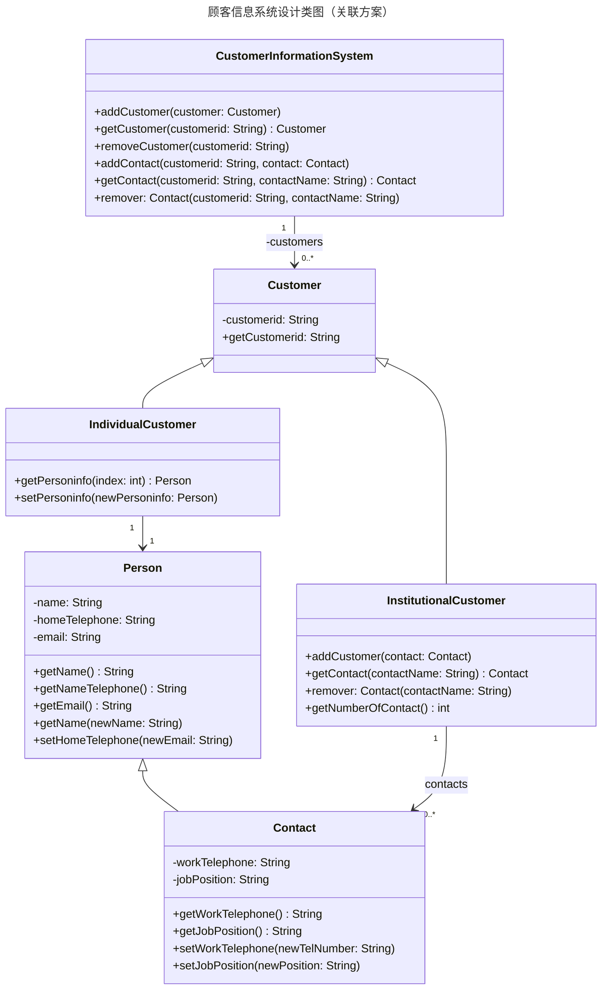
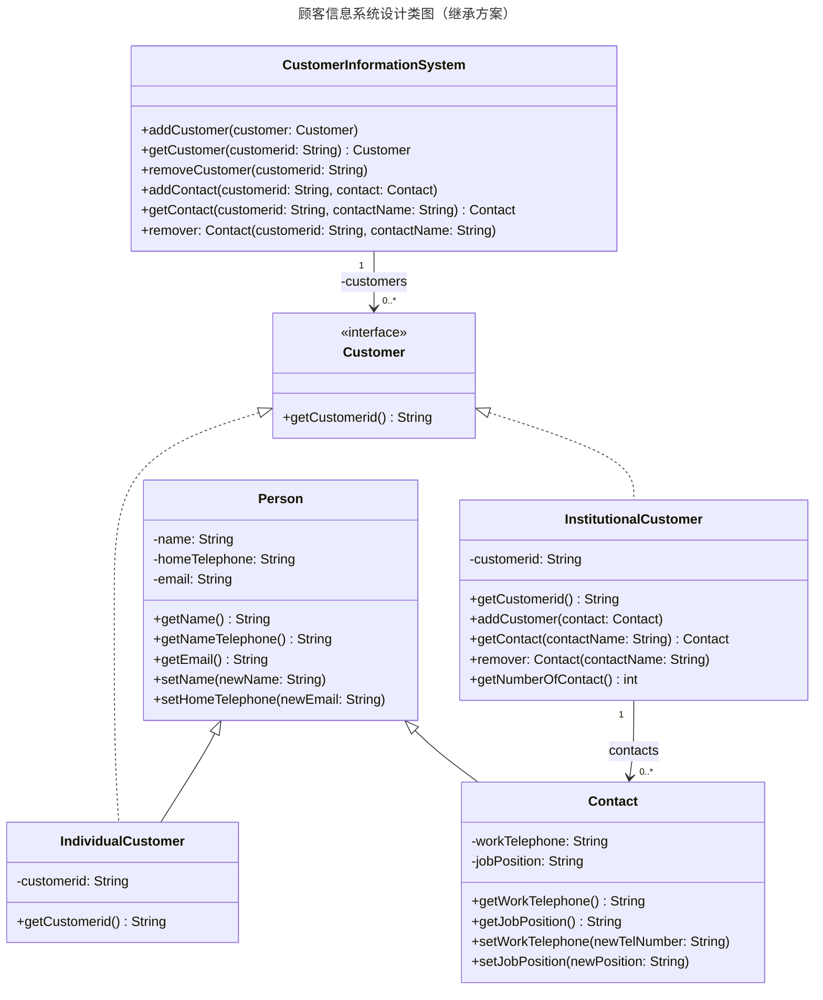

# 5.3 继承关系和关联关系

## 5.3.1 顾客信息系统

现有一个顾客信息系统，本节采用英语描述，并用黑体标示出该需求中的名词和名词短语，以便于分析设计类图。

> The **customer information system** maintains information about two different kinds of **customers**:
>
> 1. **Individual customers**: For these customers, the system stores an ID and the informaion about a **person** (**name**, **home telephone number**, and **email**).
>
> 2. **Institutional customers**: For these customers, the system stores an ID and provides the capability of defining one or more **contact people** for the institution. The system stores the following information for each contact person: **name**, **home telephone number**, **email**, **work telephone number**, and the **job position** of the contact in the institution.
>
> Assume that each customer has a unique ID and that IDs cannot be modified. Assume that each contact for an institution has a unique name.
>
> The system provides the following functions:
>
> - Add a customer into the system.
> - Look up a customer given an ID.
> - Remove a customer from the system given an ID.
> - Add a new contact for an institutional customer.
> - Look up a contact given the ID of the institution and the name of the contact.
> - Remove a contact given the ID of the institution and the name of the contact.

读者可以对该顾客信息系统的案例进行设计，很显然，顾客可以作为基类，个体顾客和机构顾客是它的两个子类，而对于 `individualCustomer` 和 `Person` 的关系，有的设计者建模为 1 对 1 的关联关系，也有的设计者建模为继承关系。这时，哪个方案更好?

## 5.3.2 关联关系和继承关系

### 方案一：使用关联关系

上面的类图为我们展示了一种可能的设计方案。让我们来详细解读一下这个设计中的关系：

- **`Customer` 作为基类**：设计者正确地识别出了“个体顾客”和“机构顾客”的共性，将 `Customer` 作为抽象基类，包含了所有顾客共有的属性，如图中的 `customerid`。`IndividualCustomer` 和 `InstitutionalCustomer` 都继承自 `Customer`，这体现了**继承（is-a）** 关系。这是一种典型的、合理的继承用法。

- **`IndividualCustomer` 与 `Person` 的关系**：图中 `IndividualCustomer` 与 `Person` 之间是**一对一的关联（has-a）** 关系。这意味着一个 `IndividualCustomer` 对象“拥有”一个 `Person` 对象来存储其个人信息（姓名、家庭电话、邮箱）。从代码实现的角度看，`IndividualCustomer` 类中会包含一个 `Person` 类型的成员变量。

- **`InstitutionalCustomer` 与 `Contact` 的关系**：图中 `InstitutionalCustomer` 与 `Contact` 之间是**一对多的关联（has-a）** 关系。这意味着一个 `InstitutionalCustomer` 对象可以“拥有”零个或多个 `Contact` 对象。在代码实现上，`InstitutionalCustomer` 类中会有一个集合（如 `List<Contact>`）来存储其所有的联系人。

- **`Contact` 与 `Person` 的关系**：图中 `Contact` 继承自 `Person`，这是一种**继承（is-a）** 关系。这个设计的逻辑是：一个“联系人”首先是一个“人”，所以它天然地拥有 `Person` 类的所有属性（姓名、家庭电话、邮箱），同时它还有自己独特的属性（工作电话、职位）。

这个设计方案在结构上是清晰的，并且在很大程度上遵循了面向对象的设计原则。但它是否是唯一的，或者说最优的方案呢？特别是 `IndividualCustomer` 与 `Person` 之间的关系，我们不禁要问：一个个体顾客（Individual Customer）**是**一个人（Person），还是**拥有**一个人的信息（Person）？

就用到了我们接下来要探讨的核心问题：如何在这两种关系之间做出正确的选择。

### 方案二：使用继承关系

针对上面提出的问题，我们可以构思另一种设计方案。在这个方案中，我们认为“个体顾客”**是**一个“人”，因此 `IndividualCustomer` 可以直接继承 `Person` 类。同时，`IndividualCustomer` 本身也是一个 `Customer`，所以它也需要继承 `Customer`。由于 Java 不支持多重继承，我们通常会选择将其中一个父类作为接口来实现。

考虑到 `Customer` 只包含一个 `customerid` 和相关的行为，更像是一种“身份”或“契约”，而 `Person` 包含了更具体的属性和状态，因此一个更合理的设计是将 `Customer` 设计为接口。

下面是这个替代方案的类图：

在这个设计中：

- **`Customer` 变为接口**：它定义了一个顾客必须遵守的契约，即必须提供一个获取 `customerid` 的方法。
- **`IndividualCustomer` 继承 `Person` 并实现 `Customer`**：这种关系可以解读为 `IndividualCustomer` **是**一个 `Person`，同时它也扮演着 `Customer` 的**角色**。它从 `Person` 继承了所有个人信息相关的属性和方法，并自己实现了 `Customer` 接口中定义的方法。
- **`InstitutionalCustomer` 实现 `Customer`**：机构顾客不是一个“人”，所以它不能继承 `Person`。它直接实现 `Customer` 接口，并拥有自己的联系人列表（`Contact`）。

现在我们有了两个不同的设计方案，接下来就可以对它们进行详细的比较和分析了。

### 方案对比与分析

我们从几个不同的维度来比较这两个方案：

| 特性           | 方案一 (关联 Has-a)                                                       | 方案二 (继承 Is-a)                                              |
| :------------- | :------------------------------------------------------------------------ | :-------------------------------------------------------------- |
| **关系解读**   | `IndividualCustomer` **拥有** `Person` 的信息。                           | `IndividualCustomer` **是**一个 `Person`。                      |
| **耦合度**     | **较低**。`IndividualCustomer` 和 `Person` 是两个独立的类，通过组合连接。 | **较高**。子类 `IndividualCustomer` 与父类 `Person` 紧密耦合。  |
| **代码复用**   | 通过**组合**复用 `Person` 类的功能。                                      | 通过**继承**复用 `Person` 类的功能。                            |
| **灵活性**     | **更高**。`Person` 的变化不直接影响 `IndividualCustomer` 的继承体系。     | **较低**。`Person` 的任何改动都会被 `IndividualCustomer` 继承。 |
| **语义清晰度** | 可能引发争议：顾客到底是不是人？                                          | 语义上更符合直觉：个体顾客就是一个人。                          |

#### 深入分析

**方案一（关联）：**

|优势|劣势|
|:--|:--|
|**松耦合，更灵活**： 这是关联关系最大的优点。`IndividualCustomer` 和 `Person` 是两个独立的实体。如果未来 `Person` 类的定义发生变化（例如，增加了 `age` 属性），`IndividualCustomer` 类本身的代码不需要改变。我们甚至可以在运行时动态地为一个 `IndividualCustomer` 更换其关联的 `Person` 对象（虽然在这个业务场景下可能意义不大）。这种设计使得系统的各个部分更加独立，易于维护和修改。|**增加了类的数量和管理的复杂性**： 我们需要同时管理 `IndividualCustomer` 和 `Person` 两个类的对象。|
|**避免继承滥用**： 继承是一个非常强的关系。如果 `IndividualCustomer` 仅仅是为了复用 `Person` 的几个属性，而其本质行为与 `Person` 并不完全一致，那么使用继承就是不恰当的。方案一避免了这个问题。|**代码冗余**： 当 `IndividualCustomer` 需要暴露 `Person` 的信息时，需要在 `IndividualCustomer` 类中编写额外的“代理方法”。例如，为了获取顾客的姓名，调用链会是 `individualCustomer.getPersoninfo().getName()`，而不是更直接的 `individualCustomer.getName()`。|

**方案二（继承）：**

|优势|劣势|
|:--|:--|
|**代码简洁，直观**： `IndividualCustomer` 直接拥有了 `Person` 的所有 `public` 和 `protected` 成员，无需编写任何代理方法。获取姓名可以直接调用 `individualCustomer.getName()`，代码更短，意图更明显。|**高耦合，破坏封装性**： 这是继承关系最大的风险。父类 `Person` 的任何变化都会直接影响子类 `IndividualCustomer`。如果父类的实现发生改变，可能会无意中破坏子类的功能。这被称为“脆弱的基类问题”（Fragile Base Class Problem）。|
|**符合“is-a”的直觉**： 在现实世界中，“个体顾客是一个人”这个逻辑是成立的，因此这种设计在语义上非常清晰。|**继承体系僵化**： 一旦 `IndividualCustomer` 继承了 `Person`，这个关系在编译时就固定下来了。如果未来业务发生变化，例如，一个 `Person` 可以同时是多个不同类型的 `Customer`，这种设计将难以扩展。|

#### 结论：哪个方案更好？

在这个特定的“顾客信息系统”案例中，**方案一（关联关系）通常被认为是更优的设计**。

尽管方案二在代码上看起来更简洁，但它引入了继承带来的高耦合风险。面向对象设计中有一条非常重要的原则：“**组合优于继承**”（Composition over Inheritance）。这条原则建议我们优先使用组合/聚合（即关联关系）来复用代码，因为它提供了比继承更高的灵活性和更低的耦合度。

`IndividualCustomer` 的核心职责是作为系统中的一个“顾客”，而“人”的属性只是它的一部分数据。它“拥有”人的信息，但它的行为不完全等同于一个 `Person`。因此，使用关联关系能更好地将“顾客”的职责和“人”的属性分离开来，使得系统设计更加健壮和灵活。

## 5.3.3 总结：Is-a 还是 Has-a？

通过上面的案例分析，我们可以总结出在面向对象设计中选择继承（Is-a）与关联（Has-a）关系时可以参考的一般性原则：

1.  **明确关系本质：Is-a vs. Has-a**

    - **继承 (Is-a)**：表示“是一个”的关系，是类型之间的一种分类关系。子类是父类的一个特殊类型（A is a kind of B）。例如，`Dog` is a `Animal`。使用继承时，要确保子类在概念上完全符合父类的定义，并且能够遵循里氏替换原则（Liskov Substitution Principle），即任何使用父类的地方都可以用子类来替换而不会产生错误。
    - **关联 (Has-a)**：表示“有一个”或“包含”的关系，是对象之间的一种结构关系。一个类“拥有”另一个类的对象作为其成员或一部分（A has a B）。例如，一辆 `Car` has an `Engine`。

2.  **优先使用组合/关联，而不是继承**

    - 这是面向对象设计中的一条黄金法则：“Composition over inheritance”。
    - **继承**是“白盒复用”，因为父类的内部实现对子类是可见的，这破坏了封装性，并带来了高耦合。父类的改变很可能导致所有子类都需要修改。
    - **关联/组合**是“黑盒复用”，因为被包含的对象（如 `Person`）的内部实现是隐藏的。我们只通过其公开的接口进行交互，耦合度更低，系统更灵活。

3.  **什么时候应该使用继承？**

    - 当两个类之间存在明显的、内在的“is-a”关系，并且这种关系在可预见的未来是稳定的时候。
    - 当子类需要重写父类的方法以实现多态行为时。这是继承最强大的用途之一。
    - 当你想利用父类来为一组子类定义一个共同的、强制性的接口或契约时。

4.  **什么时候应该使用关联？**
    - 当你仅仅是为了复用一个类的功能，而不是因为它们之间存在“is-a”的分类关系时。
    - 当你想在运行时动态地改变一个类的行为或组成部分时。例如，一个 `Computer` 可以在运行时更换它的 `GraphicsCard`。
    - 当一个类需要包含多个另一个类的实例时（一对多或多对多关系），只能使用关联。

总而言之，继承是一个强大但需要谨慎使用的工具。在设计类时，我们应该首先思考类之间的关系本质。如果“Has-a”能够满足需求，那么就优先选择关联/组合，因为它能带来一个更灵活、更健壮、更易于维护的系统。只有当“Is-a”关系非常明确且必要时，才考虑使用继承。
