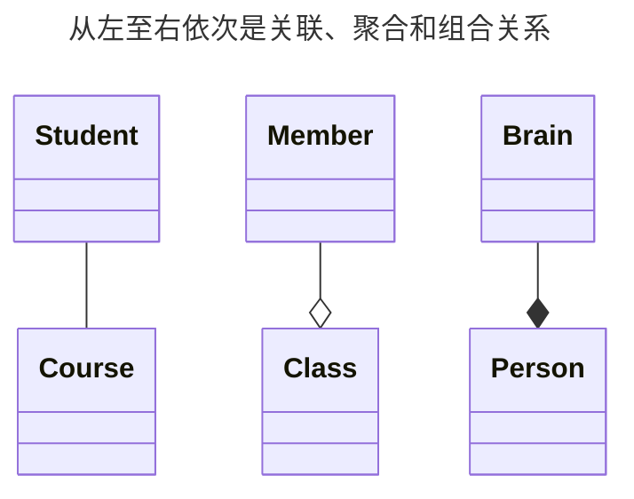

# 6.2 关联关系的 Java 编程实现

## 6.2.1 关联关系

### 关联关系的概念

在面向对象的世界里，对象之间并不是孤立存在的，它们通过各种方式相互协作，共同完成复杂的任务。**关联（Association）** 关系就是用来描述对象之间结构化联系的最常用的一种方式。

简单来说，关联关系描述了一个类的对象与另一个类的对象之间存在的长期、稳定的连接。例如，“学生”和“课程”之间存在关联，“老师”和“学生”之间也存在关联。这种关系是结构性的，因为它强调了系统在结构上由哪些部分组成，以及这些部分是如何连接的。

在 Java 编程中，我们通常通过在一个类中包含另一个类对象的引用（即成员变量）来实现关联关系。

### 关联关系的类型

关联关系本身是一个广义的概念，根据关系强弱和生命周期的不同，可以细分为三种主要类型：

1.  **普通关联（Association）**：这是一种最弱的关联。两个类在概念上是平等的，它们的生命周期相互独立。一个对象的销毁不会导致另一个对象的销毁。例如，一个“学生”可以选择多门“课程”，一门“课程”也可以被多个“学生”选择。学生和课程的生命周期是独立的，一个学生毕业了，课程依然存在。

2.  **聚合（Aggregation）**：这是一种“整体-部分”（has-a）的关联，但关系相对松散。部分可以脱离整体而独立存在。例如，“班级”和“学生”的关系。一个班级由多个学生组成，但如果这个班级解散了，学生依然作为独立个体存在，可以加入其他班级。

3.  **组合（Composition）**：这是一种更强的“整体-部分”（contains-a）的关联，也称为“强聚合”。部分与整体的生命周期紧密绑定，部分不能脱离整体而独立存在。如果整体被销毁，部分也随之销-毁。例如，“人”和“大脑”的关系。人由大脑等器官组成，如果人死亡了，大脑也就不复存在了。

| 关系类型 | 关系强度 | 生命周期         | 举例        | UML 表示         |
| :------- | :------- | :--------------- | :---------- | :--------------- |
| **关联** | 弱       | 独立             | 学生 - 课程 | 实线箭头或直线   |
| **聚合** | 中       | 部分可独立       | 班级 - 学生 | 空心菱形指向整体 |
| **组合** | 强       | 部分与整体共存亡 | 人 - 大脑   | 实心菱形指向整体 |



## 6.2.2 管理集合：数组与容器

在实现“一对多”或“多对多”的关联关系时，我们需要一种方式来持有多个对象的引用。在 Java 中，最基础的机制就是**数组（Array）**。数组是一个固定大小的、存储相同类型元素的容器。

### 数组

#### 数组的声明

声明一个数组需要指定元素的类型和数组的名称。

```java
// 声明一个能存储整数的数组
int[] intArray;

// 声明一个能存储字符串的数组
String[] stringArray;

// 声明一个能存储 Student 对象的数组
Student[] studentArray;
```

::: warning 注意
`int[] arr` 和 `int arr[]` 两种声明方式都可以，但前者是 Java 推荐的风格，因为它将类型 `int[]` (整数数组) 和变量名 `arr` 分开了，更清晰。
:::

#### 数组变量的初始化

声明数组后，它仅仅是一个引用，还没有指向任何实际的内存空间（值为 `null`）。我们需要使用 `new` 关键字来创建数组实例，并指定其长度。

```java
// 创建一个长度为 10 的整数数组
intArray = new int[10];

// 声明的同时进行创建
Student[] studentArray = new Student[30]; // 可以容纳 30 个学生对象
```

也可以在创建时直接提供初始值，编译器会自动计算数组的长度。

```java
// 静态初始化
String[] names = {"张三", "李四", "王五"};
int[] scores = {98, 100, 95, 88};
```

#### 数组的使用

通过**索引（Index）** 来访问、修改数组中的元素。数组的索引从 `0` 开始，到 `length - 1` 结束。

```java
// 创建一个学生数组
Student[] students = new Student[3];

// 为数组元素赋值
students[0] = new Student("小明");
students[1] = new Student("小红");
// students[2] 的值仍然是 null

// 访问数组元素
System.out.println("第一个学生是：" + students[0].getName());

// 遍历数组
for (int i = 0; i < students.length; i++) {
    if (students[i] != null) {
        System.out.println("学生 " + (i + 1) + ": " + students[i].getName());
    }
}
```

**数组的局限性**：

- **大小固定**：一旦创建，数组的长度就不能改变。如果需要添加的元素超过了数组容量，就需要创建一个更大的新数组，并将旧数组的元素复制过去，非常不便。
- **功能有限**：数组本身提供的操作方法很少，比如插入、删除元素等操作都需要自己手动实现。

由于这些局限性，在实际开发中，尤其是在需要动态增删元素的场景下，我们更倾向于使用 Java 提供的**容器（Collection）**。

为了克服数组的缺点，Java 提供了功能强大的**集合框架（Collection Framework）**，位于 `java.util` 包中。其中，**容器（或称集合）** 是用于存储和管理对象的主要工具。

### 容器

#### 容器 `java.util.ArrayList<E>`

`ArrayList` 是最常用的容器之一，它像一个“可变长度的数组”。`E` 是泛型参数，代表容器中存储的元素类型。

**核心优势**：

- **动态扩容**：当元素数量超过当前容量时，`ArrayList` 会自动创建一个更大的内部数组来容纳新元素。
- **丰富的 API**：提供了大量便捷的方法，如 `add()`、`remove()`、`get()`、`size()`、`isEmpty()` 等。

让我们用 `ArrayList` 来重写之前“一对多”关系中 `Clazz` 的例子：

```java
import java.util.ArrayList;
import java.util.List; // ArrayList 实现了 List 接口

public class Clazz {
    private String name;
    // 使用 ArrayList 来存储 Student 对象，比数组灵活得多
    private List<Student> students = new ArrayList<>();

    public Clazz(String name) {
        this.name = name;
    }

    // 添加学生，无需担心容量问题
    public void addStudent(Student student) {
        this.students.add(student);
    }

    // 移除学生
    public void removeStudent(Student student) {
        this.students.remove(student);
    }

    public List<Student> getStudents() {
        return students;
    }
}
```

#### 迭代器 `Iterator<E>`

如何遍历容器中的所有元素？虽然 `ArrayList` 可以像数组一样使用 `for` 循环和 `get(i)` 方法来遍历，但对于其他类型的容器（如 `HashSet`、`LinkedList`），这种方式可能效率低下或根本不适用。

为了提供一种统一的遍历方式，Java 设计了**迭代器（Iterator）** 接口。任何实现了 `Collection` 接口的容器都必须提供一个 `iterator()` 方法，该方法返回一个迭代器对象。

`Iterator` 接口的核心方法：

- `hasNext()`: 判断是否存在下一个元素。
- `next()`: 返回下一个元素，并将迭代器的指针后移。
- `remove()`: （可选操作）删除 `next()` 方法最后一次返回的元素。

使用迭代器遍历 `Clazz` 中的学生：

```java
import java.util.Iterator;

// ... 在 Main 方法中
Clazz clazz = new Clazz("计算机一班");
// ... 添加学生

System.out.println("班级: " + clazz.getName());
Iterator<Student> iterator = clazz.getStudents().iterator();
while (iterator.hasNext()) {
    Student s = iterator.next();
    System.out.println("  学生: " + s.getName());
}
```

**使用迭代器的好处**：

- **统一性**：为所有类型的容器提供了统一的遍历逻辑，使代码更具通用性。
- **安全性**：在遍历过程中，如果直接使用容器的 `remove()` 方法删除元素，可能会导致并发修改异常（`ConcurrentModificationException`）。而使用迭代器的 `remove()` 方法是安全的。

#### `for-each` 循环

虽然迭代器很强大，但 `while` 循环的写法还是有些繁琐。从 Java 5 开始，引入了 `for-each` 循环（也称增强 for 循环），它可以极大地简化容器和数组的遍历。

`for-each` 循环的本质是一个语法糖，它在编译后会被转换为对迭代器的调用（对于容器）或传统的 `for` 循环（对于数组）。

使用 `for-each` 循环遍历学生：

```java
// 遍历容器
System.out.println("班级: " + clazz.getName());
for (Student s : clazz.getStudents()) {
    System.out.println("  学生: " + s.getName());
}

// 遍历数组
String[] names = {"张三", "李四", "王五"};
for (String name : names) {
    System.out.println("姓名: " + name);
}
```

`for-each` 循环语法简洁，可读性强，是遍历数组和容器的首选方式，除非你需要在遍历时获取索引或安全地删除元素（此时仍需使用传统 `for` 循环或迭代器）。

## 6.2.3 实现不同多重性的关联

多重性（Multiplicity）描述了关联关系中，一个类的实例可以与另一个类的多少个实例相关联。常见的有多重性有一对一、一对多和多对多。

### 一对一（One-to-One）

一个对象最多只能与另一个对象的一个实例相关联。

**场景**：一个人（Person）只有一个身份证（IDCard），一个身份证也只对应一个人。

**实现方式**：在两个类中互相持有对方的引用。

```java
// Person.java
public class Person {
    private String name;
    // [!code highlight:1]
    private IDCard card; // 持有 IDCard 的引用

    public Person(String name) {
        this.name = name;
    }

    public void setCard(IDCard card) {
        this.card = card;
    }

    public IDCard getCard() {
        return card;
    }
}

// IDCard.java
public class IDCard {
    private String cardNumber;
    // [!code highlight:1]
    private Person person; // 持有 Person 的引用

    public IDCard(String cardNumber) {
        this.cardNumber = cardNumber;
    }

    public void setPerson(Person person) {
        this.person = person;
    }

    public Person getPerson() {
        return person;
    }
}

// Main.java
public class Main {
    public static void main(String[] args) {
        Person person = new Person("张三");
        IDCard card = new IDCard("123456789012345678");

        // [!code highlight:3]
        // 建立双向关联
        person.setCard(card);
        card.setPerson(person);

        System.out.println(person.getName() + " 的身份证号是: " + person.getCard().getCardNumber());
        System.out.println(card.getCardNumber() + " 对应的人是: " + card.getPerson().getName());
    }
}
```

### 一对多（One-to-Many）

“一”的一方的对象可以与“多”的一方的多个对象相关联，但“多”的一方的每个对象只能与“一”的一方的一个对象相关联。

**场景**：一个班级（Clazz）可以包含多个学生（Student），但一个学生只属于一个班级。

**实现方式**：“一”的一方持有一个“多”的一方对象的集合，“多”的一方持有“一”的一方的一个引用。

```java
import java.util.ArrayList;
import java.util.List;

// Clazz.java (一的一方)
public class Clazz {
    private String name;
    // [!code highlight:1]
    private List<Student> students = new ArrayList<>(); // 持有多个 Student 的引用

    public Clazz(String name) {
        this.name = name;
    }

    public void addStudent(Student student) {
        this.students.add(student);
    }

    public List<Student> getStudents() {
        return students;
    }
}

// Student.java (多的一方)
public class Student {
    private String name;
    // [!code highlight:1]
    private Clazz clazz; // 持有 Clazz 的引用

    public Student(String name, Clazz clazz) {
        this.name = name;
        this.clazz = clazz;
    }

    public String getName() {
        return name;
    }

    public Clazz getClazz() {
        return clazz;
    }
}

// Main.java
public class Main {
    public static void main(String[] args) {
        Clazz clazz = new Clazz("计算机一班");

        // [!code highlight:2]
        Student student1 = new Student("李四", clazz);
        Student student2 = new Student("王五", clazz);

        // [!code highlight:2]
        clazz.addStudent(student1);
        clazz.addStudent(student2);

        System.out.println("班级: " + clazz.getName());
        for (Student s : clazz.getStudents()) {
            System.out.println("  学生: " + s.getName());
        }
    }
}
```

### 多对多（Many-to-Many）

任意一方的对象都可以与对方的多个对象相关联。

**场景**：一个学生（Student）可以选择多门课程（Course），一门课程也可以被多个学生选择。

**实现方式**：在两个类中都持有对方的一个对象集合。

```java
import java.util.ArrayList;
import java.util.List;

// Student.java
public class Student {
    private String name;
    // [!code highlight:1]
    private List<Course> courses = new ArrayList<>(); // 持有多个 Course 的引用

    public Student(String name) {
        this.name = name;
    }

    public void addCourse(Course course) {
        this.courses.add(course);
    }

    public List<Course> getCourses() {
        return courses;
    }
    // ... getName()
}

// Course.java
public class Course {
    private String name;
    // [!code highlight:1]
    private List<Student> students = new ArrayList<>(); // 持有多个 Student 的引用

    public Course(String name) {
        this.name = name;
    }

    public void addStudent(Student student) {
        this.students.add(student);
    }

    public List<Student> getStudents() {
        return students;
    }
    // ... getName()
}

// Main.java
public class Main {
    public static void main(String[] args) {
        Student student1 = new Student("小明");
        Student student2 = new Student("小红");

        Course course1 = new Course("Java编程");
        Course course2 = new Course("数据结构");

        // [!code highlight:8]
        // 建立双向关联
        student1.addCourse(course1);
        student1.addCourse(course2);
        course1.addStudent(student1);
        course2.addStudent(student1);

        student2.addCourse(course1);
        course1.addStudent(student2);

        System.out.println(course1.getName() + " 的选课学生:");
        for (Student s : course1.getStudents()) {
            System.out.println("  " + s.getName());
        }
    }
}
```

## 6.2.4 特殊的关联：聚合与组合

聚合和组合在代码实现上与普通关联非常相似，都是通过成员变量持有其他对象的引用。它们的区别更多地体现在**设计思想**和**生命周期管理**上。

### 聚合（Aggregation）

聚合关系中，“部分”对象的生命周期不由“整体”控制。

**场景**：一个车队（Fleet）由多辆汽车（Car）组成。车队解散了，汽车仍然可以单独存在。

```java
import java.util.ArrayList;
import java.util.List;

// Car.java (部分)
public class Car {
    private String licensePlate;

    public Car(String licensePlate) {
        this.licensePlate = licensePlate;
    }
    // ... getter
}

// Fleet.java (整体)
public class Fleet {
    private String name;
    private List<Car> cars = new ArrayList<>();

    public Fleet(String name) {
        this.name = name;
    }

    // [!code highlight:4]
    // 外部创建的 Car 对象被加入到 Fleet 中
    public void addCar(Car car) {
        this.cars.add(car);
    }
}

// Main.java
public class Main {
    public static void main(String[] args) {
        Car car1 = new Car("京A88888");
        Car car2 = new Car("沪B66666");

        Fleet fleet = new Fleet("第一车队");
        fleet.addCar(car1);
        fleet.addCar(car2);

        // [!code highlight:4]
        // 即使 fleet 对象被销毁，car1 和 car2 依然存在
        fleet = null;
        System.out.println(car1.getLicensePlate()); // 仍然可以访问
    }
}
```

### 组合（Composition）

组合关系中，“部分”对象的创建和销毁由“整体”完全控制。

**场景**：一辆汽车（Car）由一个引擎（Engine）和多个轮子（Wheel）组成。汽车报废了，它的引擎和轮子也就没有存在的意义了。

**实现要点**：“部分”对象通常在“整体”的构造函数中被创建，并且不提供公共方法让外部直接访问或修改这些“部分”对象。

```java
import java.util.ArrayList;
import java.util.List;

// Engine.java (部分)
class Engine {
    public void start() {
        System.out.println("引擎启动");
    }
}

// Wheel.java (部分)
class Wheel {
    private int position;
    public Wheel(int position) { this.position = position; }
}

// Car.java (整体)
public class Car {
    // Engine 和 Wheel 对象由 Car 内部创建和管理
    private Engine engine;
    private List<Wheel> wheels = new ArrayList<>();

    public Car() {
        // 在整体的构造函数中创建部分
        this.engine = new Engine();
        for (int i = 1; i <= 4; i++) {
            // [!code highlight:1]
            this.wheels.add(new Wheel(i));
        }
        System.out.println("一辆新车被制造出来了");
    }

    public void drive() {
        engine.start();
        System.out.println("汽车行驶中...");
    }

    // 没有提供 setEngine() 或 addWheel() 等方法
}

// Main.java
public class Main {
    public static void main(String[] args) {
        Car myCar = new Car();
        myCar.drive();

        // [!code highlight:3]
        // 当 myCar 的引用丢失，GC 会回收 Car 对象，
        // 同时，由它创建的 Engine 和 Wheel 对象也会被回收。
        myCar = null;
    }
}
```

## 6.2.5 总结

关联、聚合和组合是理解和设计面向对象系统结构的基础。在 Java 中，这些关系都通过对象引用（成员变量）来实现，但它们的核心区别在于语义和生命周期管理：

- **关联**是对象间的通用连接，生命周期独立。
- **聚合**是松散的“整体-部分”关系，部分可以独立于整体存在。
- **组合**是紧密的“整体-部分”关系，部分的生命周期依赖于整体。

理解这些关系，并根据实际业务场景选择合适的实现方式，是编写出结构清晰、高内聚、低耦合的 Java 代码的关键一步。
