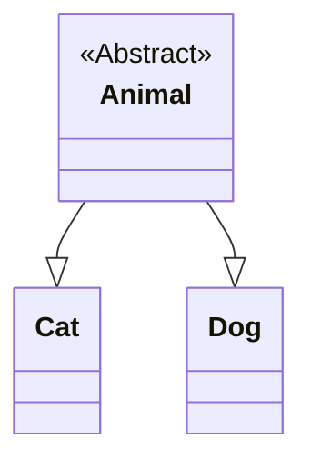

# 7.1 抽象类

在面向对象编程中，我们经常会遇到这样一种情况：父类中的某个方法无法给出具体的实现，或者说，父类的方法需要其子类根据自身的特性进行定制化的实现。这时，就可以使用抽象类和抽象方法。

## 7.1.1 抽象方法

**抽象方法**是指一个只有方法声明，没有方法体的方法。它使用 `abstract` 关键字来修饰。

抽象方法的特点：

- **没有方法体**：抽象方法没有 `{}` 括起来的具体实现。
- **必须在抽象类中**：如果一个类包含抽象方法，那么该类也必须被声明为抽象类。
- **强制子类实现**：继承抽象类的子类必须实现（重写）父类中所有的抽象方法，除非子类本身也是一个抽象类。

下面是一个抽象方法的例子：

```java
public abstract class Shape {
    // 这是一个抽象方法
    public abstract double getArea();
}
```

在这个例子中，`getArea()` 方法就是一个抽象方法。因为它在 `Shape` 类中无法确定如何计算面积，具体的计算方式需要由其子类（如 `Circle`、`Rectangle` 等）来决定。

## 7.1.2 抽象类的定义及使用方法

**抽象类**是指被 `abstract` 关键字修饰的类。它存在的目的主要是为了**被继承**。

**抽象类的定义**：

```java
public abstract class Animal {
    private String name;

    public Animal(String name) {
        this.name = name;
    }

    // 抽象方法
    public abstract void makeSound();

    // 普通方法
    public void eat() {
        System.out.println("这个动物正在吃东西...");
    }
}
```

在这个 `Animal` 抽象类中，`makeSound()` 是一个抽象方法，因为不同动物的叫声是不同的。而 `eat()` 是一个普通方法，因为它对于所有动物来说是共通的。

**使用方法**：

抽象类不能被实例化（即不能使用 `new` 关键字创建对象），它只能被继承。子类继承抽象类后，必须实现所有的抽象方法。

```java
public class Cat extends Animal {
    public Cat(String name) {
        super(name);
    }

    @Override
    public void makeSound() {
        System.out.println("喵喵喵！");
    }
}

public class Dog extends Animal {
    public Dog(String name) {
        super(name);
    }

    @Override
    public void makeSound() {
        System.out.println("汪汪汪！");
    }
}
```

我们可以这样使用它们：

```java
public class Main {
    public static void main(String[] args) {
        // Animal animal = new Animal("动物"); // 错误！抽象类不能被实例化

        Animal myCat = new Cat("咪咪");
        myCat.makeSound(); // 输出：喵喵喵！
        myCat.eat();       // 输出：这个动物正在吃东西...

        Animal myDog = new Dog("旺财");
        myDog.makeSound(); // 输出：汪汪汪！
        myDog.eat();       // 输出：这个动物正在吃东西...
    }
}
```

## 7.1.3 抽象类的特点

为了更好地理解抽象类，我们可以总结出以下几个特点：

1.  **不能被实例化**：抽象类不能创建自己的对象。
2.  **可以有构造方法**：抽象类的构造方法主要用于子类创建对象时，初始化父类的成员变量。
3.  **可以包含普通成员变量和方法**：抽象类和普通类一样，可以拥有成员变量、成员方法、构造方法等。
4.  **可以包含抽象方法**：这是抽象类最重要的特性。
5.  **子类必须实现所有抽象方法**：一个非抽象子类继承抽象类后，必须重写父类中所有的抽象方法。如果子类不想实现，那么子类也必须被声明为抽象类。

下面用一张图来展示 `Animal`、`Cat` 和 `Dog` 之间的关系：



## 7.1.4 抽象类的应用场景

抽象类在实际开发中非常有用，它常常被用作**模板**。当多个类具有一些共同的行为，但又有各自独特的实现时，就可以将这些共同的行为提取到抽象类中，然后让各个子类去实现那些独特的部分。

例如，我们可以设计一个制作饮料的模板。制作饮料的流程大致是相同的：烧水、放入原料、倒入杯中、加入辅料。但是，放入的原料和加入的辅料是不同的。

```java
// 制作饮料的抽象类（模板）
public abstract class Beverage {

    // 制作流程，这是一个模板方法
    public final void prepareBeverage() {
        boilWater();
        brew();
        pourInCup();
        addCondiments();
    }

    // 烧水（共同行为）
    private void boilWater() {
        System.out.println("烧开水");
    }

    // 放入原料（抽象方法，由子类实现）
    protected abstract void brew();

    // 倒入杯中（共同行为）
    private void pourInCup() {
        System.out.println("倒入杯中");
    }

    // 加入辅料（抽象方法，由子类实现）
    protected abstract void addCondiments();
}
```

然后，我们可以创建具体的咖啡类和茶类：

```java
// 制作咖啡
public class Coffee extends Beverage {
    @Override
    protected void brew() {
        System.out.println("冲泡咖啡");
    }

    @Override
    protected void addCondiments() {
        System.out.println("加糖和牛奶");
    }
}

// 制作茶
public class Tea extends Beverage {
    @Override
    protected void brew() {
        System.out.println("浸泡茶叶");
    }

    @Override
    protected void addCondiments() {
        System.out.println("加柠檬");
    }
}
```

这样，我们就通过抽象类实现了一个模板，使得制作饮料的流程被固定下来，而具体的原料和辅料则由子类自由发挥。这种设计模式被称为**模板方法模式**。
