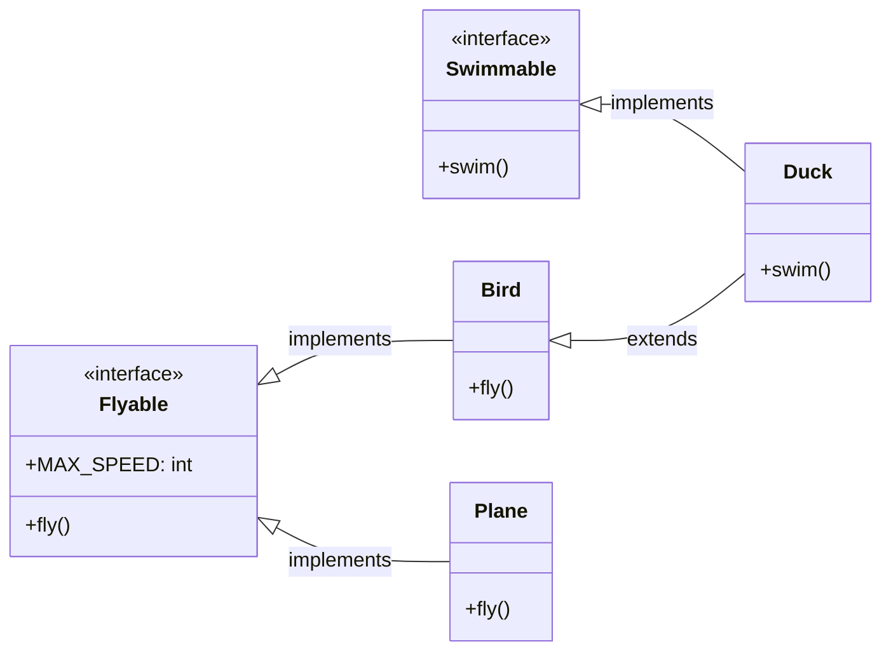
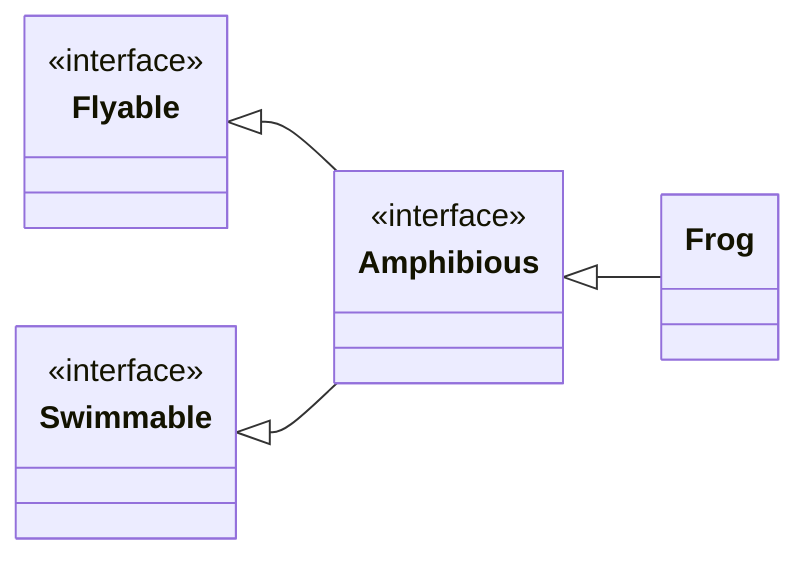
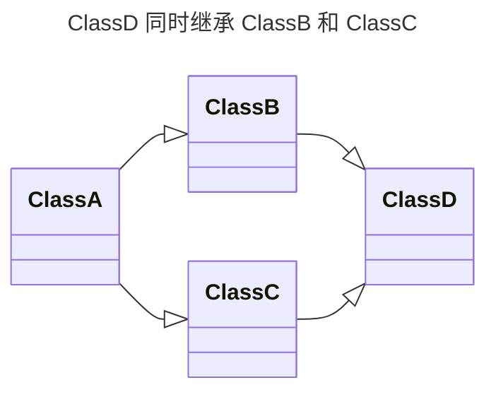

# 7.2 接口

在 Java 中，接口（Interface）是一种完全抽象的类型，它定义了一组方法的规范，但没有提供这些方法的具体实现。接口是 Java 中实现多态和代码解耦的重要机制。

## 7.2.1 接口的定义

接口使用 `interface` 关键字来定义。接口中可以包含：

- **常量**：接口中定义的变量默认都是 `public static final` 类型的常量。
- **抽象方法**：接口中的方法默认都是 `public abstract` 的，没有方法体。
- **默认方法**（Java 8+）：使用 `default` 关键字修饰，可以有方法体。
- **静态方法**（Java 8+）：使用 `static` 关键字修饰，可以有方法体。

下面是一个简单的接口定义示例：

```java
public interface Flyable {
    // 常量
    int MAX_SPEED = 100;

    // 抽象方法
    void fly();
}
```

在这个例子中，`Flyable` 接口定义了一个名为 `fly` 的抽象方法，任何实现了这个接口的类都必须提供 `fly` 方法的具体实现。

## 7.2.2 接口的实现

一个类可以使用 `implements` 关键字来实现一个或多个接口。当一个类实现一个接口时，它必须实现接口中定义的所有抽象方法，除非这个类本身也是一个抽象类。

```java
public class Bird implements Flyable {
    @Override
    public void fly() {
        System.out.println("鸟在飞");
    }
}

public class Plane implements Flyable {
    @Override
    public void fly() {
        System.out.println("飞机在飞");
    }
}
```

一个类可以实现多个接口，这使得 Java 可以绕过单继承的限制，实现类似多重继承的效果。

```java
public interface Swimmable {
    void swim();
}

public class Duck extends Bird implements Swimmable {
    @Override
    public void swim() {
        System.out.println("鸭子在游泳");
    }
}
```

可以使用类图来表示这种关系：



## 7.2.3 接口之间的继承

和类一样，接口之间也可以使用 `extends` 关键字实现继承。一个接口可以继承一个或多个接口，从而获得父接口中定义的所有常量和方法。

```java
public interface Flyable {
    void fly();
}

public interface Swimmable {
    void swim();
}

// Amphibious 接口继承了 Flyable 和 Swimmable 接口
public interface Amphibious extends Flyable, Swimmable {
    void moveOnLand();
}

// 实现 Amphibious 接口的类需要实现所有三个接口的方法
public class Frog implements Amphibious {
    @Override
    public void fly() {
        System.out.println("青蛙不会飞，但这是个例子");
    }

    @Override
    public void swim() {
        System.out.println("青蛙在游泳");
    }

    @Override
    public void moveOnLand() {
        System.out.println("青蛙在陆地上移动");
    }
}
```

对应的类图如下：



## 7.2.4 Lambda 表达式与函数式接口

从 Java 8 开始，引入了 Lambda 表达式，这是一种表示匿名函数的简洁方式。Lambda 表达式的核心思想是“将代码作为数据传递”。它极大地简化了对**函数式接口**（Functional Interface）的实现。

### 什么是函数式接口？

如果一个接口**只包含一个抽象方法**，那么它就被称为函数式接口。Java API 提供了 `@FunctionalInterface` 注解来标记一个接口是函数式接口。如果一个接口被该注解标记，但它不满足函数式接口的条件（例如，有多个抽象方法），编译器就会报错。

我们之前已经见过的 `Runnable` 接口就是一个典型的函数式接口。

```java
@FunctionalInterface
public interface Runnable {
    void run();
}
```

### Lambda 表达式的语法

Lambda 表达式的语法非常灵活，可以根据不同的场景进行简化。其基本结构是 `(参数列表) -> { 方法体 }`。

下面我们通过一些例子来详细了解它的语法：

**1. 无参数，无返回值**

最简单的 Lambda 表达式，对应 `Runnable` 接口的 `run` 方法。

```java
// 传统匿名内部类
new Thread(new Runnable() {
    @Override
    public void run() {
        System.out.println("Thread with anonymous class is running.");
    }
}).start();

// 使用 Lambda 表达式
// [!code highlight:1]
new Thread(() -> System.out.println("Thread with Lambda is running.")).start();
```

**2. 有参数，无返回值**

Java 内置了许多函数式接口，例如 `java.util.function.Consumer<T>`，它接受一个参数并且不返回任何值。

```java
// @FunctionalInterface
// public interface Consumer<T> {
//     void accept(T t);
// }

// 传统方式
Consumer<String> consumer1 = new Consumer<String>() {
    @Override
    public void accept(String s) {
        System.out.println(s);
    }
};
consumer1.accept("Hello from anonymous class!");

// Lambda 方式
// [!code highlight:6]
Consumer<String> consumer2 = (s) -> System.out.println(s);
consumer2.accept("Hello from Lambda!");

// 如果只有一个参数，可以省略参数的括号
Consumer<String> consumer3 = s -> System.out.println(s);
consumer3.accept("Hello from simplified Lambda!");
```

**3. 有参数，有返回值**

`java.util.Comparator<T>` 接口用于对象排序，它的 `compare` 方法接受两个参数并返回一个 `int` 值。

```java
// 传统方式
Comparator<String> comparator1 = new Comparator<String>() {
    @Override
    public int compare(String s1, String s2) {
        return s1.compareTo(s2);
    }
};

// Lambda 方式
// [!code highlight:7]
Comparator<String> comparator2 = (s1, s2) -> s1.compareTo(s2);

// 方法体中可以包含复杂的逻辑
Comparator<String> comparator3 = (s1, s2) -> {
    System.out.println("Comparing " + s1 + " and " + s2);
    return s1.compareTo(s2);
};
```

- 当方法体只有一条语句时，可以省略大括号 `{}` 和 `return` 关键字。
- 当方法体包含多条语句时，则必须使用大括号 `{}`，并且如果需要返回值，必须显式使用 `return` 语句。

### 变量捕获

Lambda 表达式可以访问其外部作用域中的变量，这个过程称为“变量捕获”。但是，它只能访问**final**或**事实上的 final**（effectively final）的局部变量。

::: tip 什么是“事实上的 final”？
指一个局部变量在初始化后，其值没有再被改变过。
:::

```java
public class Main {
    public static void main(String[] args) {
        String message = "Hello"; // 这是一个事实上的 final 变量

        Runnable r = () -> {
            // 可以在 Lambda 内部访问 message
            System.out.println(message);
        };
        r.run();

        // 如果我们尝试修改 message，就会导致编译错误
        // [!code error:1]
        // message = "World"; // Error: Variable used in lambda expression should be final or effectively final
    }
}
```

这个限制是为了防止在并发环境中出现线程安全问题。

### 方法引用

方法引用（Method Reference）是 Lambda 表达式的一种特殊形式，它可以让你的代码更加简洁。当你需要实现的 Lambda 表达式只是调用一个已经存在的方法时，就可以使用方法引用。

方法引用主要有四种类型：

| 类型                       | 示例                  | 等效的 Lambda 表达式         |
| :------------------------- | :-------------------- | :--------------------------- |
| **静态方法引用**           | `String::valueOf`     | `x -> String.valueOf(x)`     |
| **特定对象的实例方法引用** | `System.out::println` | `x -> System.out.println(x)` |
| **任意对象的实例方法引用** | `String::length`      | `str -> str.length()`        |
| **构造方法引用**           | `ArrayList::new`      | `() -> new ArrayList<>()`    |

**示例：**

```java
import java.util.Arrays;
import java.util.List;

public class MethodReferenceExample {
    public static void main(String[] args) {
        List<String> names = Arrays.asList("Alice", "Bob", "Charlie");

        // 使用 Lambda 表达式
        names.forEach(s -> System.out.println(s));

        // 使用方法引用，代码更简洁
        // [!code highlight:1]
        names.forEach(System.out::println);
    }
}
```

::: tip 上方代码第 9 行 Lambda 表达式中的的 `s` 是什么？
在 `names.forEach(s -> System.out.println(s))` 中，`s` 是一个可以任意命名的**参数**。它代表了 `names` 列表中的**每一个元素**。

`forEach` 方法在遍历列表时，会依次将每个元素（如 `"Alice"`, `"Bob"`, `"Charlie"`）传递给这个 `s` 参数，然后执行 `->` 右侧的代码。这和传统 `for-each` 循环中的 `for (String s : names)` 里的 `s` 在功能上是完全一样的。
:::

## 7.2.5 接口的静态方法和默认方法

Java 8 为接口引入了两个新特性：静态方法和默认方法。这使得我们可以在接口中提供方法的具体实现。

### 静态方法

接口中的静态方法使用 `static` 关键字修饰，它属于接口本身，只能通过接口名来调用。实现类不会继承接口的静态方法。

```java
public interface MyInterface {
    static void staticMethod() {
        System.out.println("这是一个接口的静态方法");
    }
}

public class Main {
    public static void main(String[] args) {
        MyInterface.staticMethod(); // 只能通过接口名调用
    }
}
```

### 默认方法

默认方法使用 `default` 关键字修饰，它可以在不破坏实现类的情况下，为接口添加新的方法。实现类会继承接口的默认方法，也可以根据需要重写默认方法。

```java
public interface MyInterface {
    default void defaultMethod() {
        System.out.println("这是一个接口的默认方法");
    }
}

public class MyClass implements MyInterface {
    // MyClass 继承了 defaultMethod
}

public class AnotherClass implements MyInterface {
    // 重写默认方法
    @Override
    public void defaultMethod() {
        System.out.println("重写了接口的默认方法");
    }
}
```

如果一个类实现了多个接口，并且这些接口中包含了签名相同的默认方法，那么这个类必须重写该方法，以解决所谓的“菱形问题”。

::: tip 深入理解“菱形问题” (The Diamond Problem)

“菱形问题”是多重继承中一个经典的模糊性问题。当一个类同时从两个或更多的父类（或接口）继承了同名的方法时，编译器就不知道该选择哪一个父类的实现。因为继承关系图画出来很像一个菱形，所以得名。



在上图中，如果 `B` 和 `C` 都从 `A` 继承了一个方法并各自重写了它，那么 `D` 在继承时就面临一个两难的选择：**到底用 `B` 的版本还是 `C` 的版本**？

Java 的类只支持单继承，从根本上避免了这个问题。但是，Java 8 引入接口的默认方法后，一个类可以实现多个接口，这就可能再次遇到类似的问题。

**Java 如何解决接口中的菱形问题？**

Java 的设计者规定：如果一个类实现了多个接口，且这些接口中存在签名相同的默认方法，那么这个类**必须**重写该方法，从而明确地告诉编译器应该使用哪个实现，或者提供一个全新的实现。

**代码示例：**

```java
interface Flyable {
    default void takeOff() {
        System.out.println("准备起飞");
    }
}

interface Mythical {
    default void takeOff() {
        System.out.println("化作一道光飞走");
    }
}

// Griffin（狮鹫）既能飞，也是神话生物
// 它必须重写 takeOff() 方法来解决冲突
class Griffin implements Flyable, Mythical {
    @Override
    public void takeOff() {
        // 开发者可以自己决定如何实现
        System.out.println("狮鹫扇动翅膀，腾空而起！");

        // 或者，你也可以选择性地调用其中一个父接口的实现
        // Flyable.super.takeOff();
    }
}
```

通过这种强制重写的方式，Java 将选择权交给了开发者，从而消除了模糊性。
:::

### 接口和抽象类的使用场景区分

| 特性         | 抽象类                               | 接口                                                    |
| :----------- | :----------------------------------- | :------------------------------------------------------ |
| **继承**     | 单继承                               | 多实现                                                  |
| **构造方法** | 有                                   | 没有                                                    |
| **成员变量** | 可以是任意类型                       | 只能是 `public static final` 常量                       |
| **方法**     | 可以有抽象方法和非抽象方法           | Java 8 之前只能有抽象方法，之后可以有默认方法和静态方法 |
| **设计目的** | 强调 “is-a” 关系，表示一种模板或骨架 | 强调 “has-a” 或 “can-do” 的能力，表示一种行为规范       |

**总结**：

- 当你需要定义一组相关类的共同行为，并且这些类之间存在明显的 “is-a” 关系时，使用**抽象类**。
- 当你需要为不相关的类定义一组共同的行为规范，或者想要利用多重继承的优势时，使用**接口**。

## 7.2.6 接口的特点

最后，我们总结一下 **Java 接口的核心特点**：

1.  **契约性**：接口定义了一组行为规范，实现接口的类必须遵守这个契约，实现所有抽象方法。
2.  **多重实现**：一个类可以实现多个接口，这弥补了 Java 单继承的不足，使得类可以拥有多种“能力”。
3.  **完全抽象**：在 Java 8 之前，接口是完全抽象的，只包含抽象方法和常量。这使得接口成为定义纯粹规范的理想选择。
4.  **不可实例化**：接口不能被直接实例化，我们只能创建实现了接口的类的实例。
5.  **解耦**：接口是实现代码解耦的关键。通过面向接口编程，我们可以降低代码模块之间的耦合度，提高代码的可维护性和可扩展性。
6.  **扩展性**：从 Java 8 开始，通过默认方法和静态方法，我们可以在不破坏现有实现的情况下，为接口添加新的功能，提高了接口的灵活性和扩展性。

**接口的特点主要体现在下述三方面**:
1. 接口可以实现子类型被向上转型至多个基类类型。
2. 接口对象没有存在的意义，让客户端程序员无法产生接口类型的对象，并因此确保这只是一个“接口”（而无实体）。
3. 接口建立了一个基本形式，让程序员可以陈述所有实现该接口的共同方法特征，任何实现该接口的子类都以不同的方法体来表现接口中陈述的共同的方法特征。