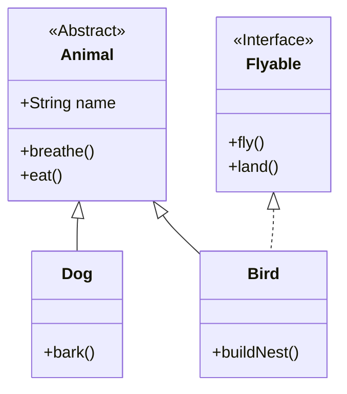

# 7.3 接口、抽象类、一般类的比较

在理解了普通类、抽象类和接口各自的定义之后，将三者放在一起进行详细的比较，可以帮助我们更深刻地把握它们在面向对象设计中的不同角色和适用场景。本节将聚焦于它们的差异，并提供选择使用的指导原则。

## 核心差异对比

为了更清晰地展示三者的区别，我们通过一个表格来进行全面的对比。

| 特性/维度     | 普通类（Concrete Class）                | 抽象类（Abstract Class）                | 接口（Interface）                                                  |
| :------------ | :-------------------------------------- | :-------------------------------------- | :----------------------------------------------------------------- |
| **实例化**    | 可以（`new`）                           | **不可以**                              | **不可以**                                                         |
| **继承/实现** | `extends` 一个类, `implements` 多个接口 | `extends` 一个类（通常是抽象类）        | `implements` 多个接口                                              |
| **构造方法**  | 有                                      | 有（供子类调用）                        | **没有**                                                           |
| **成员变量**  | 任意类型                                | 任意类型                                | 只能是 `public static final` 常量                                  |
| **方法**      | 只能有具体方法                          | 可有**抽象方法**和**具体方法**          | 可有**抽象方法**、**默认方法**（Java 8+）、**静态方法**（Java 8+） |
| **设计目的**  | 描述一个具体的对象实体                  | “**is-a**”关系，作为模板，强调**是什么** | “**can-do**”关系，定义行为规范，强调**能做什么**                    |

为了更直观地理解它们的关系，我们可以参考以下这个简单的类图：

在这个图中：

- `Animal` 是一个抽象类，代表了“动物”这个抽象概念，`Dog` 和 `Bird` 都继承了它，体现了 **is-a** 关系。
- `Flyable` 是一个接口，定义了“飞翔”这项能力，`Bird` 实现了这个接口，表示鸟“能飞”，体现了 **can-do** 关系。
- `Dog` 是一个具体的普通类，它只继承了 `Animal`。

## 如何选择？

在实际开发中，到底应该使用抽象类还是接口？可以遵循以下几个原则：

1.  **优先使用接口**：如果只是想定义一组行为规范，让不同的类去实现，那么接口是首选。它更加灵活，因为一个类可以实现多个接口。

2.  **考虑 “is-a” vs “can-do”**：

    - 如果类之间存在明显的层级关系，是一种 **“is-a”** 的关系（例如，“狗”是“动物”），并且你想为子类提供一些通用的方法实现或共享属性，那么使用**抽象类**。
    - 如果你想定义一种能力或角色，而这个能力可以被赋予给完全不相关的类，这是一种 **“can-do”** 的关系（例如，“鸟”和“飞机”都能“飞”），那么使用**接口**。

3.  **需要代码复用时**：如果你想在多个子类中复用一些代码（具体方法），那么抽象类是更好的选择。虽然接口的默认方法 (Java 8+) 也提供了代码复用的能力，但抽象类的设计初衷更是为了代码复用和模板化。

4.  **需要多重继承时**：Java 不支持类的多重继承，但支持接口的多重实现。如果你希望一个类能拥有来自不同来源的多种行为，那么接口是唯一的选择。

通过上述的对比和分析，相信你对何时以及如何使用普通类、抽象类和接口已经有了清晰的判断。在编程实践中正确地运用它们，是构建出结构清晰、易于扩展的优秀程序的关键一步。
