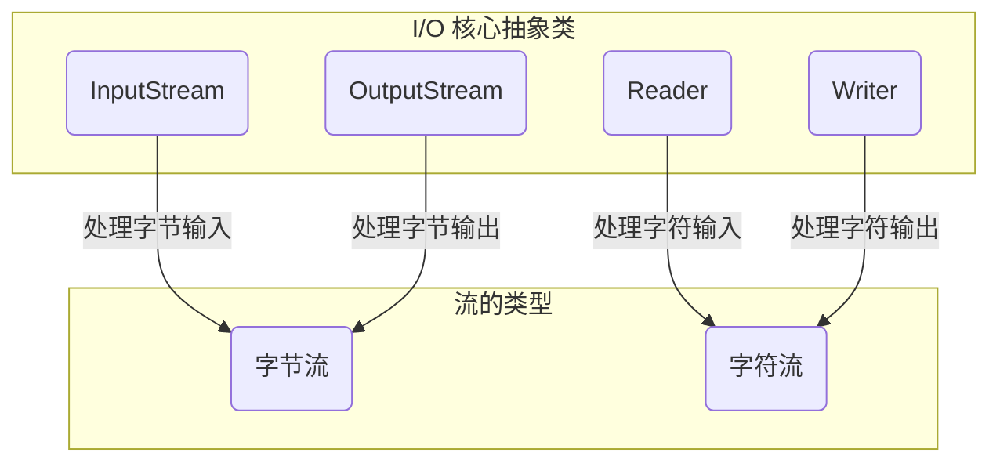

# 8.1 Java I/O 概述

本文将对 Java 的输入/输出（I/O）系统进行概述。对于初学者来说，理解 I/O 的基本概念是掌握文件操作、网络通信等高级主题的关键第一步。

## 8.1.1 什么是 I/O？

I/O 是**输入（Input）** 和**输出（Output）** 的缩写。在计算机科学中，I/O 指的是程序与外部世界之间进行数据交换的过程。

- **输入（Input）**：程序从外部数据源（如文件、键盘、网络连接）读取数据的过程。
- **输出（Output）**：程序将处理后的数据写入到指定目标（如文件、屏幕、网络连接）的过程。

简单来说，Java I/O 就是 Java 提供的一套用来处理程序与外部数据交互的机制。无论是读取配置文件、保存用户数据，还是进行网络请求，都离不开 I/O 操作。

## 8.1.2 数据流（Stream）

在 Java I/O 中，所有的数据交换都是通过 **“流”（Stream）** 来完成的。你可以将流想象成一个连接着数据源和程序的数据管道，数据会像水流一样在这个管道中单向流动。

### 数据流的分类

根据数据流动的**方向**，我们可以将流分为：

- **输入流（Input Stream）**：用于从数据源（Source）读取数据到程序中。
- **输出流（Output Stream）**：用于将程序中的数据写入到数据目标（Sink）。

```mermaid
graph LR
    subgraph 数据源 (Source)
        direction LR
        F(文件)
        N(网络)
        M(内存)
    end

    subgraph 程序 (Program)
        direction LR
        P(Java Application)
    end

    subgraph 数据目标 (Sink)
        direction LR
        F2(文件)
        N2(网络)
        C(控制台)
    end

    F -- 输入流 --> P
    N -- 输入流 --> P
    M -- 输入流 --> P

    P -- 输出流 --> F2
    P -- 输出流 --> N2
    P -- 输出流 --> C
```

### 数据源与数据目标

流的两端连接着数据源和数据目标：

- **数据源（Source）**：产生数据的来源，例如文件、网络套接字（Socket）、内存中的数组或键盘输入。
- **数据目标（Sink）**：接收数据的目的地，例如文件、网络套接字、内存中的数组或控制台屏幕。

## 8.1.3 `java.io` 包概览

Java 的核心 I/O 功能都封装在 `java.io` 包中。这个包提供了处理各种输入输出操作所需的类和接口。

### 流的层次结构

`java.io` 包中的流根据其处理的数据单位不同，可以分为两大类。我们将在后续的文章中详细介绍它们：

- **字节流（Byte Streams）**：以字节（8 位）为单位处理数据。它非常通用，适用于所有类型的数据，包括二进制文件（如图片、音频）和文本文件。
- **字符流（Character Streams）**：以字符（16 位 Unicode）为单位处理数据。它专门用于处理文本数据，能够更好地处理国际化字符。

虽然本文不深入探讨这两种流的具体实现，但了解它们的基本分类对于理解 `java.io` 的整体设计至关重要。下面是 `java.io` 中四个核心抽象类的简化层次图，它们是所有 I/O 流的基础：



## 8.1.4 `File` 类：文件和目录的抽象表示

在进行文件 I/O 操作之前，我们首先需要一种方式来表示文件系统中的文件或目录路径。`java.io.File` 类就是为此而生的。

::: tip 重要提示
`File` 类的对象仅仅是文件或目录路径的**抽象表示**，它本身并不包含文件的内容数据。你可以把它看作是文件系统中的一个“快捷方式”或“句柄”。对 `File` 对象调用方法会直接影响硬盘上对应的实际文件或目录。
:::

### 创建 `File` 对象

你可以通过提供一个路径字符串来创建一个 `File` 对象。这个路径可以是绝对路径，也可以是相对路径。

```java
// 使用绝对路径 (Windows 示例)
File file1 = new File("D:/data/config.properties");

// 使用相对路径（相对于当前项目的根目录）
File file2 = new File("src/main/resources/input.txt");

// 也可以通过父目录和子路径来创建
File parentDir = new File("D:/data");
File file3 = new File(parentDir, "config.properties");
```

### `File` 类的常用方法

`File` 类提供了许多有用的方法来检查和操作文件及目录：

| 方法                       | 描述                                                                         |
| :------------------------- | :--------------------------------------------------------------------------- |
| `boolean exists()`         | 判断此 `File` 对象表示的文件或目录是否真实存在。                             |
| `boolean isFile()`         | 判断此 `File` 对象是否代表一个文件。                                         |
| `boolean isDirectory()`    | 判断此 `File` 对象是否代表一个目录。                                         |
| `String getName()`         | 返回文件名或目录名。                                                         |
| `String getPath()`         | 返回创建 `File` 对象时传入的路径字符串。                                     |
| `String getAbsolutePath()` | 返回文件或目录的绝对路径字符串。                                             |
| `long length()`            | 返回文件的长度（以字节为单位）。如果 `File` 对象是目录，则返回值不确定。     |
| `long lastModified()`      | 返回文件最后被修改的时间（毫秒级时间戳）。                                   |
| `boolean createNewFile()`  | 当文件不存在时，创建一个新的空文件。成功返回 `true`。                        |
| `boolean mkdir()`          | 创建此 `File` 对象表示的单级目录。                                           |
| `boolean mkdirs()`         | 创建此 `File` 对象表示的目录，包括任何不存在的父目录。                       |
| `boolean delete()`         | 删除此 `File` 对象表示的文件或 **空目录**。                                  |
| `String[] list()`          | 返回一个字符串数组，包含此 `File` 对象表示的目录中的所有文件和子目录的名称。 |
| `File[] listFiles()`       | 返回一个 `File` 对象数组，代表此目录中的所有文件和子目录。                   |

### 示例：遍历目录

下面是一个使用 `File` 类遍历指定目录并打印其所有内容的例子：

```java
import java.io.File;

public class DirectoryWalker {
    public static void main(String[] args) {
        // 创建一个代表目录的 File 对象 (请替换为你自己电脑上的有效目录路径)
        File directory = new File("C:\Users\Public\Documents");

        if (directory.exists() && directory.isDirectory()) {
            System.out.println("正在遍历目录: " + directory.getAbsolutePath());
            File[] files = directory.listFiles(); // 获取目录下的所有文件和子目录
            if (files != null) {
                for (File file : files) {
                    if (file.isDirectory()) {
                        System.out.println("  [目录] " + file.getName());
                    } else {
                        System.out.println("  [文件] " + file.getName() + " (" + file.length() + " 字节)");
                    }
                }
            }
        } else {
            System.out.println("指定的路径不是一个有效的目录。");
        }
    }
}
```

## 8.1.5 标准输入输出（Standard I/O）

Java 提供了三个已经预先定义好的“标准”流，它们被封装在 `System` 类中，作为静态字段存在，因此在任何 Java 程序中都可以直接使用：

- `System.in`：**标准输入流**（`InputStream`）。默认情况下，它连接到键盘输入，程序可以从中读取用户的按键。
- `System.out`：**标准输出流**（`PrintStream`）。默认情况下，它连接到控制台（显示器）。我们最常用的 `System.out.println()` 方法就是在使用这个流。
- `System.err`：**标准错误流**（`PrintStream`）。默认情况下，它也连接到控制台，但专门用于输出错误信息。在很多 IDE 中，错误信息会以红色字体显示，以示区分。

这三个流为程序与控制台进行基本交互提供了非常便捷的方式。

## 总结

在本节中，我们对 Java I/O 进行了高层次的概述，学习了以下核心概念：

- **I/O** 是程序与外部世界进行数据交换的过程，分为输入和输出。
- **流（Stream）** 是 Java I/O 中数据传输的抽象模型，它像一个单向的数据管道。
- `java.io` 包是 Java I/O 的核心，它提供了处理输入输出的各种类。
- `File` 类用于在 Java 程序中以抽象的方式代表文件和目录路径，是进行文件操作的基础。
- **标准 I/O**（`System.in`, `System.out`, `System.err`） 是程序与控制台进行交互的便捷通道。

在接下来的章节中，我们将基于这些基础概念，深入学习字节流和字符流的具体使用方法，探索如何高效地读写文件、处理网络数据等更高级的 I/O 操作。
