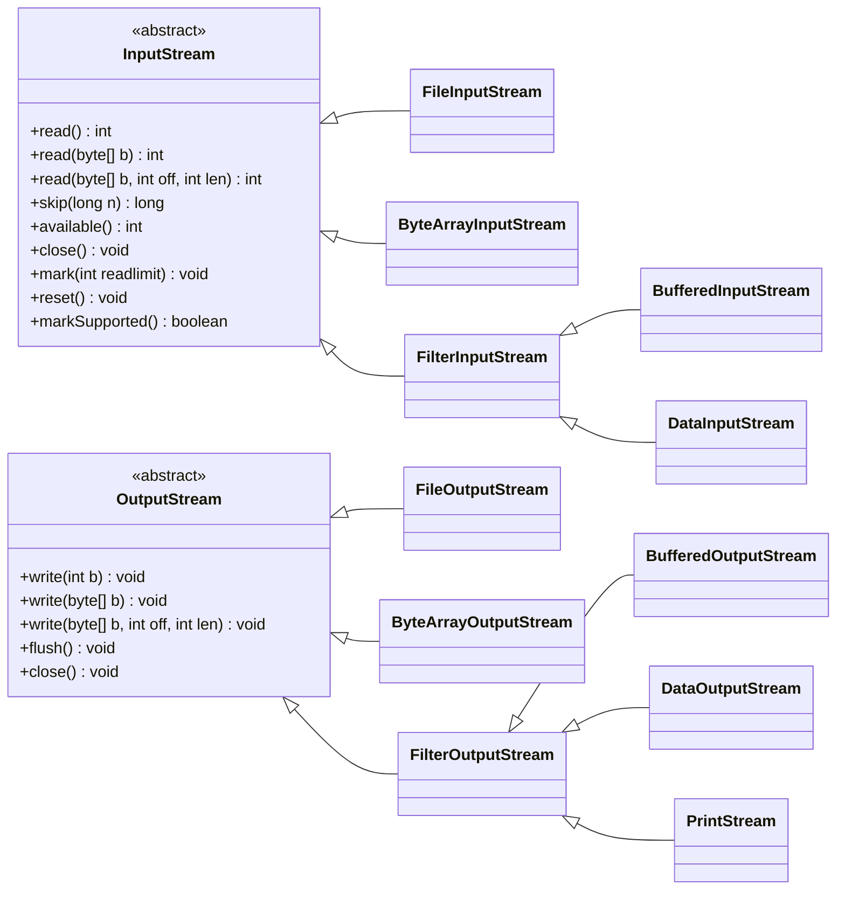

# 8.2 Java 字节流

在计算机中，所有的数据，无论是文本、图片、音频还是视频，最终都是以二进制的形式存储的。Java 的 I/O（输入/输出）操作同样是基于这种思想。当我们需要从外部来源（如文件、网络连接）读取数据，或者将数据写入到这些来源时，就需要使用 Java 的 I/O 流。

Java 的 I/O 流根据处理数据的单位不同，可以分为两种：**字节流**和**字符流**。

- **字节流 (Byte Stream)**：以字节（8-bit）为单位来处理数据。它可以处理任何类型的数据，因为所有数据在底层都是字节。字节流非常适合处理二进制文件，如图片、音频、视频文件等。
- **字符流 (Character Stream)**：以字符为单位来处理数据。它在字节流的基础上，增加了编码和解码的功能，专门用于处理文本数据。

本文将重点介绍 **Java 字节流**。

## 8.2.1 Java 抽象字节流

Java 字节流的继承体系中，最顶层的抽象基类是 `InputStream` 和 `OutputStream`。它们定义了所有字节输入流和输出流必须具备的基本方法。



### `InputStream`

`InputStream` 是所有字节输入流的抽象基类。它定义了从数据源读取字节数据的基本方法。

**核心方法:**

| 方法定义         | 功能                                                                            |
| ---------------- | ------------------------------------------------------------------------------- |
| `read()`         | 从输入流中读取下一个字节的数据。如果到达流的末尾，则返回 -1。                   |
| `read(byte[] b)` | 从输入流中读取一些字节数，并将它们存储到字节数组 `b` 中。返回实际读取的字节数。 |
| `close()`        | 关闭此输入流并释放与该流关联的所有系统资源。                                    |

### `OutputStream`

`OutputStream` 是所有字节输出流的抽象基类。它定义了向目标写入字节数据的基本方法。

**核心方法:**

| 方法定义          | 功能                                               |
| ----------------- | -------------------------------------------------- |
| `write(int b)`    | 将指定的字节写入此输出流。                         |
| `write(byte[] b)` | 将 `b.length` 个字节从指定的字节数组写入此输出流。 |
| `close()`         | 关闭此输出流并释放与该流关联的所有系统资源。       |
| `flush()`         | 刷新此输出流并强制写出所有缓冲的输出字节。         |

## 8.2.2 Java 基本字节流

基本字节流直接与数据源或数据目标进行交互。

### `FileInputStream`

`FileInputStream` 用于从文件系统中的文件获取输入字节。它通常用于读取图像、音频、视频等原始字节流。

**构造方法:**

| 方法定义                       | 功能                                                                                                       |
| ------------------------------ | ---------------------------------------------------------------------------------------------------------- |
| `FileInputStream(String name)` | 创建一个向具有指定名称的文件中读取数据的输入文件流。                                                       |
| `FileInputStream(File file)`   | 通过打开一个到实际文件的连接来创建一个 `FileInputStream`，该文件通过文件系统中的 `File` 对象 `file` 指定。 |

**示例：从文件中读取数据**

假设我们有一个名为 `input.txt` 的文件，内容为 `Hello`。

```java
import java.io.FileInputStream;
import java.io.IOException;

public class FileInputStreamExample {
    public static void main(String[] args) {
        try (FileInputStream fis = new FileInputStream("input.txt")) {
            int data;
            // 逐字节读取，直到文件末尾
            while ((data = fis.read()) != -1) {
                System.out.print((char) data);
            }
        } catch (IOException e) {
            e.printStackTrace();
        }
    }
}
```

**输出:**

```
Hello
```

### `FileOutputStream`

`FileOutputStream` 用于将数据写入文件。

**构造方法:**

| 方法定义                                        | 功能                                                                                                                  |
| ----------------------------------------------- | --------------------------------------------------------------------------------------------------------------------- |
| `FileOutputStream(String name)`                 | 创建一个向具有指定名称的文件中写入数据的输出文件流。                                                                  |
| `FileOutputStream(String name, boolean append)` | 如果 `append` 为 `true`，则字节将写入文件末尾而不是开头。                                                             |
| `FileOutputStream(File file)`                   | 创建一个向指定 `File` 对象表示的文件中写入数据的文件输出流。                                                          |
| `FileOutputStream(File file, boolean append)`   | 创建一个向指定 `File` 对象表示的文件中写入数据的文件输出流。如果 `append` 为 `true`，则字节将写入文件末尾而不是开头。 |

**示例：向文件中写入数据**

```java
import java.io.FileOutputStream;
import java.io.IOException;

public class FileOutputStreamExample {
    public static void main(String[] args) {
        String content = "Hello, World!";
        try (FileOutputStream fos = new FileOutputStream("output.txt")) {
            fos.write(content.getBytes());
        } catch (IOException e) {
            e.printStackTrace();
        }
    }
}
```

执行后，会在项目根目录下创建一个 `output.txt` 文件，内容为 `Hello, World!`。

### `ByteArrayInputStream`

`ByteArrayInputStream` 将内存中的一个字节数组作为数据源。它主要用于将数据从内存读入到流中。

**构造方法:**

| 方法定义                                                   | 功能                                                                                               |
| ---------------------------------------------------------- | -------------------------------------------------------------------------------------------------- |
| `ByteArrayInputStream(byte[] buf)`                         | 创建一个 `ByteArrayInputStream`，使用 `buf` 作为其缓冲区数组。                                     |
| `ByteArrayInputStream(byte[] buf, int offset, int length)` | 创建 `ByteArrayInputStream`，使用 `buf` 作为其缓冲区数组，从 `offset` 开始，读取 `length` 个字节。 |

**示例：从字节数组中读取数据**

```java
import java.io.ByteArrayInputStream;

public class ByteArrayInputStreamExample {
    public static void main(String[] args) {
        byte[] bytes = { 'H', 'e', 'l', 'l', 'o' };
        try (ByteArrayInputStream bais = new ByteArrayInputStream(bytes)) {
            int data;
            while ((data = bais.read()) != -1) {
                System.out.print((char) data);
            }
        }
    }
}
```

**输出:**

```
Hello
```

### `ByteArrayOutputStream`

`ByteArrayOutputStream` 在内存中创建一个字节数组缓冲区，所有发送到输出流的数据都存储在此缓冲区中。

**核心方法:**

| 方法定义        | 功能                                                                           |
| --------------- | ------------------------------------------------------------------------------ |
| `toByteArray()` | 创建一个新分配的字节数组。其大小是此输出流的当前大小，内容是缓冲区的有效内容。 |

**示例：向字节数组中写入数据**

```java
import java.io.ByteArrayOutputStream;
import java.io.IOException;

public class ByteArrayOutputStreamExample {
    public static void main(String[] args) {
        try (ByteArrayOutputStream baos = new ByteArrayOutputStream()) {
            baos.write("Hello".getBytes());
            byte[] bytes = baos.toByteArray();
            for (byte b : bytes) {
                System.out.print((char) b);
            }
        } catch (IOException e) {
            e.printStackTrace();
        }
    }
}
```

**输出:**

```
Hello
```

## 8.2.3 Java 标准数据流

Java 提供了三个标准 I/O 流，它们是 `System` 类的静态成员。

### 标准输入流 `System.in`

`System.in` 是一个 `InputStream`，通常对应于键盘输入。

### 标准输出流 `System.out`

`System.out` 是一个 `PrintStream`，通常对应于显示器输出。我们常用的 `System.out.println()` 就是在使用标准输出流。

### 标准错误流 `System.err`

`System.err` 也是一个 `PrintStream`，用于输出错误信息，通常也对应于显示器输出。

**示例：**

```java
import java.io.IOException;

public class StandardIOExample {
    public static void main(String[] args) throws IOException {
        System.out.println("请输入一个字符：");
        int input = System.in.read();
        System.out.println("您输入的字符是：" + (char)input);
        System.err.println("这是一个错误信息示例。");
    }
}
```

## 8.2.4 Java 字节过滤流

字节过滤流（也称为处理流或装饰器流）是连接在现有流（节点流或另一个过滤流）之上的流。它们为底层流提供额外的功能，如缓冲、数据类型转换等。这是装饰器设计模式的一个典型应用。

### `FilterInputStream`

`FilterInputStream` 是所有字节输入过滤流的基类。

#### `BufferedInputStream`

`BufferedInputStream` 为另一个输入流添加了缓冲功能。当 `BufferedInputStream` 读取数据时，它会从底层输入流中一次性读取一个较大的数据块，并将其存储在内部缓冲区中。当我们逐字节读取时，实际上是从缓冲区中读取，这大大减少了对底层 I/O 的访问次数，从而提高了读取效率。

**构造方法:**

| 方法定义                                        | 功能                                                                                       |
| ----------------------------------------------- | ------------------------------------------------------------------------------------------ |
| `BufferedInputStream(InputStream in)`           | 创建一个 `BufferedInputStream` 并保存其参数，即输入流 `in`，以便将来使用。                 |
| `BufferedInputStream(InputStream in, int size)` | 创建具有指定缓冲区大小的 `BufferedInputStream` 并保存其参数，即输入流 `in`，以便将来使用。 |

**示例：使用缓冲流提高文件读取效率**

```java
import java.io.BufferedInputStream;
import java.io.FileInputStream;
import java.io.IOException;

public class BufferedInputStreamExample {
    public static void main(String[] args) {
        try (FileInputStream fis = new FileInputStream("large_file.txt");
             BufferedInputStream bis = new BufferedInputStream(fis)) {
            // ... 读取操作 ...
        } catch (IOException e) {
            e.printStackTrace();
        }
    }
}
```

#### `DataInputStream`

`DataInputStream` 允许应用程序以与机器无关的方式从底层输入流中读取 Java 基本数据类型。

**核心方法:**

| 方法定义        | 功能                                      |
| --------------- | ----------------------------------------- |
| `readBoolean()` | 读取一个 `boolean` 值。                   |
| `readByte()`    | 读取一个字节。                            |
| `readChar()`    | 读取一个 `char` 值。                      |
| `readShort()`   | 读取一个 `short` 值。                     |
| `readInt()`     | 读取一个 `int` 值。                       |
| `readLong()`    | 读取一个 `long` 值。                      |
| `readFloat()`   | 读取一个 `float` 值。                     |
| `readDouble()`  | 读取一个 `double` 值。                    |
| `readUTF()`     | 读取一个以 UTF-8 修改版格式编码的字符串。 |

### `FilterOutputStream`

`FilterOutputStream` 是所有字节输出过滤流的基类。

#### `BufferedOutputStream`

`BufferedOutputStream` 为另一个输出流添加了缓冲功能。它会将写入的数据先存储在内部缓冲区中，当缓冲区满或手动调用 `flush()` 方法时，才会将数据一次性写入底层输出流。

**构造方法:**

| 方法定义                                           | 功能                                                                       |
| -------------------------------------------------- | -------------------------------------------------------------------------- |
| `BufferedOutputStream(OutputStream out)`           | 创建一个新的缓冲输出流，以将数据写入指定的底层输出流。                     |
| `BufferedOutputStream(OutputStream out, int size)` | 创建一个新的缓冲输出流，以将具有指定缓冲区大小的数据写入指定的底层输出流。 |

#### `DataOutputStream`

`DataOutputStream` 允许应用程序以与机器无关的方式将 Java 基本数据类型写入输出流。

**核心方法:**

| 方法定义                  | 功能                                                                                                 |
| ------------------------- | ---------------------------------------------------------------------------------------------------- |
| `writeBoolean(boolean v)` | 将一个 `boolean` 值写入底层输出流，作为一个 1 字节值。                                               |
| `writeByte(int v)`        | 将一个 `byte` 写入底层输出流，作为 1 字节值。                                                        |
| `writeChar(int v)`        | 将一个 `char` 写入底层输出流，作为 2 字节值，高字节在前。                                            |
| `writeShort(int v)`       | 将一个 `short` 写入底层输出流，作为 2 字节值，高字节在前。                                           |
| `writeInt(int v)`         | 将一个 `int` 写入底层输出流，作为 4 字节值，高字节在前。                                             |
| `writeLong(long v)`       | 将一个 `long` 写入底层输出流，作为 8 字节值，高字节在前。                                            |
| `writeFloat(float v)`     | 使用 `Float.floatToIntBits` 方法将 `float` 参数转换为 `int`，然后将该 `int` 值写入底层输出流。       |
| `writeDouble(double v)`   | 使用 `Double.doubleToLongBits` 方法将 `double` 参数转换为 `long`，然后将该 `long` 值写入底层输出流。 |
| `writeUTF(String str)`    | 以与机器无关的方式使用 UTF-8 修改版编码将一个字符串写入底层输出流。                                  |

**示例：使用 `DataInputStream` 和 `DataOutputStream` 读写基本数据类型**

```java
import java.io.*;

public class DataStreamExample {
    public static void main(String[] args) {
        // 写入数据
        try (FileOutputStream fos = new FileOutputStream("data.bin");
             DataOutputStream dos = new DataOutputStream(fos)) {
            dos.writeInt(123);
            dos.writeDouble(45.67);
            dos.writeUTF("Hello");
        } catch (IOException e) {
            e.printStackTrace();
        }

        // 读取数据
        try (FileInputStream fis = new FileInputStream("data.bin");
             DataInputStream dis = new DataInputStream(fis)) {
            int intValue = dis.readInt();
            double doubleValue = dis.readDouble();
            String stringValue = dis.readUTF();

            System.out.println("Int: " + intValue);
            System.out.println("Double: " + doubleValue);
            System.out.println("String: " + stringValue);
        } catch (IOException e) {
            e.printStackTrace();
        }
    }
}
```

**输出:**

```
Int: 123
Double: 45.67
String: Hello
```

**重要提示：** 使用 `DataInputStream` 读取数据时，必须按照 `DataOutputStream` 写入数据的顺序和类型来读取，否则会导致数据错乱或抛出 `EOFException`。

#### `PrintStream`

`PrintStream` 为另一个输出流添加了功能，使它能够方便地打印各种数据值的表示形式。`System.out` 和 `System.err` 就是 `PrintStream` 的实例。

**与其他输出流的区别:**

- `PrintStream` 永远不会抛出 `IOException`；相反，异常情况会设置可通过 `checkError` 方法测试的内部标志。
- `PrintStream` 具有自动刷新功能。

**核心方法:**

| 方法定义                | 功能                                                         |
| ----------------------- | ------------------------------------------------------------ |
| `print()` / `println()` | 打印各种数据类型的值。`println()` 会在输出后添加一个换行符。 |

**示例：**

```java
import java.io.FileOutputStream;
import java.io.PrintStream;
import java.io.IOException;

public class PrintStreamExample {
    public static void main(String[] args) {
        try (FileOutputStream fos = new FileOutputStream("log.txt");
             PrintStream ps = new PrintStream(fos)) {
            ps.println("这是一个日志记录。");
            ps.println("当前时间：" + System.currentTimeMillis());
            ps.printf("格式化输出：%s, %d", "Java", 11);
        } catch (IOException e) {
            e.printStackTrace();
        }
    }
}
```
