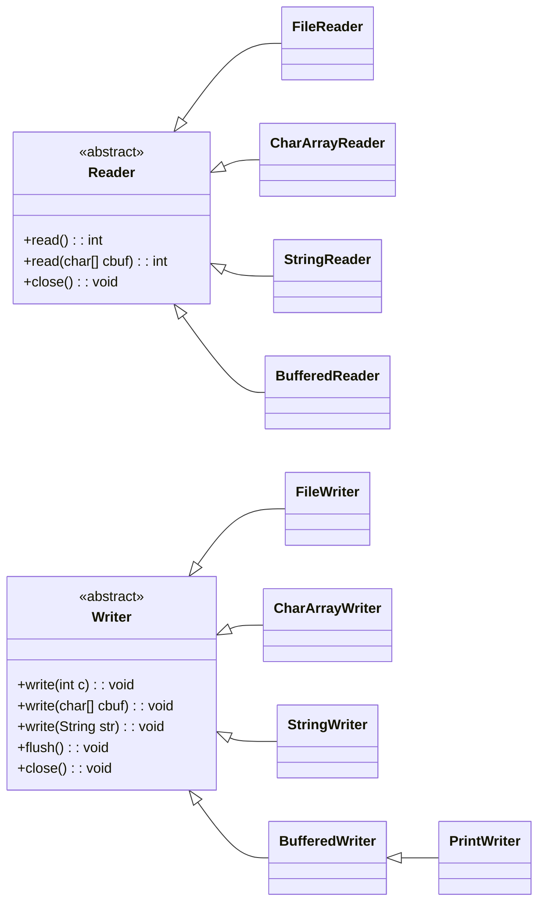

# 8.3 Java 字符流

在计算机中，所有的数据，无论是文本、图片、音频还是视频，最终都是以二进制的形式存储的。Java 的 I/O（输入/输出）操作同样是基于这种思想。当我们需要从外部来源（如文件、网络连接）读取数据，或者将数据写入到这些来源时，就需要使用 Java 的 I/O 流。

Java 的 I/O 流根据处理数据的单位不同，可以分为两种：**字节流**和**字符流**。

- **字节流 (Byte Stream)**：以字节（8-bit）为单位来处理数据。它可以处理任何类型的数据，因为所有数据在底层都是字节。字节流非常适合处理二进制文件，如图片、音频、视频文件等。
- **字符流 (Character Stream)**：以字符为单位来处理数据。它在字节流的基础上，增加了编码和解码的功能，专门用于处理文本数据。

本文将重点介绍 **Java 字符流**。

## 8.3.1 字符流与字符编码

在我们深入学习字符流之前，理解**字符编码**的概念至关重要。

计算机只能理解二进制的 0 和 1。那么，我们人类语言中的文字（如 'A', '中'）是如何存储和处理的呢？答案就是通过**字符编码**。

**字符编码（Character Encoding）** 是一套规则，它将字符（如字母、数字、符号）映射到特定的二进制码上。常见的编码表有：

- **ASCII**：最早的编码之一，使用 7 位二进制数表示 128 个英文字符。
- **ISO-8859-1**：扩展了 ASCII，使用 8 位二进制数，兼容西欧语言。
- **GBK/GB2312**：中文字符编码，用于处理汉字。
- **UTF-8**：目前最流行的编码，是一种可变长度的编码，可以表示世界上几乎所有的字符。它对英文字符使用 1 个字节，对汉字通常使用 3 个字节。

**为什么字符流需要编码？**

字节流直接读写原始的字节数据，它不关心这些字节代表什么。但字符流的目标是读写**文本**，它必须知道如何将字节序列转换成有意义的字符，或者反过来。这个转换过程就是**编码（Encode）**和**解码（Decode）**。

- **解码**：读取时，字符流会根据指定的编码方式，将输入的字节序列转换成程序中的字符。
- **编码**：写入时，字符流会根据指定的编码方式，将程序中的字符转换成字节序列进行输出。

如果编码和解码时使用的字符集不一致，就会产生**乱码**问题。例如，一个使用 `UTF-8` 编码保存的文件，如果用 `GBK` 编码去读取，其中的中文字符很可能就无法正确显示。

因此，在使用字符流，特别是涉及文件读写的 `FileReader` 和 `FileWriter` 时，指定正确的字符编码是一个非常好的编程习惯。

## 8.3.2 Java 抽象字符流

Java 的字符流体系结构由两个核心的抽象基类构成：`Reader` 和 `Writer`。所有具体的字符流类都是从这两个类派生出来的。



### `Reader` 字符输入流

`java.io.Reader` 是所有字符输入流的抽象父类。它定义了读取字符的基本方法。

**核心方法：**

| 方法定义                       | 功能                                                                                    |
| ------------------------------ | --------------------------------------------------------------------------------------- |
| `public int read()`            | 读取单个字符。返回读取到的字符的 Unicode 值（0-65535）。如果已到达流的末尾，则返回 -1。 |
| `public int read(char[] cbuf)` | 将字符读入数组。返回实际读取的字符数。如果已到达流的末尾，则返回 -1。                   |
| `public abstract void close()` | 关闭流并释放与之关联的所有系统资源。                                                    |

### `Writer` 字符输出流

`java.io.Writer` 是所有字符输出流的抽象父类。它定义了写入字符的基本方法。

**核心方法：**

| 方法定义                         | 功能                                                         |
| -------------------------------- | ------------------------------------------------------------ |
| `public void write(int c)`       | 写入单个字符。                                               |
| `public void write(char[] cbuf)` | 写入字符数组。                                               |
| `public void write(String str)`  | 写入字符串。                                                 |
| `public abstract void flush()`   | 刷新该流的缓冲。将缓冲中任何剩余的输出字符写入底层输出设备。 |
| `public abstract void close()`   | 关闭流，但在关闭前会先刷新它。                               |

## 8.3.3 文件字符流

`FileReader` 和 `FileWriter` 是专门用于读写文件的字符流。它们非常适合于处理纯文本文件。

### `FileReader`

`FileReader` 用于从文件中读取字符。

**构造方法：**

| 方法定义                      | 功能                                                  |
| ----------------------------- | ----------------------------------------------------- |
| `FileReader(String fileName)` | 创建一个新的 `FileReader`，给定要读取的文件的名称。   |
| `FileReader(File file)`       | 创建一个新的 `FileReader`，给定要读取的 `File` 对象。 |

**使用 `FileReader` 读取文件：**

```java
import java.io.FileReader;
import java.io.IOException;

public class FileReaderExample {
    public static void main(String[] args) {
        // 使用 try-with-resources 语句确保流被自动关闭
        try (FileReader reader = new FileReader("example.txt")) {
            int character;
            // 逐个字符读取，直到文件末尾 (read() 返回 -1)
            while ((character = reader.read()) != -1) {
                System.out.print((char) character);
            }
        } catch (IOException e) {
            e.printStackTrace();
        }
    }
}
```

上面的代码一次只读取一个字符，效率较低。我们通常使用一个字符数组作为缓冲区来批量读取：

```java
import java.io.FileReader;
import java.io.IOException;

public class FileReaderBufferExample {
    public static void main(String[] args) {
        try (FileReader reader = new FileReader("example.txt")) {
            char[] buffer = new char[1024]; // 创建一个 1024 字符的缓冲区
            int charsRead;
            // 批量读取，直到文件末尾 (read(buffer) 返回 -1)
            while ((charsRead = reader.read(buffer)) != -1) {
                // 将读取的内容转换成字符串并打印
                System.out.print(new String(buffer, 0, charsRead));
            }
        } catch (IOException e) {
            e.printStackTrace();
        }
    }
}
```

### `FileWriter`

`FileWriter` 用于将字符写入文件。

**构造方法：**

| 方法定义                                      | 功能                                                                              |
| --------------------------------------------- | --------------------------------------------------------------------------------- |
| `FileWriter(String fileName)`                 | 创建一个新的 `FileWriter`，给定要写入的文件的名称。如果文件已存在，内容将被覆盖。 |
| `FileWriter(String fileName, boolean append)` | 如果 `append` 为 `true`，则字符将被写入文件末尾，而不是覆盖原有内容。             |

**使用 `FileWriter` 写入文件：**

```java
import java.io.FileWriter;
import java.io.IOException;

public class FileWriterExample {
    public static void main(String[] args) {
        // 使用 try-with-resources 语句确保流被自动关闭
        try (FileWriter writer = new FileWriter("output.txt")) {
            writer.write("Hello, Java I/O!\n");
            writer.write("这是新的一行。\n");
            writer.write("This is a new line.");

            // flush() 不是必需的，因为 close() 会自动调用 flush()
            // 但在需要立即写入时很有用
            // writer.flush();

            System.out.println("内容已成功写入文件。");
        } catch (IOException e) {
            e.printStackTrace();
        }
    }
}
```

## 8.3.4 内存字符流

`CharArrayReader`/`CharArrayWriter` 和 `StringReader`/`StringWriter` 用于在内存中进行字符流操作。它们的源和目标分别是字符数组和字符串，不涉及与磁盘等外部设备的交互。

### `CharArrayReader` 和 `CharArrayWriter`

- `CharArrayReader`: 将字符数组作为其输入源。
- `CharArrayWriter`: 将数据写入到一个字符数组中。这个数组会根据需要自动增长。

```java
import java.io.CharArrayReader;
import java.io.CharArrayWriter;
import java.io.IOException;

public class CharArrayStreamExample {
    public static void main(String[] args) throws IOException {
        // CharArrayWriter 示例
        CharArrayWriter writer = new CharArrayWriter();
        writer.write("在内存中写入数据。");

        char[] data = writer.toCharArray(); // 获取写入的数据
        System.out.println("CharArrayWriter 中的数据: " + new String(data));

        // CharArrayReader 示例
        CharArrayReader reader = new CharArrayReader(data);
        int character;
        System.out.print("从 CharArrayReader 读取数据: ");
        while ((character = reader.read()) != -1) {
            System.out.print((char) character);
        }
    }
}
```

### `StringReader` 和 `StringWriter`

- `StringReader`: 将字符串作为其输入源。
- `StringWriter`: 将数据写入到一个字符串缓冲区（`StringBuffer`）中。

```java
import java.io.StringReader;
import java.io.StringWriter;
import java.io.IOException;

public class StringStreamExample {
    public static void main(String[] args) throws IOException {
        // StringWriter 示例
        StringWriter writer = new StringWriter();
        writer.write("使用 StringWriter ");
        writer.append("在内存中构建字符串。");

        String result = writer.toString(); // 获取构建的字符串
        System.out.println("StringWriter 中的数据: " + result);

        // StringReader 示例
        StringReader reader = new StringReader(result);
        int character;
        System.out.print("从 StringReader 读取数据: ");
        while ((character = reader.read()) != -1) {
            System.out.print((char) character);
        }
    }
}
```

## 8.3.5 缓冲字符流（过滤流）

为了提高 I/O 操作的效率，Java 提供了缓冲流。`BufferedReader` 和 `BufferedWriter` 是字符缓冲流，它们在内部维护一个缓冲区（一个内存区域），用于临时存储数据。

- **写入时**：程序将数据写入到 `BufferedWriter` 的缓冲区，当缓冲区满时，`BufferedWriter` 会一次性将整个缓冲区的数据写入底层的输出流。
- **读取时**：`BufferedReader` 会一次性从底层输入流读取大量数据到其缓冲区，程序再从缓冲区中逐个读取数据。

这种机制大大减少了对物理设备（如硬盘）的实际读写次数，从而显著提升性能。

### `BufferedReader`

`BufferedReader` 从字符输入流中读取文本，缓冲各个字符，从而实现字符、数组和行的高效读取。

一个非常有用的方法是 `readLine()`，它可以一次读取一行文本。

**构造方法：**

| 方法定义                    | 功能                                         |
| --------------------------- | -------------------------------------------- |
| `BufferedReader(Reader in)` | 创建一个使用默认大小缓冲区的缓冲字符输入流。 |

**使用 `BufferedReader` 高效读取文件：**

```java
import java.io.BufferedReader;
import java.io.FileReader;
import java.io.IOException;

public class BufferedReaderExample {
    public static void main(String[] args) {
        try (BufferedReader br = new BufferedReader(new FileReader("example.txt"))) {
            String line;
            // 逐行读取，直到文件末尾 (readLine() 返回 null)
            while ((line = br.readLine()) != null) {
                System.out.println(line);
            }
        } catch (IOException e) {
            e.printStackTrace();
        }
    }
}
```

### `BufferedWriter`

`BufferedWriter` 将文本写入字符输出流，缓冲各个字符，从而提供对单个字符、数组和字符串的高效写入。

它提供了一个 `newLine()` 方法，用于写入一个平台相关的换行符。

**构造方法：**

| 方法定义                     | 功能                                         |
| ---------------------------- | -------------------------------------------- |
| `BufferedWriter(Writer out)` | 创建一个使用默认大小缓冲区的缓冲字符输出流。 |

**使用 `BufferedWriter` 高效写入文件：**

```java
import java.io.BufferedWriter;
import java.io.FileWriter;
import java.io.IOException;

public class BufferedWriterExample {
    public static void main(String[] args) {
        try (BufferedWriter bw = new BufferedWriter(new FileWriter("buffered_output.txt"))) {
            bw.write("使用 BufferedWriter 写入数据。");
            bw.newLine(); // 写入一个换行符
            bw.write("这可以提高 I/O 性能。");
            bw.newLine();
            System.out.println("内容已通过缓冲区写入文件。");
        } catch (IOException e) {
            e.printStackTrace();
        }
    }
}
```

### `PrintWriter`

`PrintWriter` 是一个非常方便的打印输出流，它在 `Writer` 的基础上增加了很多 `print()` 和 `println()` 方法，可以用来输出各种数据类型（如 `int`, `double`, `boolean`, `String` 等）的文本表示。

**特点：**

- **自动刷新**：可以在构造时启用自动刷新（`auto-flush`）功能。如果启用，每当调用 `println()`、`printf()` 或 `format()` 方法时，缓冲区会自动刷新。
- **不会抛出 `IOException`**：与其他 `Writer` 不同，`PrintWriter` 的方法不会抛出 `IOException`。你可以通过调用 `checkError()` 方法来检查是否发生了错误。
- **方法重载丰富**：提供了 `print()` 和 `println()` 的多种重载形式，使用起来非常灵活。

**构造方法：**

| 方法定义                                     | 功能                                                                                                              |
| -------------------------------------------- | ----------------------------------------------------------------------------------------------------------------- |
| `PrintWriter(Writer out)`                    | 创建一个新的 `PrintWriter`，不带自动行刷新。                                                                      |
| `PrintWriter(Writer out, boolean autoFlush)` | 创建一个新的 `PrintWriter`。如果 `autoFlush` 为 `true`，则 `println`、`printf` 或 `format` 方法将刷新输出缓冲区。 |
| `PrintWriter(String fileName)`               | 创建一个新的 `PrintWriter`，给定文件名，不带自动行刷新。                                                          |

**使用 `PrintWriter` 写入文件：**

```java
import java.io.PrintWriter;
import java.io.FileWriter;
import java.io.IOException;

public class PrintWriterExample {
    public static void main(String[] args) {
        try (PrintWriter pw = new PrintWriter(new FileWriter("print_output.txt"))) {
            pw.println("使用 PrintWriter 写入：");
            pw.print("整数: ");
            pw.println(123);
            pw.print("浮点数: ");
            pw.println(45.67);
            pw.printf("格式化输出: PI ≈ %.2f\n", Math.PI);

            System.out.println("内容已通过 PrintWriter 写入文件。");

            // 检查是否有错误发生
            if (pw.checkError()) {
                System.out.println("写入过程中发生错误。");
            }
        } catch (IOException e) {
            // 构造函数可能会抛出 IOException
            e.printStackTrace();
        }
    }
}
```

## 8.3.6 总结

Java 的字符流是处理文本数据的强大工具。

- **核心抽象类**：`Reader` 和 `Writer` 是所有字符流的基石。
- **文件操作**：`FileReader` 和 `FileWriter` 是读写文本文件的直接选择。
- **内存操作**：`CharArrayReader`/`Writer` 和 `StringReader`/`Writer` 可以在内存中高效地处理字符数据，无需访问文件系统。
- **性能提升**：`BufferedReader` 和 `BufferedWriter` 通过增加缓冲区来显著提高 I/O 性能，是处理大文件时的首选。`BufferedReader` 的 `readLine()` 方法尤其常用。
- **便捷输出**：`PrintWriter` 提供了丰富的 `print`/`println` 方法，是构建文本输出最方便的工具之一。
- **字符编码**：始终要关注字符编码，以避免乱码问题。在创建流时，尽可能显式指定编码方式。

通过组合使用这些流（例如，用 `BufferedReader` 包装 `FileReader`），你可以构建出既强大又高效的 I/O 操作。
