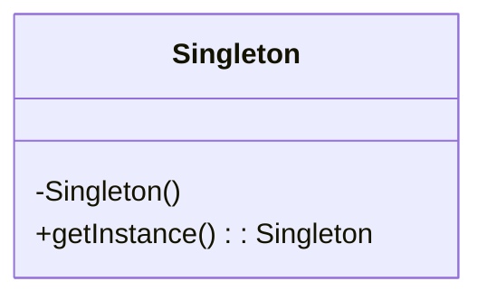
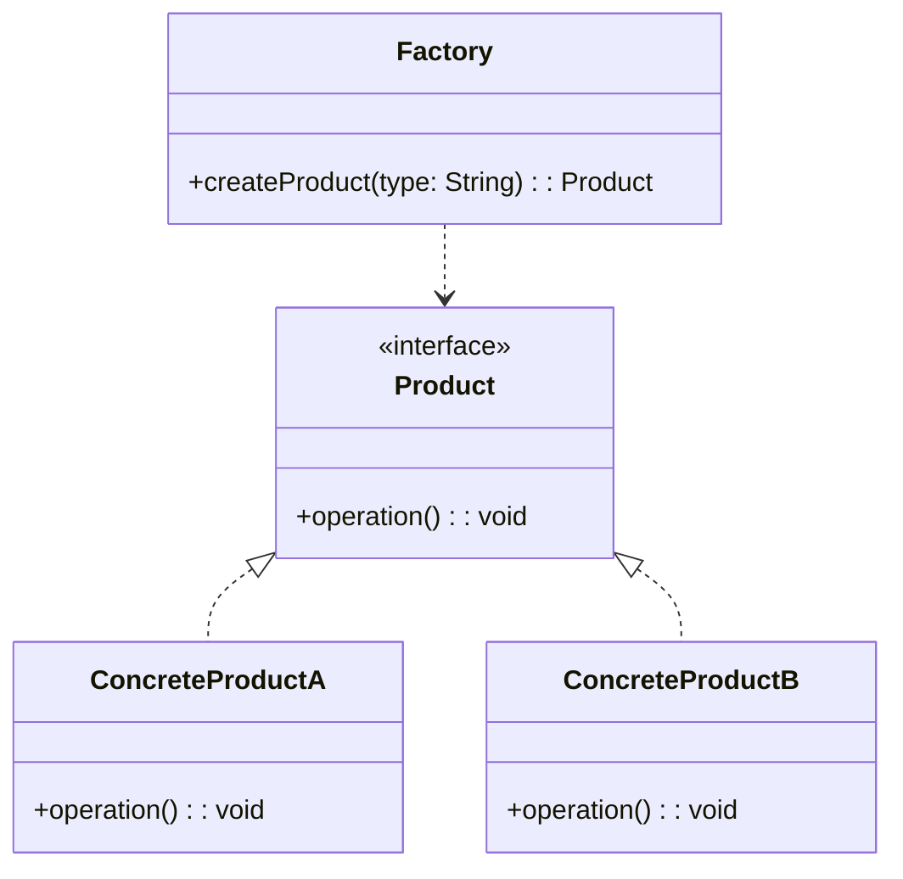
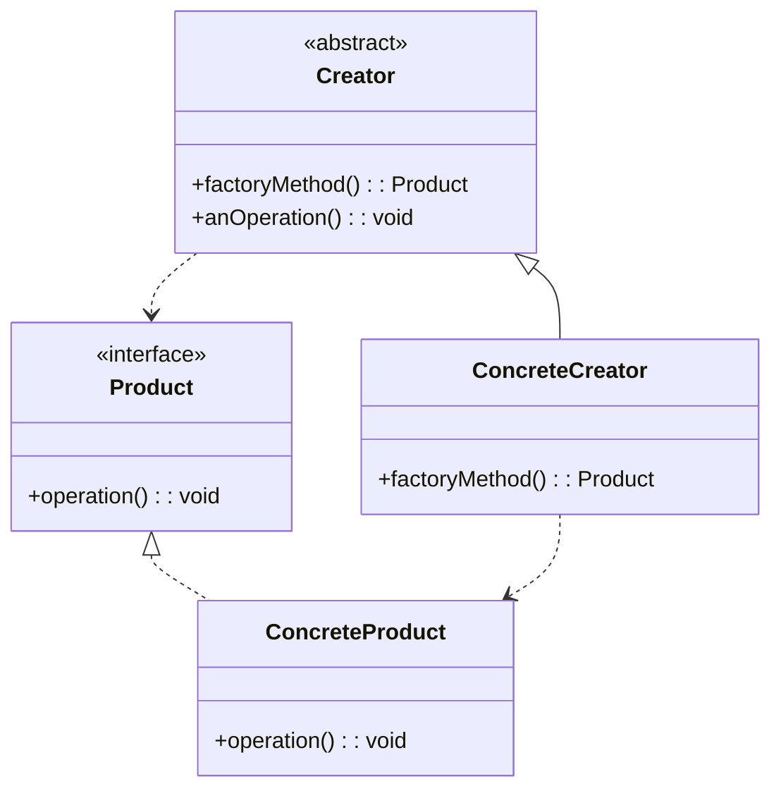
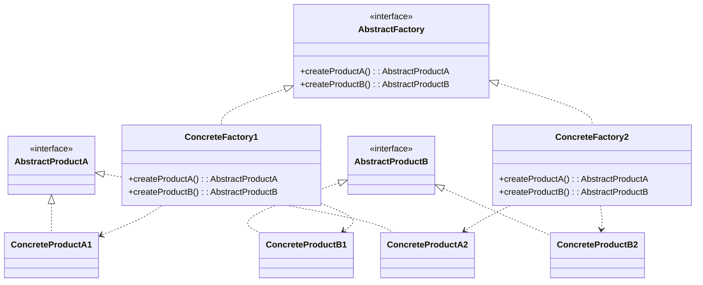
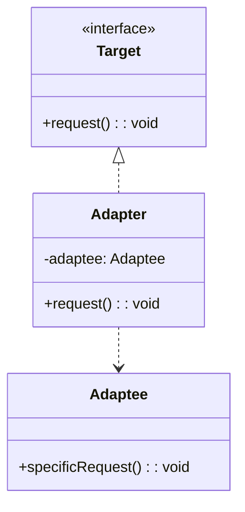
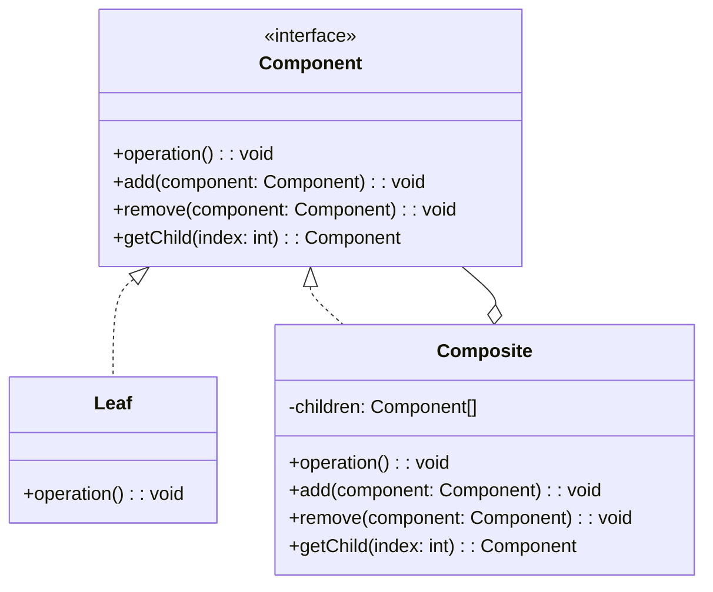
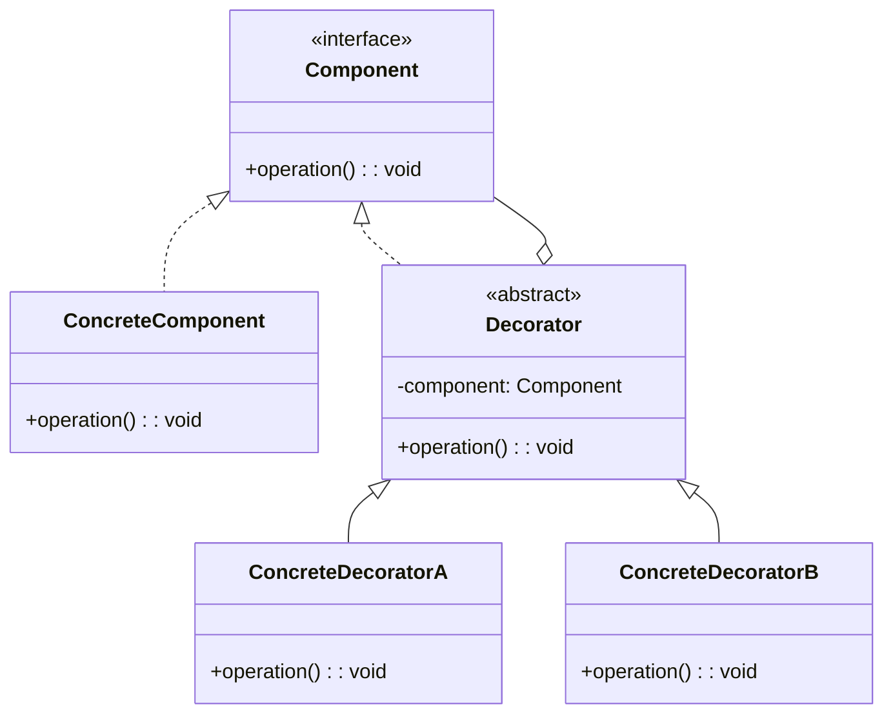
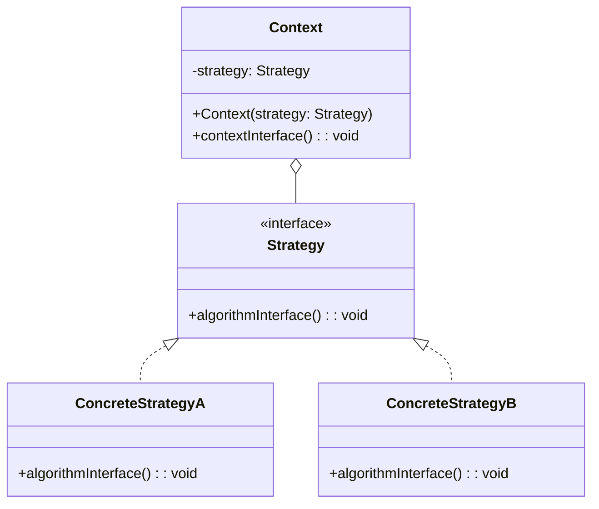
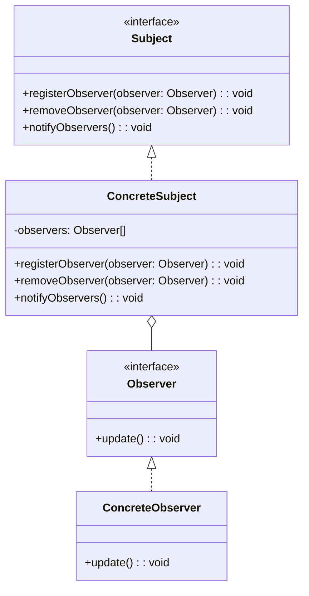
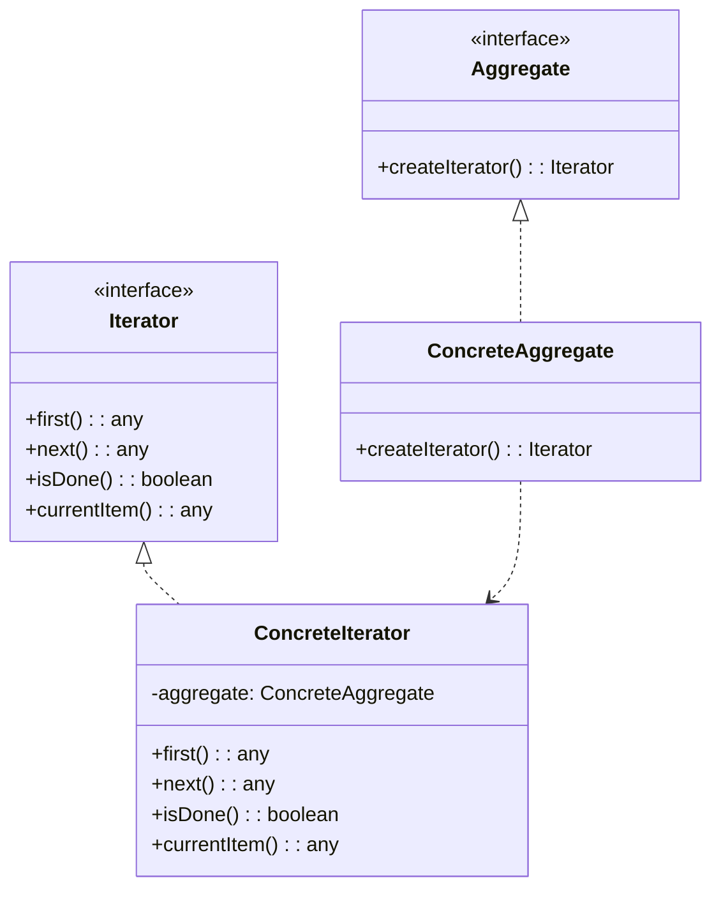

# 9.1 设计模式概述

设计模式（Design Pattern）是一套被反复使用、多数人知晓的、经过分类编目的、代码设计经验的总结。使用设计模式是为了可重用代码、让代码更容易被他人理解、保证代码可靠性。

## 9.1.1 创建型模式（Creational Patterns）

创建型模式是处理对象创建的设计模式，试图根据实际情况使用合适的方式创建对象。基本的对象创建方式可能会导致设计上的问题，或增加设计的复杂度。创建型模式通过以某种方式控制对象的创建来解决问题。

### 单例设计模式

单例模式（Singleton Pattern）是一种创建型设计模式，它确保一个类只有一个实例，并提供一个全局访问点来访问该实例。

**特点：**

- 一个类只有一个实例。
- 必须自行创建这个实例。
- 必须自行向整个系统提供这个实例。

**使用场景：**

- 当类只能有一个实例而且客户可以从一个众所周知的小节访问点访问它时。
- 当这个唯一实例应该是通过子类化可扩展的，并且客户应该无需更改代码就能使用一个扩展的实例时。

**类图：**

### 简单工厂模式

简单工厂模式（Simple Factory Pattern）是一种创建型设计模式，它属于工厂模式的一种，但并不属于 23 种 GoF 设计模式之一。简单工厂模式定义了一个工厂类，它可以根据参数的不同返回不同类的实例。

**特点：**

- 由一个工厂对象决定创建出哪一种产品类的实例。
- 客户端不需要知道所创建的具体产品类的类名，只需要知道具体产品类所对应的参数即可。

**使用场景：**

- 工厂类负责创建的对象比较少。
- 客户端只知道传入工厂类的参数，对于如何创建对象不关心。

**类图：**

### 工厂方法模式

工厂方法模式（Factory Method Pattern）是一种创建型设计模式，它定义了一个创建对象的接口，但由子类决定要实例化的类是哪一个。工厂方法让类把实例化推迟到子类。

**特点：**

- 定义一个创建对象的接口，让子类决定实例化哪一个类。
- 将实际创建工作推迟到子类当中。

**使用场景：**

- 当一个类不知道它所必须创建的对象的类的时候。
- 当一个类希望由它的子类来指定它所创建的对象的时候。
- 当类将创建对象的职责委托给多个帮助子类中的某一个，并且你希望将哪一个帮助子类是代理者这一信息局部化的时候。

**类图：**

### 抽象工厂模式

抽象工厂模式（Abstract Factory Pattern）是一种创建型设计模式，它提供一个接口，用于创建相关或依赖对象的家族，而不需要明确指定具体类。

**特点：**

- 提供一个创建一系列相关或相互依赖对象的接口，而无须指定它们具体的类。
- 针对一个产品族，在不修改工厂类的情况下，可以增加新的产品。

**使用场景：**

- 一个系统要独立于它的产品的创建、组合和表示时。
- 一个系统要由多个产品系列中的一个来配置时。
- 当你要强调一系列相关的产品对象的设计以便进行联合使用时。
- 当你提供一个产品类库，而只想显示它们的接口而不是实现时。

**类图：**

## 9.1.2 结构型模式（Structural Patterns）

结构型模式是处理类或对象的组合的设计模式。它关注于如何将类和对象组合成更大的结构，同时保持结构的灵活性和效率。

### 适配器模式

适配器模式（Adapter Pattern）是一种结构型设计模式，它能使接口不兼容的对象能够相互合作。适配器模式通过创建一个包装对象（即适配器）来实现，该对象包含一个不兼容的对象，并将其接口转换为客户端期望的接口。

**特点：**

- 将一个类的接口转换成客户希望的另外一个接口。
- 适配器模式使得原本由于接口不兼容而不能一起工作的那些类可以一起工作。

**使用场景：**

- 当你想使用一个已经存在的类，而它的接口不符合你的需求时。
- 当你想创建一个可以复用的类，该类可以与其他不相关的类或不可预见的类协同工作时。
- （仅适用于对象适配器）当你想使用一些已经存在的子类，但是不可能对每一个都进行子类化以匹配它们的接口时。对象适配器可以适配它的父类接口。

**类图：**

### 组合模式

组合模式（Composite Pattern）是一种结构型设计模式，它允许你将对象组合成树状结构，并且能像使用独立对象一样使用它们。组合模式使得客户端可以统一对待单个对象和组合对象。

**特点：**

- 定义了包含基本对象和组合对象的类层次结构。
- 基本对象可以被组合成更复杂的组合对象，而这个组合对象又可以被组合，这样不断地递归下去。
- 客户端代码可以一致地处理单个对象和组合对象。

**使用场景：**

- 当你想表示对象的部分-整体层次结构时。
- 当你希望客户端忽略组合对象与单个对象的不同，客户端将统一地使用组合结构中的所有对象时。

**类图：**

### 装饰器模式

装饰器模式（Decorator Pattern）是一种结构型设计模式，它允许你通过将对象放入包含行为的特殊封装对象中来为原对象绑定新的行为。装饰器模式是一种用于替代继承以扩展功能的备选方案。

**特点：**

- 动态地给一个对象添加一些额外的职责。
- 就增加功能来说，装饰器模式相比生成子类更为灵活。

**使用场景：**

- 在不影响其他对象的情况下，以动态、透明的方式给单个对象添加职责。
- 处理那些可以撤销的职责。
- 当不能采用生成子类的方法进行扩充时。一种情况是，可能有大量独立的扩展，为支持每一种组合将产生大量的子类，使得子类数目呈爆炸性增长。另一种情况可能是因为类定义被隐藏，或类定义不能用于生成子类。

**类图：**

## 9.1.3 行为型模式（Behavioral Patterns）

行为型模式是处理对象之间的通信的设计模式。它关注于对象之间的职责分配，以及它们如何相互协作来完成任务。

### 策略模式

策略模式（Strategy Pattern）是一种行为型设计模式，它定义了一系列算法，并将每个算法封装起来，使它们可以相互替换。策略模式让算法的变化独立于使用算法的客户。

**特点：**

- 定义了算法族，分别封装起来，让它们之间可以互相替换。
- 此模式让算法的变化独立于使用算法的客户。

**使用场景：**

- 许多相关的类仅仅是行为有异。“策略”提供了一种用多个行为中的一个来配置一个类的方法。
- 需要使用一个算法的不同变体。
- 算法使用客户不应该知道的数据。可使用策略模式以避免暴露复杂的、与算法相关的数据结构。
- 一个类定义了多种行为，并且这些行为在这个类的操作中以多个条件语句的形式出现。将相关的条件分支移入它们各自的 Strategy 类中以代替这些条件语句。

**类图：**

### 观察者模式

观察者模式（Observer Pattern）是一种行为型设计模式，它定义了对象之间的一对多依赖关系，当一个对象的状态发生改变时，所有依赖于它的对象都将得到通知并自动更新。观察者模式也被称为发布-订阅（Publish-Subscribe）模式。

**特点：**

- 定义对象间的一种一对多的依赖关系，当一个对象的状态发生改变时，所有依赖于它的对象都得到通知并被自动更新。
- 实现了主题（Subject）和观察者（Observer）之间的松耦合。

**使用场景：**

- 当一个抽象模型有两个方面，其中一个方面依赖于另一个方面。将这两者封装在独立的对象中以使它们可以各自独立地改变和复用。
- 当对一个对象的改变需要同时改变其他对象，而不知道具体有多少对象有待改变。
- 当一个对象必须通知其他对象，而它又不能假定其他对象是谁。换言之，你不希望这些对象是紧密耦合的。

**类图：**

### 迭代器模式

迭代器模式（Iterator Pattern）是一种行为型设计模式，它提供一种方法来顺序访问一个聚合对象中的各个元素，而又不暴露该对象的内部表示。

**特点：**

- 提供一种方法顺序访问一个聚合对象中各个元素, 而又无须暴露该对象的内部表示。
- 为遍历不同的聚合结构提供一个统一的接口。

**使用场景：**

- 访问一个聚合对象的内容而无须暴露它的内部表示。
- 支持对聚合对象的多种遍历。
- 为遍历不同的聚合结构提供一个统一的接口 (即, 支持多态迭代)。

**类图：**

## 总结

设计模式是软件开发中非常重要的一部分，它们是经验的结晶，可以帮助我们编写出更健壮、更灵活、更易于维护的代码。本文只是对设计模式的一个概述，介绍了三种主要类型的设计模式：创建型、结构型和行为型，并对其中的一些常用模式进行了简单的介绍。

在后续的章节中，将对每个设计模式进行更详细的讲解，并通过具体的代码示例来帮助你更好地理解和掌握它们。
