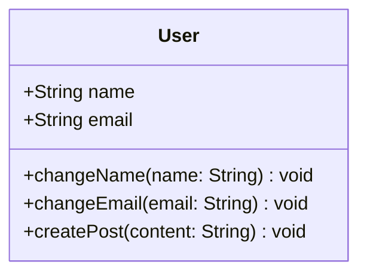
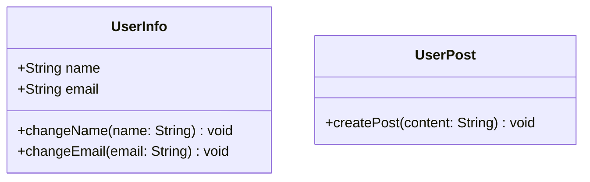
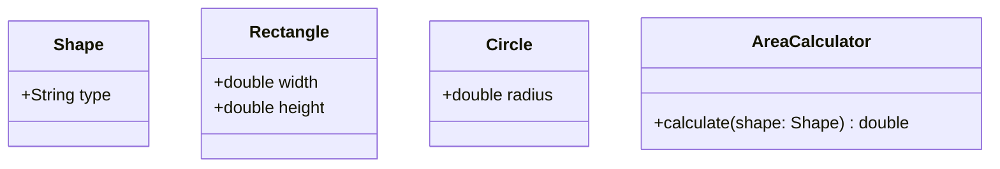
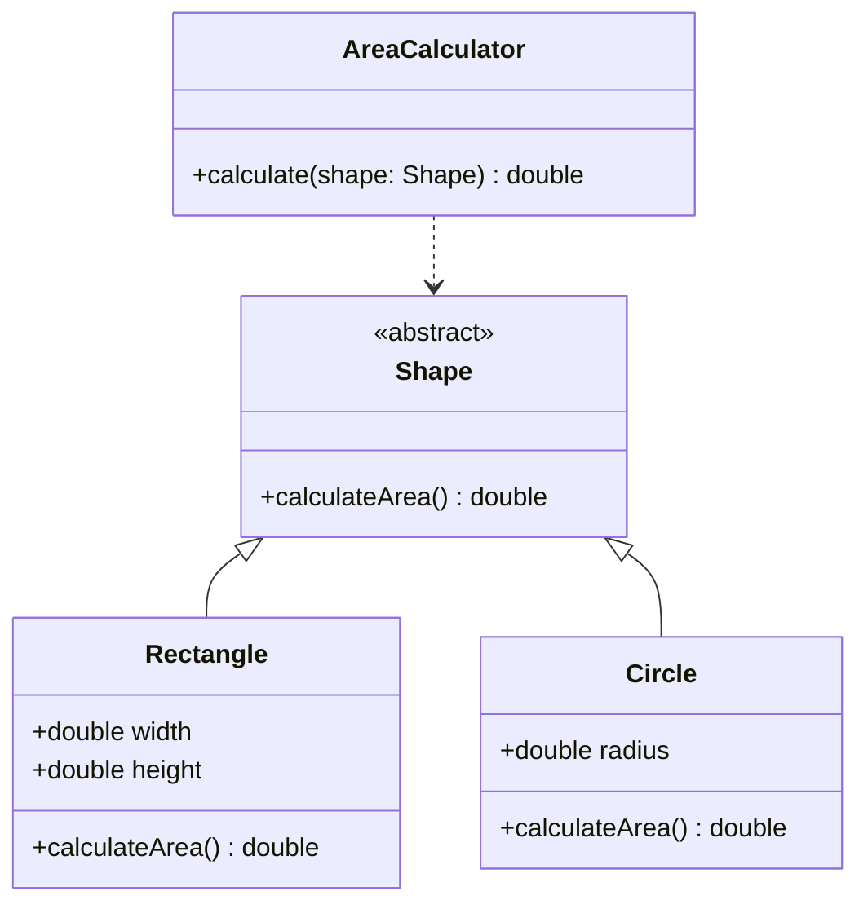

# 9.2 设计原则

## 9.2.1 单一职责原则

单一职责原则（Single Responsibility Principle, SRP）的定义是：一个类只应该有一个引起它变化的原因。通俗地说，一个类只负责一项职责。

**优点：**

- **降低类的复杂度：** 一个类只负责一项职责，其逻辑比负责多项职责的类要简单得多。
- **提高代码的可读性：** 类的职责单一，代码结构清晰，易于理解。
- **提高系统的可维护性：** 当一项职责需要变更时，不会影响到其他职责的实现。
- **降低变更引起的风险：** 变更的范围被限制在单个类中，降低了引入新问题的风险。

**实现方法：**

当一个类承担了多于一种的职责时，就应当将这些职责分离，将不同的职责封装在不同的类中。这需要开发者根据具体情况，识别出类中的不同职责，并进行拆分。

**示例：**

假设我们有一个 `User` 类，它既负责用户信息的管理，又负责用户在论坛的发帖行为。这就违反了单一职责原则。

**违反单一职责原则的类图：**



根据单一职责原则，我们应该将其拆分为两个类：`UserInfo` 和 `UserPost`。

**遵循单一职责原则的类图：**



通过这样的拆分，`UserInfo` 类只负责用户信息的管理，而 `UserPost` 类只负责用户发帖的行为。这样，当我们需要修改发帖逻辑时，就不需要改动 `UserInfo` 类，反之亦然。

## 9.2.2 开闭原则

开闭原则（Open/Closed Principle, OCP）是面向对象设计中最重要的原则之一，其定义是：一个软件实体（如类、模块、函数等）应该对扩展开放，对修改关闭。这意味着当需要增加新功能时，应该通过扩展现有代码来实现，而不是修改现有代码。

**优点：**

- **提高代码的稳定性和灵活性：** 不修改原有代码，可以避免给原有功能带来新的风险；通过扩展来增加新功能，使得系统更加灵活。
- **提高代码的可复用性：** 遵循开闭原则的设计，其模块的独立性更强，更容易被复用。
- **提高系统的可维护性：** 扩展新功能时，不需要修改旧代码，使得维护工作更加简单。

**实现方法：**

开闭原则的核心思想是面向抽象编程。通过接口或抽象类来定义系统的骨架，具体的实现细节则由子类来完成。当需要新增功能时，只需要增加一个新的子类，而不需要修改原有的接口、抽象类或已有的子类。

**示例：**

假设我们有一个 `Shape` 类，以及一个 `AreaCalculator` 类用于计算面积。如果 `AreaCalculator` 中使用 `if-else` 来判断形状类型并计算面积，那么每次增加新的形状时，都需要修改 `AreaCalculator` 的代码，这违反了开闭原则。

**违反开闭原则的类图：**



为了遵循开闭原则，我们应该让 `Shape` 成为一个抽象类，并包含一个抽象的 `calculateArea` 方法。`Rectangle` 和 `Circle` 则继承 `Shape` 并实现该方法。`AreaCalculator` 则直接调用 `calculateArea` 方法，而无需关心具体的形状类型。

**遵循开闭原则的类图：**



这样，当需要增加新的形状（如三角形）时，我们只需要创建一个新的 `Triangle` 类继承 `Shape` 并实现 `calculateArea` 方法，而 `AreaCalculator` 的代码完全不需要修改。

## 9.2.3 里氏替换原则

里氏替换原则（Liskov Substitution Principle, LSP）的定义是：所有引用基类的地方必须能透明地使用其子类的对象。简单来说，子类对象能够替换父类对象，而程序的逻辑行为不发生改变。

**含义：**

里氏替换原则包含四层含义：

1.  **子类必须完全实现父类的所有方法。**
2.  **子类可以有自己的个性。**
3.  **覆盖或实现父类的方法时，输入参数可以被放大。** 即子类方法的输入参数范围可以比父类更广。
4.  **覆盖或实现父类的方法时，输出结果可以被缩小。** 即子类方法的返回值范围可以比父类更窄。

**作用：**

- **保证了继承复用的正确性。** 遵循里氏替换原则，可以确保子类在替换父类后，程序的行为仍然符合预期。
- **是开闭原则的实现基础之一。** 只有当子类可以正确地替换父类时，才能放心地使用父类作为抽象，通过增加子类来扩展功能，而无需修改原有代码。
- **增强代码的健壮性。** 即使在运行时动态地替换为子类对象，程序也能正常工作。

**示例：**

一个经典的反面例子是“正方形是长方形”的问题。假设我们有一个 `Rectangle` 类，然后让 `Square` 类继承它。由于正方形的宽和高必须相等，我们在 `Square` 类中重写了 `setWidth` 和 `setHeight` 方法，使得修改其中一个时，另一个也随之改变。

```java
class Rectangle {
    private double width;
    private double height;

    public void setWidth(double width) { this.width = width; }
    public void setHeight(double height) { this.height = height; }
    public double getArea() { return width * height; }
}

class Square extends Rectangle {
    @Override
    public void setWidth(double side) {
        super.setWidth(side);
        super.setHeight(side);
    }

    @Override
    public void setHeight(double side) {
        super.setWidth(side);
        super.setHeight(side);
    }
}
```

现在，如果有一个方法接收 `Rectangle` 对象，并期望设置宽高后得到相应的面积，当我们传入 `Square` 对象时，就会出现问题：

```java
public void resize(Rectangle r) {
    r.setWidth(20);
    r.setHeight(10);
    // 期望面积是 200，但如果传入的是 Square 对象，面积会是 100
    System.out.println(r.getArea());
}
```

这就违反了里氏替换原则，因为子类 `Square` 的行为与父类 `Rectangle` 的期望行为不一致。正确的做法是不让 `Square` 继承 `Rectangle`，而是为它们提取一个更通用的父类，或者将它们作为独立的类。

## 9.2.4 依赖倒转原则

依赖倒转原则（Dependence Inversion Principle, DIP）的核心思想是：

1.  **高层模块不应该依赖于低层模块，两者都应该依赖于抽象。**
2.  **抽象不应该依赖于细节，细节应该依赖于抽象。**

简单来说，就是要求我们在设计程序时，要面向接口编程，而不是面向实现编程。

**核心思想：**

依赖倒转原则的本质是**控制反转（Inversion of Control, IoC）**，它将原本高层模块对低层模块的直接依赖，反转为双方共同依赖于一个抽象接口。高层模块定义接口，低层模块实现接口，从而实现了依赖关系的反转。

**优点：**

- **降低耦合度。** 模块之间通过抽象（接口或抽象类）进行交互，而不是具体的实现类，大大降低了模块间的耦合。
- **提高代码的可维护性和可扩展性。** 当需要更换或修改低层模块时，只要新的实现同样遵循接口约定，高层模块的代码就无需任何改动。
- **促进并行开发。** 只要接口定义好，高层和低层模块可以由不同的人并行开发，提高了开发效率。

**示例：**

假设有一个 `Driver` 类（司机），他开车。在不遵循依赖倒转原则的设计中，`Driver` 可能直接依赖于一个具体的 `Car` 类。

**违反原则的示例：**

```java
class Car {
    public void run() {
        System.out.println("汽车在跑...");
    }
}

class Driver {
    public void drive(Car car) {
        car.run();
    }
}
```

这样的设计问题在于，如果有一天司机需要开的不是 `Car`，而是 `Truck`，那么就需要修改 `Driver` 类的 `drive` 方法，甚至增加新的方法，这违反了开闭原则。

**遵循原则的示例：**

我们引入一个抽象的 `Vehicle` 接口，让 `Car` 和 `Truck` 都去实现它。`Driver` 类则依赖于 `Vehicle` 接口。

```java
interface Vehicle {
    void run();
}

class Car implements Vehicle {
    public void run() {
        System.out.println("汽车在跑...");
    }
}

class Truck implements Vehicle {
    public void run() {
        System.out.println("卡车在跑...");
    }
}

class Driver {
    public void drive(Vehicle vehicle) {
        vehicle.run();
    }
}
```

现在，`Driver` 类依赖于抽象的 `Vehicle` 接口，而不是具体的 `Car` 或 `Truck` 类。无论将来需要开什么类型的交通工具，只要它实现了 `Vehicle` 接口，`Driver` 类的代码就无需任何修改，具有很好的扩展性。

## 9.2.5 接口隔离原则

接口隔离原则（Interface Segregation Principle, ISP）的定义是：**客户端不应该依赖它不需要的接口。** 或者说，一个类对另一个类的依赖应该建立在最小的接口上。

这个原则的核心是**接口的拆分**。当一个接口过于“臃肿”，包含了客户端不需要的方法时，就应该将其拆分成更小、更具体的接口，让客户端只依赖于它们需要的部分。

**优点：**

- **避免接口污染。** 客户端不会被强制实现它们用不到的方法。
- **提高内聚，降低耦合。** 拆分后的接口职责更单一，模块间的依赖关系更清晰。
- **提高代码的灵活性和可维护性。** 当一个接口发生变化时，只会影响到依赖该接口的客户端，而不会波及其他客户端。

**示例：**

假设我们有一个通用的 `SmartDevice` 接口，它包含了开机、关机、播放音乐和显示画面的方法。

**违反原则的示例：**

```java
interface SmartDevice {
    void turnOn();
    void turnOff();
    void playMusic();
    void displayPicture();
}

class SmartSpeaker implements SmartDevice {
    public void turnOn() { /* ... */ }
    public void turnOff() { /* ... */ }
    public void playMusic() { /* ... */ }
    public void displayPicture() {
        // 智能音箱没有屏幕，这个方法是多余的
        throw new UnsupportedOperationException();
    }
}

class SmartTV implements SmartDevice {
    public void turnOn() { /* ... */ }
    public void turnOff() { /* ... */ }
    public void playMusic() { /* ... */ }
    public void displayPicture() { /* ... */ }
}
```

在这个例子中，`SmartSpeaker` 被迫实现了一个它根本不需要的 `displayPicture` 方法。这就是接口过于臃肿导致的“接口污染”。

**遵循原则的示例：**

根据接口隔离原则，我们应该将 `SmartDevice` 接口拆分成更小的、功能更单一的接口。

```java
interface Switchable {
    void turnOn();
    void turnOff();
}

interface AudioPlayer {
    void playMusic();
}

interface VideoPlayer {
    void displayPicture();
}

class SmartSpeaker implements Switchable, AudioPlayer {
    public void turnOn() { /* ... */ }
    public void turnOff() { /* ... */ }
    public void playMusic() { /* ... */ }
}

class SmartTV implements Switchable, AudioPlayer, VideoPlayer {
    public void turnOn() { /* ... */ }
    public void turnOff() { /* ... */ }
    public void playMusic() { /* ... */ }
    public void displayPicture() { /* ... */ }
}
```

通过拆分接口，`SmartSpeaker` 现在只依赖并实现它需要的功能（`Switchable` 和 `AudioPlayer`），而 `SmartTV` 则实现了所有三个接口。每个类都只依赖于它需要的部分，代码变得更加清晰和灵活。

## 9.2.6 合成复用原则

合成复用原则（Composite Reuse Principle, CRP），也叫组合/聚合复用原则（Composition/Aggregation Reuse Principle, CARP），其核心思想是：**尽量使用对象组合/聚合，而不是继承来达到复用的目的。**

**定义：**

在一个新的对象里通过关联关系（包括组合关系和聚合关系）来使用一些已有的对象，使之成为新对象的一部分；新对象通过委派调用已有对象的方法达到复用其功能的母的。简而言之：要尽量使用组合/聚合，尽量不要使用继承。

**优点：**

- **维持了类的封装性。** 因为对象内部的实现细节对外部是不可见的，所以这种复用方式被称为“黑箱”复用。
- **新旧代码之间的耦合度低。** 组合/聚合关系是“has-a”关系，比继承的“is-a”关系要松散。
- **复用的灵活性高。** 可以在运行时动态地决定要组合的对象。

**继承复用的缺点：**

- **破坏了类的封装性。** 父类的实现细节对子类是可见的，这被称为“白箱”复用。
- **“侵入性”强。** 如果父类发生改变，子类也必须跟着改变。
- **不支持在运行时改变。** 在编译时就已经确定了父子关系。

**示例：**

假设我们有一个 `Car` 类，它需要一个引擎。

**使用继承的复用（不推荐）：**

```java
class Engine {
    public void start() {
        System.out.println("引擎启动");
    }
}

class Car extends Engine {
    // Car "is-a" Engine，这在逻辑上是不通的
}
```

这种设计非常不合理，因为“汽车是一种引擎”在逻辑上是说不通的。

**使用组合/聚合的复用（推荐）：**

```java
class Engine {
    public void start() {
        System.out.println("引擎启动");
    }
}

class Car {
    private Engine engine;

    public Car(Engine engine) {
        this.engine = engine;
    }

    public void start() {
        engine.start();
        System.out.println("汽车启动");
    }
}
```

在这个设计中，`Car` 类包含一个 `Engine` 对象（`Car` "has-a" `Engine`），这在逻辑上是合理的。`Car` 类通过调用其内部 `engine` 对象的 `start` 方法来复用引擎的功能。这种方式更加灵活，耦合度也更低。

## 9.2.7 迪米特法则

迪米特法则（Law of Demeter, LoD），也称为最少知识原则（Least Knowledge Principle），它的核心思想是：**一个对象应该对其他对象有最少的了解。**

**定义：**

通俗地讲，就是一个类对自己依赖的类知道的越少越好。对于被依赖的类来说，无论逻辑多么复杂，都尽量地的将逻辑封装在类的内部，对外除了提供的 public 方法，不对外泄漏任何信息。

**核心思想：**

迪米特法则要求一个对象（方法）只能与以下几类对象进行交互：

1.  **当前对象本身（`this`）**
2.  **方法的参数**
3.  **当前对象的成员变量**
4.  **方法内创建的对象**

任何不属于这几类的对象，都不应该直接出现在方法体内。如果需要与“朋友的朋友”进行交互，应该通过“朋友”来转发这个调用。

**优点：**

- **降低类之间的耦合度。** 每个类都专注于自己的功能，减少了类与类之间的直接依赖。
- **提高模块的独立性。** 当一个类的内部实现发生变化时，只要它的公共接口不变，就不会影响到其他类。
- **使代码更容易维护。** 由于耦合度降低，修改代码时需要关注的范围也变小了。

**示例：**

假设有一个 `TeamLeader` 需要了解 `Course` 的数量。

**违反原则的示例：**

```java
class Course {}

class Employee {
    public List<Course> getCourses() {
        List<Course> list = new ArrayList<>();
        list.add(new Course());
        return list;
    }
}

class TeamLeader {
    public void checkNumberOfCourses(Employee employee) {
        // TeamLeader 直接调用了 Employee 的朋友 Course
        List<Course> courseList = employee.getCourses();
        System.out.println("课程数量: " + courseList.size());
    }
}
```

在这个例子中，`TeamLeader` 为了获取课程数量，需要先调用 `employee.getCourses()`，然后再调用返回的 `List` 的 `size()` 方法。这使得 `TeamLeader` 依赖了 `Employee` 的内部实现细节（即 `getCourses` 返回一个 `List`）。`Course` 是 `Employee` 的朋友，但不是 `TeamLeader` 的朋友，`TeamLeader` 与一个“陌生人” `Course` 进行了交互。

**遵循原则的示例：**

我们应该在 `Employee` 类中提供一个直接获取课程数量的方法，将细节封装起来。

```java
class Course {}

class Employee {
    public List<Course> getCourses() {
        List<Course> list = new ArrayList<>();
        list.add(new Course());
        return list;
    }

    // 提供一个直接获取数量的方法
    public int getCoursesCount() {
        return this.getCourses().size();
    }
}

class TeamLeader {
    public void checkNumberOfCourses(Employee employee) {
        // TeamLeader 只与它的直接朋友 Employee 交互
        System.out.println("课程数量: " + employee.getCoursesCount());
    }
}
```

现在，`TeamLeader` 只与它的直接朋友 `Employee` 交互，调用 `employee.getCoursesCount()` 方法来获取课程数量。`TeamLeader` 不再需要知道 `Employee` 内部是如何管理 `Course` 的，实现了更好的封装，降低了耦合。

## 总结

本文详细介绍了面向对象设计的七大基本原则：单一职责、开闭、里氏替换、依赖倒转、接口隔离、合成复用和迪米特法则。这些原则是高质量软件设计的基石，它们共同的目标是创建高内聚、低耦合、可维护、可扩展、可复用、灵活性强的软件系统。

- **单一职责原则** 强调类的专一性。
- **开闭原则** 是设计的终极目标，要求对扩展开放，对修改关闭。
- **里氏替换原则** 保证了继承的正确性。
- **依赖倒转原则** 是实现开闭原则的重要途径，要求面向接口编程。
- **接口隔离原则** 提倡使用多个专门的接口，而不是一个臃肿的总接口。
- **合成复用原则** 建议优先使用组合/聚合，而不是继承。
- **迪米特法则** 要求一个对象应该对其他对象有最少的了解。

在实际开发中，这些原则往往是相辅相成、综合运用的。深刻理解并灵活运用这些原则，将有助于我们编写出更加优雅、健壮和易于维护的代码。
