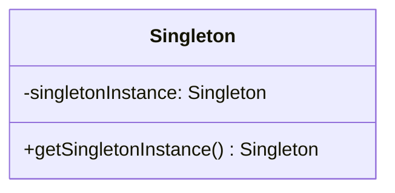
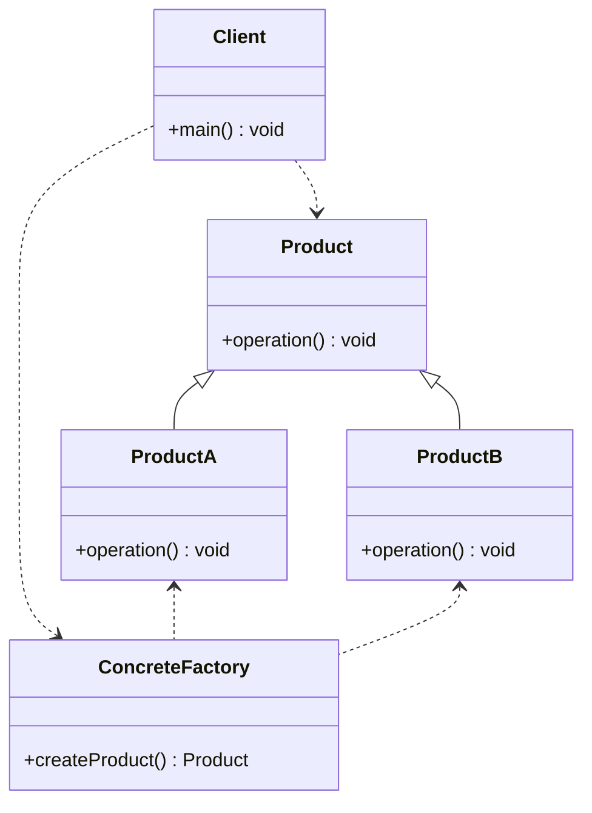
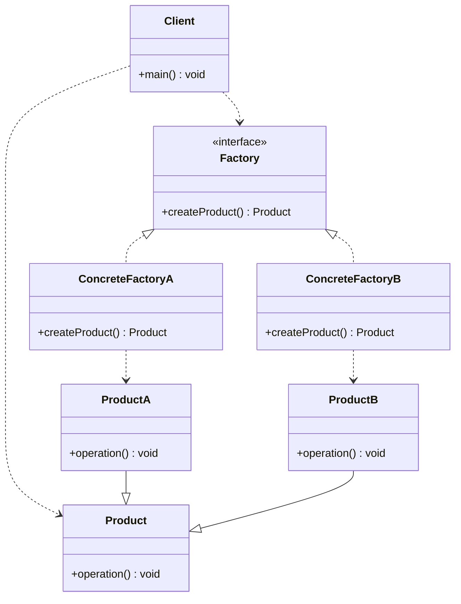
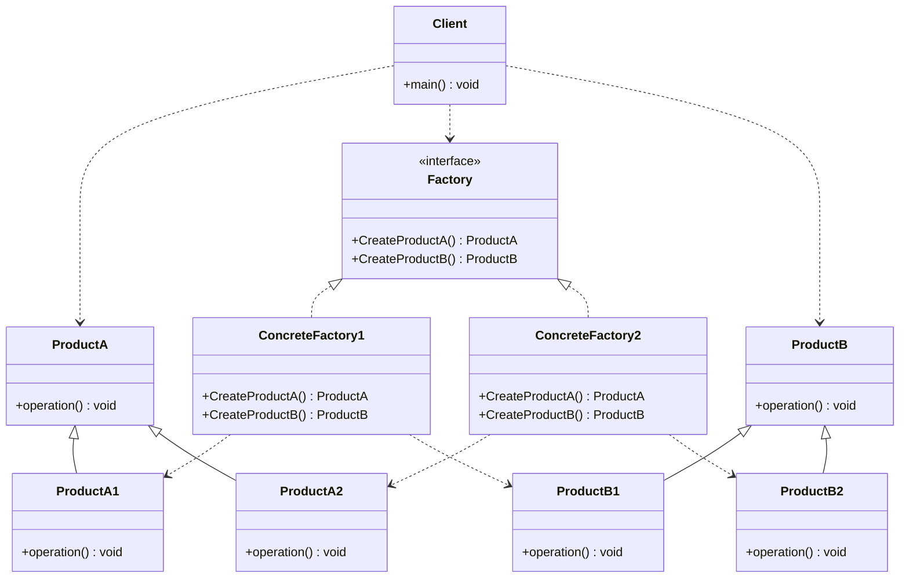

# 9.3 创建型模式

创建型模式（Creational Patterns）主要关注对象的创建过程，它将对象的创建与使用分离，使得系统在不知道对象具体类型的情况下也能够创建对象。这些模式通过封装和隐藏创建逻辑，提高了系统的灵活性和可维护性。

## 9.3.1 单例模式

### 单例模式引入

单例模式（Singleton Pattern）是最简单的设计模式之一，但也是一个非常实用且在面试中经常被问到的模式。它的核心思想是：**确保一个类只有一个实例，并提供一个全局访问点来获取这个实例。**

在很多场景下，我们需要一个全局唯一的对象，例如：

- **线程池（ThreadPool）**：整个应用程序共享一个线程池，避免资源的重复创建和销毁。
- **配置管理器（Configuration Manager）**：读取和管理应用的配置信息，整个应用只需一份配置。
- **日志记录器（Logger）**：所有模块都使用同一个日志记录器实例，方便日志的集中管理。
- **数据库连接池**：管理数据库连接，避免频繁地创建和关闭连接。

单例模式通过将类的构造函数私有化，并提供一个静态方法来返回唯一的实例，从而保证了实例的唯一性。

### 单例模式的类图



这个类图展示了单例模式的核心组成：

- `Singleton` 类：它包含一个对自身的私有静态引用 `singletonInstance`，并提供一个公共的静态方法 `getSingletonInstance()` 来获取这个唯一的实例。

### 单例模式的创建

创建单例模式的关键在于：

1.  **私有化构造函数**：防止外部通过 `new` 关键字直接创建类的实例。
2.  **提供一个静态的公共访问方法**：这个方法负责创建并返回类的唯一实例。
3.  **在类内部维护一个静态的私有实例**：这个实例是线程安全的，并且在整个应用的生命周期中只被创建一次。

### 单例模式的实现

单例模式主要有两种实现方式：饿汉式和懒汉式。它们的主要区别在于实例化的时机不同。

#### 饿汉式

饿汉式单例在**类加载时**就立即创建实例，因此它是线程安全的。它的优点是实现简单，没有线程同步的开销；缺点是如果实例化的过程很耗时，或者这个实例从未使用过，会造成资源的浪费。

```java
public class EagerSingleton {
    // 1. 在类加载时就创建实例
    private static final EagerSingleton instance = new EagerSingleton();

    // 2. 私有化构造函数
    private EagerSingleton() {}

    // 3. 提供公共的静态访问方法
    public static EagerSingleton getInstance() {
        return instance;
    }
}
```

#### 懒汉式

懒汉式单例在**第一次被调用时**才创建实例。它的优点是延迟加载，节省了资源；缺点是在多线程环境下需要处理同步问题，否则可能会创建出多个实例。

一个线程安全的懒汉式实现通常使用**双重检查锁定（Double-Checked Locking）** 来兼顾性能和线程安全。

```java
public class LazySingleton {
    // 1. 使用 volatile 保证 instance 在所有线程中同步可见
    private static volatile LazySingleton instance = null;

    // 2. 私有化构造函数
    private LazySingleton() {}

    // 3. 提供公共的静态访问方法，并使用双重检查锁定
    public static LazySingleton getInstance() {
        // 第一次检查：避免不必要的同步
        if (instance == null) {
            // 同步块，保证线程安全
            synchronized (LazySingleton.class) {
                // 第二次检查：防止多个线程同时进入同步块并创建多个实例
                if (instance == null) {
                    instance = new LazySingleton();
                }
            }
        }
        return instance;
    }
}
```

### 单例模式的应用实例

假设我们需要一个简单的日志记录器，它在整个应用程序中应该是唯一的。

```java
public class Logger {
    private static volatile Logger instance = null;

    private Logger() {
        // 初始化日志记录器，例如打开日志文件
    }

    public static Logger getInstance() {
        if (instance == null) {
            synchronized (Logger.class) {
                if (instance == null) {
                    instance = new Logger();
                }
            }
        }
        return instance;
    }

    public void log(String message) {
        // 将消息写入日志文件
        System.out.println("LOG: " + message);
    }
}

// 在应用的不同地方使用
public class App {
    public static void main(String[] args) {
        Logger logger1 = Logger.getInstance();
        logger1.log("Application started.");

        Logger logger2 = Logger.getInstance();
        logger2.log("Processing data...");

        // 检查两个实例是否相同
        System.out.println(logger1 == logger2); // 输出 true
    }
}
```

在这个例子中，无论我们调用多少次 `Logger.getInstance()`，都将返回同一个 `Logger` 实例，从而确保了日志记录的集中和一致。

## 9.3.2 简单工厂模式

### 简单工厂模式引入

简单工厂模式（Simple Factory Pattern）不属于 23 种经典的设计模式之一，但它作为工厂方法模式和抽象工厂模式的基础，是理解后两者的重要铺垫。它的核心思想是：**定义一个工厂类，根据传入的参数来动态决定创建哪一种产品的实例。**

简单工厂模式将对象的创建过程封装在一个工厂类中，客户端无需关心具体的创建细节，只需告诉工厂需要什么产品即可。这实现了**创建者和调用者的分离**。

### 简单工厂模式的类图



- `Client`：客户端，它通过工厂类来获取产品对象。
- `ConcreteFactory`：具体的工厂类，负责创建具体产品的实例。
- `Product`：抽象产品接口，定义了产品的公共方法。
- `ProductA/B`：具体产品类，实现了 `Product` 接口。

### 简单工厂模式的实现

实现简单工厂模式的关键在于工厂类中的 `createProduct` 方法。这个方法通常使用 `if-else` 或 `switch` 语句来根据传入的参数判断应该创建哪个具体产品。

```java
// 1. 定义抽象产品接口
interface Shape {
    void draw();
}

// 2. 创建具体产品类
class Circle implements Shape {
    public void draw() {
        System.out.println("Drawing a Circle.");
    }
}

class Rectangle implements Shape {
    public void draw() {
        System.out.println("Drawing a Rectangle.");
    }
}

// 3. 创建工厂类
class ShapeFactory {
    public Shape createShape(String shapeType) {
        if (shapeType == null) {
            return null;
        }
        if (shapeType.equalsIgnoreCase("CIRCLE")) {
            return new Circle();
        } else if (shapeType.equalsIgnoreCase("RECTANGLE")) {
            return new Rectangle();
        }
        return null;
    }
}
```

### 简单工厂模式的应用实例

客户端通过工厂类来获取所需的对象，而无需知道具体的创建过程。

```java
public class App {
    public static void main(String[] args) {
        ShapeFactory shapeFactory = new ShapeFactory();

        // 获取 Circle 对象并调用其 draw 方法
        Shape shape1 = shapeFactory.createShape("CIRCLE");
        shape1.draw();

        // 获取 Rectangle 对象并调用其 draw 方法
        Shape shape2 = shapeFactory.createShape("RECTANGLE");
        shape2.draw();
    }
}
```

### 简单工厂模式的扩展

简单工厂模式虽然简单，但存在一个明显的缺点：**不符合开闭原则**。当需要增加一个新的产品时（例如 `Triangle`），我们必须修改工厂类 `ShapeFactory` 的 `createShape` 方法，增加一个新的 `if-else` 分支。这在产品种类很多的情况下，会导致工厂类的代码变得非常臃肿，难以维护。

为了解决这个问题，我们可以使用更高级的工厂模式，如工厂方法模式或抽象工厂模式。

## 9.3.3 工厂方法模式

### 工厂方法模式引入

工厂方法模式（Factory Method Pattern）是简单工厂模式的升级版，它完美地解决了简单工厂模式不符合**开闭原则**的问题。其核心思想是：**定义一个用于创建对象的接口，但让子类决定实例化哪一个类。工厂方法使一个类的实例化延迟到其子类。**

与简单工厂模式集中在一个工厂类中创建所有产品不同，工厂方法模式将创建产品的责任下放到各个子工厂中，每个子工厂只负责创建一种特定的产品。这使得系统在增加新产品时，无需修改现有工厂代码，只需增加一个新的具体工厂类即可。

### 工厂方法模式的类图



- `Client`：客户端，通过抽象工厂和抽象产品来完成任务，与具体实现解耦。
- `Factory`：抽象工厂接口，定义了创建产品的工厂方法 `createProduct()`。
- `Product`：抽象产品接口。
- `ConcreteFactoryA/B`：具体工厂类，实现了 `Factory` 接口，负责创建对应的具体产品。
- `ConcreteProductA/B`：具体产品类。

### 工厂方法模式的实现

我们继续使用创建形状的例子。这次，我们为每种形状都创建一个专门的工厂。

```java
// 1. 抽象产品接口 (与简单工厂模式相同)
interface Shape {
    void draw();
}

// 2. 具体产品类 (与简单工厂模式相同)
class Circle implements Shape {
    public void draw() {
        System.out.println("Drawing a Circle.");
    }
}

class Rectangle implements Shape {
    public void draw() {
        System.out.println("Drawing a Rectangle.");
    }
}

// 3. 定义抽象工厂接口
interface ShapeFactory {
    Shape createShape();
}

// 4. 创建具体工厂类
class CircleFactory implements ShapeFactory {
    public Shape createShape() {
        return new Circle();
    }
}

class RectangleFactory implements ShapeFactory {
    public Shape createShape() {
        return new Rectangle();
    }
}
```

### 工厂方法模式的应用实例

客户端代码现在需要先选择使用哪个工厂，然后再通过该工厂创建产品。

```java
public class App {
    public static void main(String[] args) {
        // 使用 CircleFactory 创建 Circle
        ShapeFactory circleFactory = new CircleFactory();
        Shape circle = circleFactory.createShape();
        circle.draw();

        // 使用 RectangleFactory 创建 Rectangle
        ShapeFactory rectangleFactory = new RectangleFactory();
        Shape rectangle = rectangleFactory.createShape();
        rectangle.draw();
    }
}
```

### 工厂方法模式的扩展

现在，如果我们需要增加一个新的产品，比如 `Triangle`，我们只需：

1.  创建 `Triangle` 类实现 `Shape` 接口。
2.  创建一个新的 `TriangleFactory` 类实现 `ShapeFactory` 接口，并实现 `createShape` 方法返回 `Triangle` 实例。

整个过程中，我们**没有修改任何已有的代码**，只进行了扩展。这完全符合**开闭原则**。

工厂方法模式的缺点在于，每增加一个产品，就需要额外增加一个对应的工厂类，这会使得系统中的类的数量成倍增加，增加了系统的复杂度和理解难度。

## 9.3.4 抽象工厂模式

### 抽象工厂模式引入

抽象工厂模式（Abstract Factory Pattern）是所有工厂模式中最为抽象和复杂的一种。它处理的是**产品族**的创建问题。所谓产品族，是指位于不同产品等级结构中，功能相关联的产品系列。

抽象工厂模式的核心思想是：**提供一个接口，用于创建一系列相关或相互依赖的对象，而无需指定它们具体的类。**

想象一下，一个应用需要支持多种主题（如暗黑主题、明亮主题），每个主题下都有一套对应的 UI 组件（如按钮、文本框）。在这里，“暗黑主题的 UI 组件”和“明亮主题的 UI 组件”就分别构成了一个产品族。抽象工厂模式允许我们创建 `ThemeFactory` 接口，并由 `DarkThemeFactory` 和 `LightThemeFactory` 来具体实现，从而创建出成套的主题组件，而客户端代码无需关心当前使用的是哪个主题的工厂。

### 抽象工厂模式的类图



- `Client`：客户端，使用抽象工厂来创建产品族，不与具体产品实现耦合。
- `Factory`：抽象工厂接口，定义了创建一系列产品（产品族）的方法，如 `createProductA()` 和 `createProductB()`。
- `ConcreteFactory1/2`：具体工厂，实现了抽象工厂的接口，负责创建属于同一个产品族的具体产品。
- `ProductA/B`：抽象产品接口，定义了产品的功能。
- `ProductA1/B1` 和 `ProductA2/B2`：具体产品，由具体工厂创建，分别属于不同的产品族。

### 抽象工厂模式的实现

让我们用一个更具体的例子——为不同品牌的电脑（PC 和 Mac）创建一套兼容的外设（鼠标和键盘）。

```java
// 1. 定义抽象产品接口
interface Mouse {
    void click();
}

interface Keyboard {
    void type();
}

// 2. 创建具体产品类
// PC 产品族
class PcMouse implements Mouse {
    public void click() {
        System.out.println("PC Mouse clicked.");
    }
}
class PcKeyboard implements Keyboard {
    public void type() {
        System.out.println("PC Keyboard typing.");
    }
}

// Mac 产品族
class MacMouse implements Mouse {
    public void click() {
        System.out.println("Mac Mouse clicked.");
    }
}
class MacKeyboard implements Keyboard {
    public void type() {
        System.out.println("Mac Keyboard typing.");
    }
}

// 3. 定义抽象工厂接口
interface PeripheralFactory {
    Mouse createMouse();
    Keyboard createKeyboard();
}

// 4. 创建具体工厂类
class PcPeripheralFactory implements PeripheralFactory {
    public Mouse createMouse() {
        return new PcMouse();
    }
    public Keyboard createKeyboard() {
        return new PcKeyboard();
    }
}

class MacPeripheralFactory implements PeripheralFactory {
    public Mouse createMouse() {
        return new MacMouse();
    }
    public Keyboard createKeyboard() {
        return new MacKeyboard();
    }
}
```

### 抽象工厂模式的应用实例

客户端代码根据需要选择一个具体的工厂，然后使用这个工厂来创建一整套产品，从而保证了产品之间良好的兼容性。

```java
public class App {
    private final Mouse mouse;
    private final Keyboard keyboard;

    public App(PeripheralFactory factory) {
        mouse = factory.createMouse();
        keyboard = factory.createKeyboard();
    }

    public void usePeripherals() {
        mouse.click();
        keyboard.type();
    }

    public static void main(String[] args) {
        // 根据当前环境选择工厂
        String os = "Mac"; // or "PC"
        PeripheralFactory factory;

        if (os.equalsIgnoreCase("PC")) {
            factory = new PcPeripheralFactory();
        } else {
            factory = new MacPeripheralFactory();
        }

        App app = new App(factory);
        app.usePeripherals();
    }
}
```

### 抽象工厂模式的优缺点

**优点：**

- **隔离了具体类的生成**：客户端只依赖于抽象工厂和抽象产品，无需知道具体是哪个工厂、哪个产品在工作。
- **保证了产品兼容性**：当一个工厂创建了某个产品族的一个产品后，它就能保证创建出该产品族的所有其他产品，确保它们之间的兼容性。
- **易于交换产品族**：只需要改变具体的工厂实现，就可以轻松地切换整个产品族。

**缺点：**

- **难以扩展新的产品等级结构**：抽象工厂模式的致命弱点在于，如果需要给整个产品族增加一个新的产品（例如增加一个 `Touchpad` 接口），那么就需要修改抽象工厂 `PeripheralFactory` 的接口，这会导致所有子类工厂都需要进行修改。这严重违反了**开闭原则**。

## 9.3.5 工厂模式总结对比

| 特性         | 简单工厂模式                    | 工厂方法模式                                                 | 抽象工厂模式                                           |
| :----------- | :------------------------------ | :----------------------------------------------------------- | :----------------------------------------------------- |
| **核心思想** | 一个工厂类根据参数创建不同产品  | 定义创建对象的接口，由子类决定实例化哪个类                   | 提供接口创建一系列相关或相互依赖的对象                 |
| **产品关系** | 无直接关联                      | 单个产品等级结构                                             | 多个产品族（等级结构）                                 |
| **复杂度**   | 简单                            | 中等                                                         | 复杂                                                   |
| **开闭原则** | **违反** (增加新产品需修改工厂) | **符合** (增加新产品只需增加新工厂)                          | **部分符合** (增加新产品族符合，增加新产品等级违反)    |
| **关注点**   | 如何创建产品                    | 创建产品，但推迟到子类                                       | 创建产品族，保证产品兼容性                             |
| **适用场景** | 产品种类少，业务简单            | 需要创建的对象有复杂的初始化过程，或需要解耦创建者和具体产品 | 系统需要多个产品系列中的一个，且要保证这些产品相互配合 |
