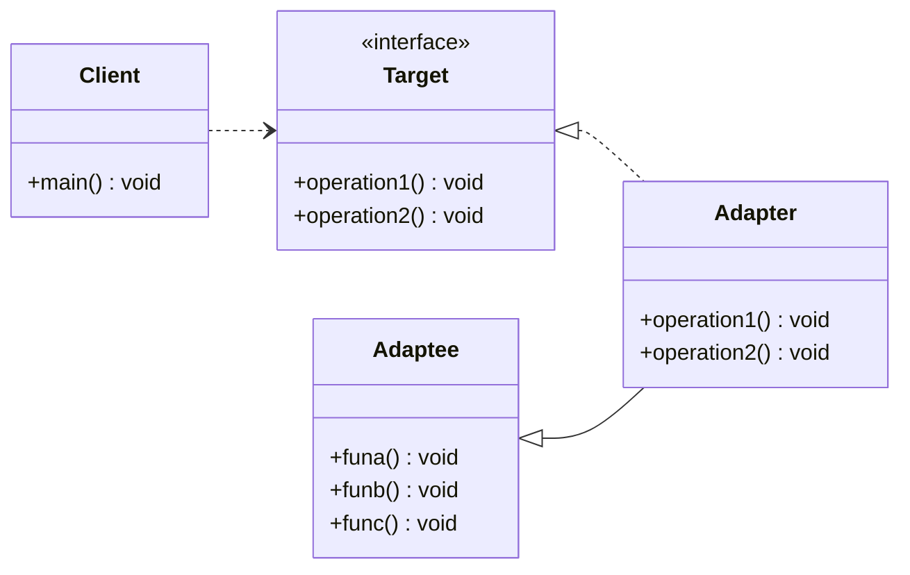
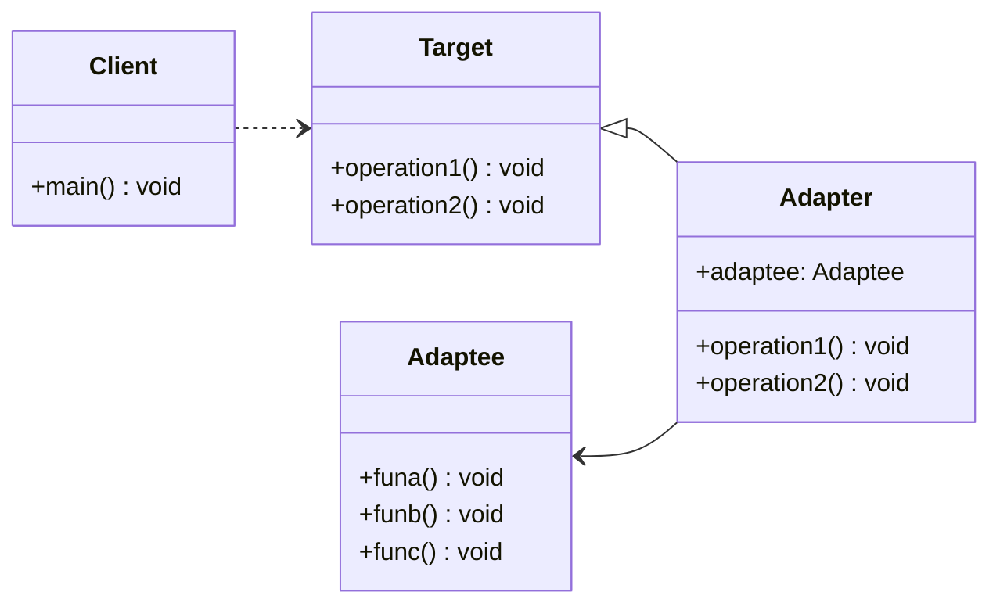
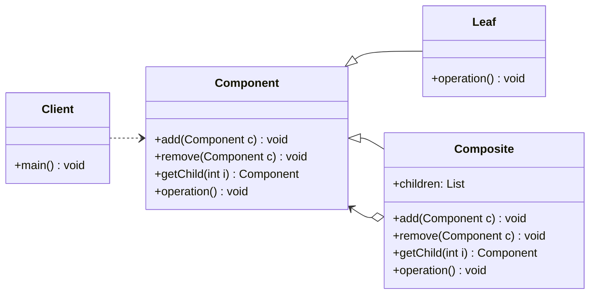
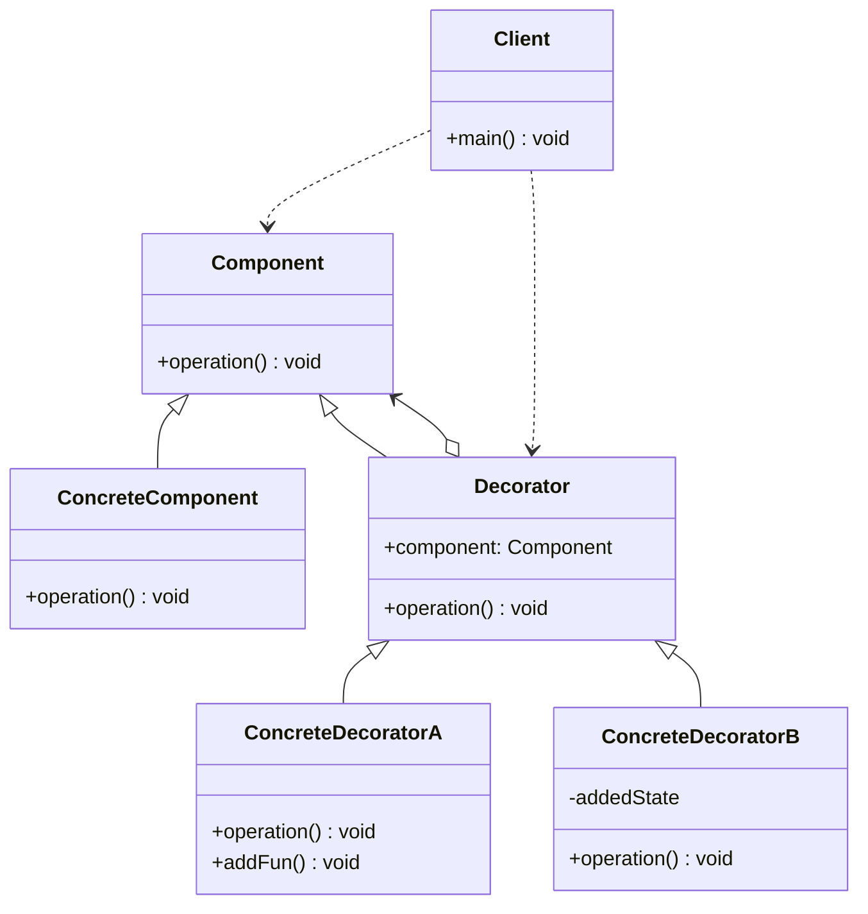

# 9.4 结构型模式

结构型模式（Structural Patterns）主要关注如何将类和对象组合成更大的结构，同时保持结构的灵活性和效率。这些模式通过识别和简化实体之间的关系来设计系统。

## 9.4.1 适配器模式

### 适配器模式引入

适配器模式（Adapter Pattern）是一种结构型设计模式，它的核心思想是：**将一个类的接口转换成客户端所期望的另一个接口。** 适配器使得原本由于接口不兼容而不能一起工作的类可以协同工作。

在现实生活中，适配器随处可见：

- **电源适配器**：你的笔记本电脑需要 19V 的直流电，但墙上的插座提供的是 220V 的交流电。电源适配器就是那个“转换器”，它将 220V 交流电转换为 19V 直流电，让你的电脑能正常工作。
- **读卡器**：你的电脑只有 USB 接口，但你想读取相机里的 SD 卡。读卡器就充当了适配器，它有一个 SD 卡插槽和一个 USB 插头，使得电脑可以通过 USB 接口读取 SD 卡的内容。

在软件开发中，我们也经常遇到类似的情况：

- **集成第三方库**：你正在开发一个系统，需要使用一个功能强大的第三方库，但这个库的接口与你现有系统的接口完全不匹配。
- **系统重构**：你正在对一个旧系统进行重构，希望用一个新的、设计更优良的组件替换掉一个旧组件，但新旧组件的接口不同，直接替换会导致大量代码需要修改。

适配器模式就是为了解决这类“接口不兼容”问题而生的。它引入一个中间层（适配器），这个适配器实现了客户端期望的接口，同时在内部封装（或继承）了那个需要被适配的、接口不兼容的类（被适配者）。当客户端调用适配器的方法时，适配器会将其转换为对被适配者相应方法的调用。

适配器模式主要有两种实现形式：**类适配器**和**对象适配器**。

### 适配器模式的类图

#### 类适配器

类适配器模式通过**继承**来实现。适配器类同时继承了目标接口（`Target`）和被适配类（`Adaptee`）。



- `Client`：客户端，它只与 `Target` 接口交互。
- `Target`：目标接口，是客户端所期望的接口。
- `Adaptee`：被适配者，是需要被适配的、接口不兼容的类。
- `Adapter`：适配器，它继承了 `Adaptee` 并实现了 `Target` 接口，负责将 `Target` 接口的调用转换为对 `Adaptee` 方法的调用。

#### 对象适配器

对象适配器模式通过**组合**（持有 `Adaptee` 的实例）来实现。适配器类实现了目标接口（`Target`），并在内部持有一个 `Adaptee` 类的实例。



- `Adapter`：适配器，它实现了 `Target` 接口，并在内部持有一个 `Adaptee` 的实例。当 `Target` 的方法被调用时，它会委托 `Adaptee` 实例去完成实际的功能。

### 适配器模式的实现

假设我们有一个旧的音频播放器 `OldAudioPlayer`，它只能播放 `mp3` 文件。现在我们需要一个新的音频播放器，它需要支持播放 `mp4` 和 `vlc` 格式。我们可以使用适配器模式来让新的播放器能够使用旧的播放器功能，同时扩展新的功能。

`Target` 接口是 `MediaPlayer`，`Adaptee` 是 `OldAudioPlayer`。

```java
// Target 接口
public interface MediaPlayer {
   void play(String audioType, String fileName);
}

// Adaptee 类
public class OldAudioPlayer {
   public void playMp3(String fileName) {
      System.out.println("Playing mp3 file. Name: "+ fileName);
   }
}
```

#### 类适配器

类适配器通过继承 `Adaptee` 来实现。但由于 Java 不支持多重继承，如果 `Target` 是一个类而不是接口，这种方式就无法使用。

```java
// Adapter 类
public class MediaAdapter extends OldAudioPlayer implements MediaPlayer {

   @Override
   public void play(String audioType, String fileName) {
      if(audioType.equalsIgnoreCase("mp3")){
         playMp3(fileName);
      }
      // 假设我们有其他播放器可以播放 mp4 和 vlc
      else if(audioType.equalsIgnoreCase("vlc")) {
         System.out.println("Playing vlc file. Name: "+ fileName);
      }
      else if(audioType.equalsIgnoreCase("mp4")){
         System.out.println("Playing mp4 file. Name: "+ fileName);
      }
   }
}
```

**缺点**：这种方式将 `Adapter` 和 `Adaptee` 紧密地耦合在了一起。如果 `Adaptee` 是一个 `final` 类，则无法使用类适配器。

#### 对象适配器

对象适配器通过组合 `Adaptee` 的实例来实现，这是更常用、更灵活的方式。

```java
// Adapter 类
public class MediaAdapter implements MediaPlayer {

   // 持有 Adaptee 的实例
   private OldAudioPlayer oldAudioPlayer;

   public MediaAdapter(String audioType){
      if(audioType.equalsIgnoreCase("mp3") ){
         oldAudioPlayer = new OldAudioPlayer();
      }
   }

   @Override
   public void play(String audioType, String fileName) {
      if(audioType.equalsIgnoreCase("mp3")){
         oldAudioPlayer.playMp3(fileName);
      }
      else if(audioType.equalsIgnoreCase("vlc")) {
         System.out.println("Playing vlc file. Name: "+ fileName);
      }
      else if(audioType.equalsIgnoreCase("mp4")){
         System.out.println("Playing mp4 file. Name: "+ fileName);
      }
   }
}
```

### 适配器模式的应用实例

现在，我们可以创建一个实现了 `MediaPlayer` 接口的 `AudioPlayer`，它在内部使用 `MediaAdapter` 来支持播放不同格式的音频。

```java
public class AudioPlayer implements MediaPlayer {
   MediaAdapter mediaAdapter;

   @Override
   public void play(String audioType, String fileName) {
      // 播放 mp3 文件的内置支持
      if(audioType.equalsIgnoreCase("mp3")){
         System.out.println("Playing mp3 file. Name: "+ fileName);
      }
      // mediaAdapter 提供了播放其他文件格式的支持
      else if(audioType.equalsIgnoreCase("vlc") || audioType.equalsIgnoreCase("mp4")){
         mediaAdapter = new MediaAdapter(audioType);
         mediaAdapter.play(audioType, fileName);
      }
      else{
         System.out.println("Invalid media. " + audioType + " format not supported");
      }
   }
}

// 客户端代码
public class App {
   public static void main(String[] args) {
      AudioPlayer audioPlayer = new AudioPlayer();

      audioPlayer.play("mp3", "beyond the horizon.mp3");
      audioPlayer.play("mp4", "alone.mp4");
      audioPlayer.play("vlc", "far far away.vlc");
      audioPlayer.play("avi", "mind me.avi");
   }
}
```

在这个例子中，`AudioPlayer` 是客户端代码，它只需要调用 `play` 方法。`MediaAdapter` 则像一个万能转换插头，将 `vlc` 和 `mp4` 的播放请求适配给了其他（假想的）播放器，而 `mp3` 的请求则由 `AudioPlayer` 自己处理。这就实现了对旧代码的复用和对新功能的扩展。

## 9.4.2 组合模式

### 组合模式引入

组合模式（Composite Pattern）是一种结构型设计模式，它的核心思想是：**将对象组合成树形结构以表示“部分-整体”的层次结构。组合模式使得用户对单个对象和组合对象的使用具有一致性。**

想象一下电脑中的文件系统：

- 一个文件夹（`Folder`）可以包含多个文件（`File`）和其他文件夹。
- 一个文件（`File`）是基本单位，它不能再包含其他东西。

对于用户来说，无论是文件夹还是文件，我们都可以执行一些共同的操作，比如“计算大小”或“删除”。当你计算一个文件夹的大小时，实际上是计算它内部所有文件和子文件夹大小的总和。当你删除一个文件夹时，它内部的所有内容也会被一并删除。

组合模式正是为了处理这种树形结构而设计的。它定义了一个共同的接口（或抽象类），让“叶子节点”（如文件）和“容器节点”（如文件夹）都实现这个接口。这样，客户端代码就可以用同样的方式对待叶子节点和容器节点，而无需关心它们的具体类型。

这大大简化了客户端的代码，因为客户端不必编写 `if-else` 来区分它正在处理的是一个叶子对象还是一个容器对象。

### 组合模式的类图



- `Client`：客户端，通过 `Component` 接口与组合结构中的对象交互。
- `Component`：组合中对象的抽象基类（或接口），定义了叶子节点和容器节点共有的操作。它通常会声明用于管理子组件的方法，如 `add`, `remove`, `getChild`。
- `Leaf`：叶子节点，它没有子节点。它实现了 `Component` 接口中定义的操作。对于管理子组件的方法，它通常会抛出异常或什么都不做。
- `Composite`：容器节点（或组合节点），它包含一组子组件（`children`），这些子组件可以是 `Leaf` 或其他的 `Composite`。它实现了 `Component` 接口，并通常将收到的请求委托给它的子组件来处理。

### 组合模式的实现

让我们用一个公司组织架构的例子来实现组合模式。一个公司由多个部门组成，部门里有员工。部门本身也可以包含子部门。

```java
import java.util.ArrayList;
import java.util.List;

// 1. Component: 抽象组件
public abstract class CompanyComponent {
    protected String name;

    public CompanyComponent(String name) {
        this.name = name;
    }

    // 容器和叶子节点都需要实现的方法
    public abstract void display();

    // 通常在容器节点中实现，叶子节点可以不支持
    public void add(CompanyComponent component) {
        throw new UnsupportedOperationException();
    }

    public void remove(CompanyComponent component) {
        throw new UnsupportedOperationException();
    }
}

// 2. Leaf: 叶子节点 (员工)
public class Employee extends CompanyComponent {
    public Employee(String name) {
        super(name);
    }

    @Override
    public void display() {
        System.out.println("  - " + name + " (员工)");
    }
}

// 3. Composite: 容器节点 (部门)
public class Department extends CompanyComponent {
    private List<CompanyComponent> children = new ArrayList<>();

    public Department(String name) {
        super(name);
    }

    @Override
    public void add(CompanyComponent component) {
        children.add(component);
    }

    @Override
    public void remove(CompanyComponent component) {
        children.remove(component);
    }

    @Override
    public void display() {
        System.out.println(name + " (部门)");
        for (CompanyComponent component : children) {
            component.display(); // 递归显示子节点
        }
    }
}
```

### 组合模式的应用实例

现在，我们可以构建一个复杂的公司结构，并用统一的方式来展示它。

```java
public class App {
    public static void main(String[] args) {
        // 创建总公司
        Department root = new Department("总公司");

        // 创建一级部门
        Department hr = new Department("人力资源部");
        Department tech = new Department("技术部");

        root.add(hr);
        root.add(tech);

        // 为部门添加员工
        hr.add(new Employee("张三"));
        hr.add(new Employee("李四"));

        // 技术部下设子部门
        Department backend = new Department("后端开发部");
        Department frontend = new Department("前端开发部");
        tech.add(backend);
        tech.add(frontend);

        // 为子部门添加员工
        backend.add(new Employee("王五"));
        backend.add(new Employee("赵六"));
        frontend.add(new Employee("孙七"));

        // 显示整个公司结构
        root.display();
    }
}
```

**输出结果：**

```
总公司 (部门)
人力资源部 (部门)
  - 张三 (员工)
  - 李四 (员工)
技术部 (部门)
后端开发部 (部门)
  - 王五 (员工)
  - 赵六 (员工)
前端开发部 (部门)
  - 孙七 (员工)
```

通过组合模式，我们用同样的方式处理了部门（`Composite`）和员工（`Leaf`），客户端代码 `App` 只需调用 `display()` 方法，就能递归地展示整个树形结构，无需关心当前处理的是部门还是员工。

## 9.4.3 装饰器模式

### 装饰器模式引入

装饰器模式（Decorator Pattern）是一种结构型设计模式，它的核心思想是：**在不改变原有对象结构的基础上，动态地给一个对象添加一些额外的职责。** 就增加功能来说，装饰器模式相比生成子类更为灵活。

想象一下你在一家咖啡店点咖啡：

1.  你先点了一杯最基础的**黑咖啡**（`ConcreteComponent`）。
2.  然后你觉得有点苦，想加点**牛奶**（`DecoratorA`）。服务员会拿你的黑咖啡，在里面加入牛奶，然后把加了牛奶的咖啡给你。
3.  你又觉得不够甜，还想加点**糖**（`DecoratorB`）。服务员会拿刚才加了牛奶的咖啡，再往里加糖，最后把这杯“加糖加奶的咖啡”给你。

在这个过程中，“黑咖啡”是我们的核心对象。而“加牛奶”和“加糖”就是对这个核心对象的**装饰**。每一次装饰，我们都给咖啡增加了新的“功能”（或风味），但咖啡本身的核心（它是一杯咖啡）没有变。我们可以自由组合这些装饰，比如只加奶、只加糖，或者先加糖再加奶。

装饰器模式就是这样工作的。它允许你将对象包裹在一个或多个“装饰器”（`Decorator`）对象中。这些装饰器和被包裹的对象拥有相同的接口，因此对于客户端来说，它不知道自己正在使用的是一个被装饰过的对象还是原始对象。装饰器在将请求转发给被包裹的对象之前或之后，会执行一些额外的操作，从而实现功能的增强。

与继承相比，装饰器模式更加灵活。继承是在编译时静态地为类添加功能，而装饰器模式则可以在运行时动态地为对象添加功能。

### 装饰器模式的类图



- `Client`：客户端，它与 `Component` 接口交互。
- `Component`：抽象组件接口，定义了原始对象和装饰器对象共有的方法。
- `ConcreteComponent`：具体组件，是我们要装饰的原始对象。
- `Decorator`：抽象装饰器，它实现了 `Component` 接口，并在内部持有一个 `Component` 对象的引用（`component`）。它的 `operation()` 方法会调用被包裹对象的 `operation()`。
- `ConcreteDecoratorA/B`：具体装饰器，继承自 `Decorator`。它们负责向 `Component` 添加新的职责。它们在调用父类的 `operation()` 方法前后，会执行自己的附加操作。

### 装饰器模式的实现

让我们用一个给文本添加不同格式的例子来实现装饰器模式。

```java
// 1. Component: 抽象组件接口
public interface Text {
    String getContent();
}

// 2. ConcreteComponent: 具体组件 (普通文本)
public class PlainText implements Text {
    private String content;

    public PlainText(String content) {
        this.content = content;
    }

    @Override
    public String getContent() {
        return content;
    }
}

// 3. Decorator: 抽象装饰器
public abstract class TextDecorator implements Text {
    protected Text decoratedText; // 持有被装饰对象的引用

    public TextDecorator(Text decoratedText) {
        this.decoratedText = decoratedText;
    }

    @Override
    public String getContent() {
        return decoratedText.getContent(); // 委托给被装饰对象
    }
}

// 4. ConcreteDecorator: 具体装饰器
// 加粗装饰器
class BoldDecorator extends TextDecorator {
    public BoldDecorator(Text decoratedText) {
        super(decoratedText);
    }

    @Override
    public String getContent() {
        return "<b>" + super.getContent() + "</b>"; // 添加加粗标签
    }
}

// 斜体装饰器
class ItalicDecorator extends TextDecorator {
    public ItalicDecorator(Text decoratedText) {
        super(decoratedText);
    }

    @Override
    public String getContent() {
        return "<i>" + super.getContent() + "</i>"; // 添加斜体标签
    }
}

// 下划线装饰器
class UnderlineDecorator extends TextDecorator {
    public UnderlineDecorator(Text decoratedText) {
        super(decoratedText);
    }

    @Override
    public String getContent() {
        return "<u>" + super.getContent() + "</u>"; // 添加下划线标签
    }
}
```

### 装饰器模式的应用实例

现在，我们可以像套娃一样，自由地组合这些装饰器来格式化我们的文本。

```java
public class App {
    public static void main(String[] args) {
        // 创建一个普通文本对象
        Text myText = new PlainText("Hello, Decorator Pattern!");
        System.out.println("Original: " + myText.getContent());

        // 装饰它，让它变粗
        Text boldText = new BoldDecorator(myText);
        System.out.println("Bold: " + boldText.getContent());

        // 再装饰它，让它变斜体
        Text italicBoldText = new ItalicDecorator(boldText);
        System.out.println("Italic and Bold: " + italicBoldText.getContent());

        // 还可以继续装饰，加上下划线
        Text finalTect = new UnderlineDecorator(italicBoldText);
        System.out.println("Final: " + finalTect.getContent());

        // 也可以直接链式调用，创建一个同时具有多种格式的文本
        Text complexText = new UnderlineDecorator(new BoldDecorator(new ItalicDecorator(new PlainText("Another example"))));
        System.out.println("Complex: " + complexText.getContent());
    }
}
```

**输出结果：**

```
Original: Hello, Decorator Pattern!
Bold: <b>Hello, Decorator Pattern!</b>
Italic and Bold: <i><b>Hello, Decorator Pattern!</b></i>
Final: <u><i><b>Hello, Decorator Pattern!</b></i></u>
Complex: <u><b><i>Another example</i></b></u>
```

这个例子完美地展示了装饰器模式的灵活性。我们可以动态地、按任意顺序地给 `PlainText` 对象添加格式，而无需创建大量的子类（如 `BoldText`、`ItalicText`、`BoldItalicText`...），从而避免了类爆炸的问题。Java 的 I/O 流（如 `BufferedReader(new FileReader(...))`）就是装饰器模式的一个经典应用。
