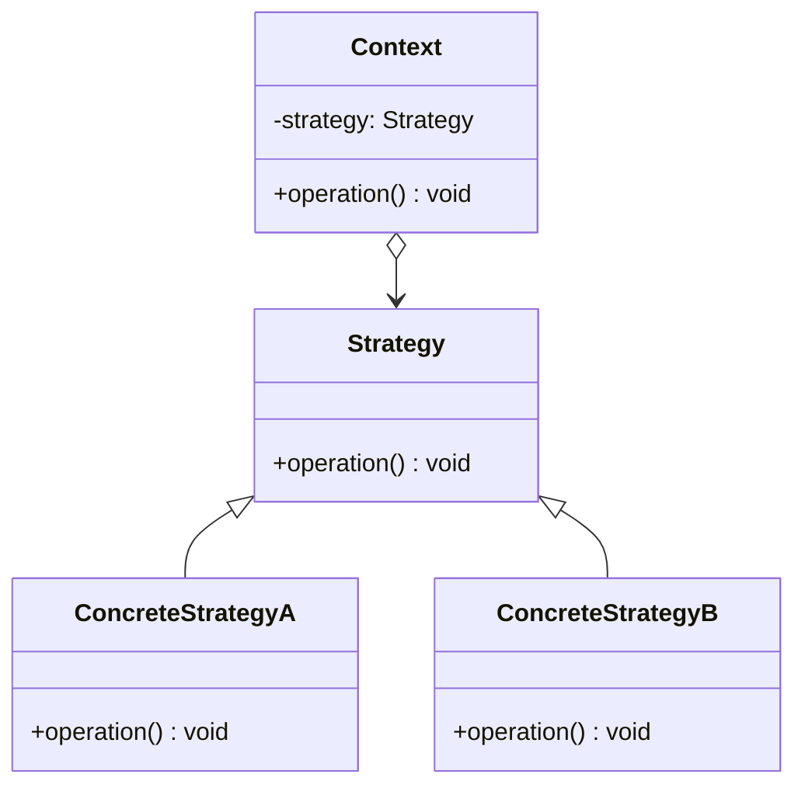
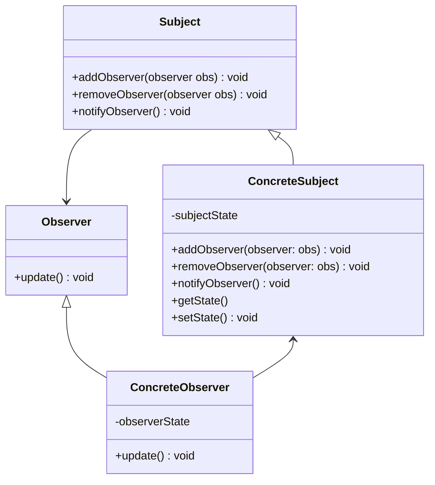
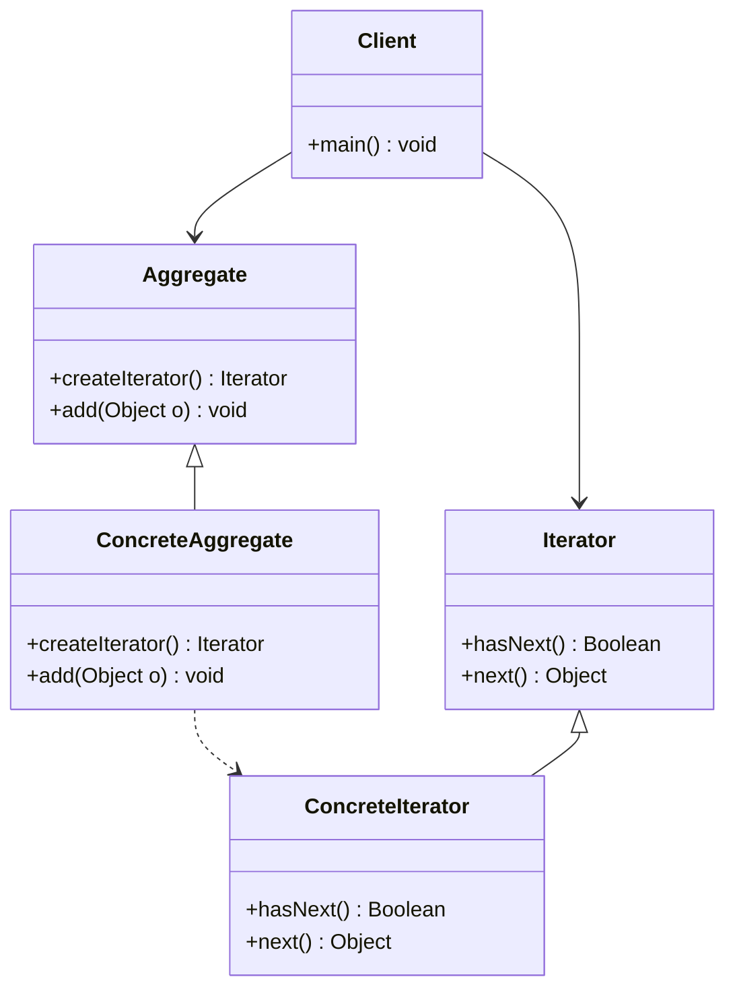

# 9.5 行为型模式

行为型模式（Behavioral Patterns）主要关注对象之间的通信、协作以及职责的分配。这些模式不仅仅是关于类和对象的结构，更侧重于它们之间的交互模式和通信流程，从而使系统更加灵活、易于理解和维护。

## 9.5.1 策略模式

### 策略模式引入

策略模式（Strategy Pattern）是一种行为设计模式，它的核心思想是：**定义一系列算法，将每一个算法封装起来，并使它们可以相互替换。** 策略模式让算法的变化独立于使用算法的客户端。

想象一下你去商场购物，结算时有多种优惠活动可选：

- **策略 A**：打 8 折。
- **策略 B**：满 300 减 50。
- **策略 C**：使用会员积分抵扣。

这些优惠活动就是不同的“策略”。收银系统（客户端）不需要关心每种优惠的具体计算方式，它只需要在结算时根据你的选择，应用对应的策略来计算最终价格。如果你想增加一种新的优惠活动（如“双十一特价”），也只需要增加一个新的策略，而无需修改原有的收银系统代码。

策略模式正是为了解决这类问题：当一个任务有多种处理方式（算法），且这些方式需要根据不同情况进行切换时，我们可以将每一种方式都封装成一个独立的策略类。客户端持有一个策略对象的引用，并在运行时动态地指定要使用哪一个策略。

这实现了算法的封装和与客户端的解耦，使得算法可以独立于客户端进行修改和扩展。

### 策略模式的类图



- `Context`：上下文环境类，它持有一个 `Strategy` 接口的引用。它不关心具体是哪个策略，只负责在需要时调用策略的接口。
- `Strategy`：抽象策略接口，定义了所有支持的算法的公共接口。
- `ConcreteStrategyA/B`：具体策略类，封装了具体的算法或行为，实现了 `Strategy` 接口。

### 策略模式的实现

让我们用一个简单的计算器例子来实现策略模式，这个计算器可以执行加法和减法操作。

```java
// 1. Strategy: 抽象策略接口
public interface Strategy {
   public int doOperation(int num1, int num2);
}

// 2. ConcreteStrategy: 具体策略类
// 加法策略
public class OperationAdd implements Strategy{
   @Override
   public int doOperation(int num1, int num2) {
      return num1 + num2;
   }
}

// 减法策略
public class OperationSubtract implements Strategy{
   @Override
   public int doOperation(int num1, int num2) {
      return num1 - num2;
   }
}

// 乘法策略
public class OperationMultiply implements Strategy{
   @Override
   public int doOperation(int num1, int num2) {
      return num1 * num2;
   }
}

// 3. Context: 上下文环境类
public class Context {
   private Strategy strategy;

   public Context(Strategy strategy){
      this.strategy = strategy;
   }

   public int executeStrategy(int num1, int num2){
      return strategy.doOperation(num1, num2);
   }
}
```

### 策略模式的应用实例

客户端代码可以根据需要创建不同的策略，并将其传递给 `Context` 来执行计算。

```java
public class App {
   public static void main(String[] args) {
      Context context = new Context(new OperationAdd());
      System.out.println("10 + 5 = " + context.executeStrategy(10, 5));

      context = new Context(new OperationSubtract());
      System.out.println("10 - 5 = " + context.executeStrategy(10, 5));

      context = new Context(new OperationMultiply());
      System.out.println("10 * 5 = " + context.executeStrategy(10, 5));
   }
}
```

**输出结果：**

```
10 + 5 = 15
10 - 5 = 5
10 * 5 = 50
```

在这个例子中，如果我们想增加一个新的“除法”操作，只需要创建一个 `OperationDivide` 类实现 `Strategy` 接口即可，`Context` 和客户端代码完全不需要修改，这完美地体现了策略模式对**开闭原则**的支持。

## 9.5.2 观察者模式

### 观察者模式引入

观察者模式（Observer Pattern）是一种应用非常广泛的行为设计模式，它的核心思想是：**定义对象之间一种一对多的依赖关系，当一个对象的状态发生改变时，所有依赖于它的对象都将得到通知并自动更新。**

这个模式也被称为“发布-订阅”（Publish-Subscribe）模式。我们来看一个生活中的例子：

- 你在 B 站上关注（**订阅**）了某个 UP 主。
- 这个 UP 主就是“**被观察者**”（或“发布者”），而你和其他所有粉丝就是“**观察者**”（或“订阅者”）。
- 当这个 UP 主发布了一个新视频（状态发生改变）时，B 站的系统会自动向所有关注他的粉丝发送通知（**通知更新**）。

在软件开发中，观察者模式同样非常有用：

- **GUI 事件处理**：一个按钮（被观察者）被点击时，所有注册了点击事件监听器（观察者）的代码都会被执行。
- **MVC 架构**：模型（Model）是被观察者，视图（View）是观察者。当模型的数据发生变化时，它会通知所有相关的视图进行更新，以反映最新的数据状态。

观察者模式成功地将“被观察者”和“观察者”解耦。被观察者只知道它有一系列的观察者，但它不需要知道这些观察者是谁、是做什么的。同样，观察者也只知道它需要关注某个被观察者，但它不影响被观察者。这使得双方可以独立地变化和复用。

### 观察者模式的类图



- `Subject`（主题/被观察者）：它是一个接口，提供了添加、删除和通知观察者的方法。
- `ConcreteSubject`（具体主题）：实现了 `Subject` 接口。它维护了一个观察者列表，并在自身状态改变时，调用 `notifyObserver()` 方法通知所有观察者。
- `Observer`（观察者）：它是一个接口，定义了一个 `update()` 方法，当接收到主题的通知时，这个方法就会被调用。
- `ConcreteObserver`（具体观察者）：实现了 `Observer` 接口。它在 `update()` 方法中定义了收到通知后要执行的具体逻辑。

### 观察者模式的实现

让我们用一个简单的气象站例子来实现观察者模式。气象站（`WeatherStation`）是具体主题，当它的气象数据（温度、湿度）更新时，会通知所有显示面板（具体观察者）。

```java
import java.util.ArrayList;
import java.util.List;

// 1. Observer: 观察者接口
public interface Observer {
    void update(float temperature, float humidity, float pressure);
}

// 2. Subject: 主题接口
public interface Subject {
    void registerObserver(Observer o);
    void removeObserver(Observer o);
    void notifyObservers();
}

// 3. ConcreteSubject: 具体主题 (气象站)
public class WeatherStation implements Subject {
    private List<Observer> observers;
    private float temperature;
    private float humidity;
    private float pressure;

    public WeatherStation() {
        observers = new ArrayList<>();
    }

    @Override
    public void registerObserver(Observer o) {
        observers.add(o);
    }

    @Override
    public void removeObserver(Observer o) {
        observers.remove(o);
    }

    @Override
    public void notifyObservers() {
        for (Observer observer : observers) {
            observer.update(temperature, humidity, pressure);
        }
    }

    // 当气象数据更新时，通知所有观察者
    public void setMeasurements(float temperature, float humidity, float pressure) {
        this.temperature = temperature;
        this.humidity = humidity;
        this.pressure = pressure;
        notifyObservers();
    }
}

// 4. ConcreteObserver: 具体观察者 (显示面板)
public class CurrentConditionsDisplay implements Observer {
    private float temperature;
    private float humidity;

    public CurrentConditionsDisplay(Subject weatherStation) {
        weatherStation.registerObserver(this); // 注册自己
    }

    @Override
    public void update(float temperature, float humidity, float pressure) {
        this.temperature = temperature;
        this.humidity = humidity;
        display();
    }

    public void display() {
        System.out.println("Current conditions: " + temperature + "F degrees and " + humidity + "% humidity");
    }
}
```

### 观察者模式的应用实例

现在，我们可以创建一个气象站和显示面板，看看当气象数据变化时会发生什么。

```java
public class App {
    public static void main(String[] args) {
        WeatherStation weatherStation = new WeatherStation();

        // 创建一个显示面板，并将其注册到气象站
        CurrentConditionsDisplay currentDisplay = new CurrentConditionsDisplay(weatherStation);

        // 模拟新的气象数据
        System.out.println("Weather station updating measurements...");
        weatherStation.setMeasurements(80, 65, 30.4f);

        System.out.println("\nWeather station updating measurements again...");
        weatherStation.setMeasurements(82, 70, 29.2f);
    }
}
```

**输出结果：**

```
Weather station updating measurements...
Current conditions: 80.0F degrees and 65.0% humidity

Weather station updating measurements again...
Current conditions: 82.0F degrees and 70.0% humidity
```

每次 `weatherStation.setMeasurements()` 被调用时，`CurrentConditionsDisplay` 都会自动收到通知并更新其显示内容，而 `WeatherStation` 完全不知道 `CurrentConditionsDisplay` 的存在，它只知道需要通知所有已注册的 `Observer`。

## 9.5.3 迭代器模式

### 迭代器模式引入

迭代器模式（Iterator Pattern）是一种非常基础且常用的行为设计模式，它的核心思想是：**提供一种方法来顺序访问一个聚合对象（如列表、数组）中的各个元素，而又不需要暴露该对象的内部表示。**

几乎所有的编程语言都内置了迭代器的概念。当你使用 `for-each` 循环遍历一个 `ArrayList` 或一个数组时，你其实就在使用迭代器模式。

```java
List<String> names = new ArrayList<>();
names.add("Alice");
names.add("Bob");

for (String name : names) { // 这里就隐式地使用了迭代器
    System.out.println(name);
}
```

为什么需要迭代器？想象一下，如果没有迭代器，你需要遍历一个 `ArrayList`，你可能会写 `for (int i = 0; i < list.size(); i++) { list.get(i); }`。但如果现在数据结构换成了一个 `LinkedList` 或是 `HashSet`，你的遍历代码就需要重写，因为它们的内部结构和访问元素的方式完全不同。

迭代器模式就是为了解决这个问题。它将**遍历的责任**从聚合对象中分离出来，交给一个独立的“迭代器”对象。这个迭代器对象知道如何遍历它所关联的聚合对象，并向客户端提供一个统一的遍历接口（如 `hasNext()` 和 `next()`）。

这样，客户端代码就无需关心聚合对象的具体类型（是 `ArrayList` 还是 `HashSet`），它只需要从聚合对象那里获取一个迭代器，然后使用这个统一的接口来遍历元素即可。这实现了数据结构与遍历算法的解耦。

### 迭代器模式的类图



- `Iterator`（迭代器接口）：定义了遍历元素所需的方法，如 `hasNext()`（判断是否还有下一个元素）和 `next()`（获取下一个元素）。
- `ConcreteIterator`（具体迭代器）：实现了 `Iterator` 接口，负责实际的遍历逻辑，并跟踪当前遍历的位置。
- `Aggregate`（聚合接口）：定义了创建迭代器对象的接口方法 `createIterator()`。
- `ConcreteAggregate`（具体聚合类）：实现了 `Aggregate` 接口，它是一个存储元素的容器，并能返回一个与之对应的 `ConcreteIterator` 实例。

### 迭代器模式的实现

让我们自定义一个简单的集合类，并为它实现迭代器。

```java
// 1. Iterator: 迭代器接口
public interface Iterator<E> {
    boolean hasNext();
    E next();
}

// 2. Aggregate: 聚合接口
public interface Aggregate<E> {
    Iterator<E> createIterator();
}

// 3. ConcreteAggregate & ConcreteIterator
public class NameRepository implements Aggregate<String> {
    private String names[] = {"Robert" , "John" ,"Julie" , "Lora"};

    @Override
    public Iterator<String> createIterator() {
        return new NameIterator();
    }

    // 将具体迭代器实现为内部类，方便访问外部类的私有成员
    private class NameIterator implements Iterator<String> {
        int index;

        @Override
        public boolean hasNext() {
            if(index < names.length){
                return true;
            }
            return false;
        }

        @Override
        public String next() {
            if(this.hasNext()){
                return names[index++];
            }
            return null;
        }
    }
}
```

### 迭代器模式的应用实例

客户端代码通过 `NameRepository` 获取迭代器，然后用统一的方式进行遍历，而无需知道 `names` 是一个数组。

```java
public class App {
   public static void main(String[] args) {
      NameRepository namesRepository = new NameRepository();

      // 获取迭代器
      Iterator<String> iter = namesRepository.createIterator();

      // 循环遍历
      while(iter.hasNext()){
         String name = iter.next();
         System.out.println("Name : " + name);
      }
   }
}
```

**输出结果：**

```
Name : Robert
Name : John
Name : Julie
Name : Lora
```

如果我们把 `NameRepository` 的内部实现从数组换成 `ArrayList`，只需要修改 `NameIterator` 的实现逻辑，而客户端 `App` 的代码完全不需要改变。这就是迭代器模式的强大之处，它为不同的数据结构提供了统一的遍历接口。
